# 银行智能体开发框架技术说明书

## 一、背景铺垫：AI Agent 重构银行业务流程

### 1.1 什么是 AI Agent

AI Agent（智能体）是大模型应用的核心形态，它代表了从"问答工具"到"自主执行者"的范式跃迁。

**核心特征：**
- **自主推理**：理解任务目标，分解执行步骤
- **工具调用**：根据需要调用外部工具（API、数据库、文件系统）
- **状态管理**：维护多轮对话的上下文和记忆
- **循环执行**：持续执行直到任务完成

**与传统自动化的本质区别：**

| 维度 | 传统 RPA/自动化 | AI Agent |
|------|----------------|----------|
| 规则 | 硬编码规则 | 自然语言指令 |
| 适应性 | 固定流程，异常需人工 | 自主处理异常和变化 |
| 交互 | 系统间数据搬运 | 理解语义，做出判断 |
| 学习 | 需重新编程 | 通过示例和反馈优化 |

**Agent 执行模型（ReAct）：**

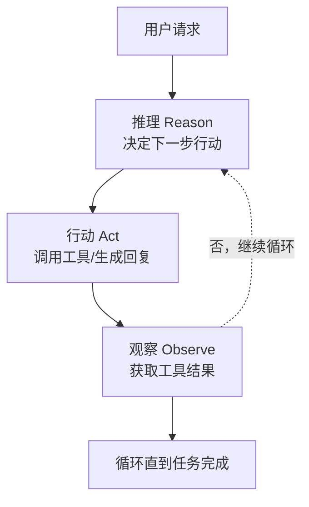

### 1.2 规划书中的 Agent 愿景

《银行大模型本地化落地与AI转型全景规划书》提出了从 L1 到 L5 的五阶成熟度模型，核心演进逻辑是 Agent 能力的持续跃迁：

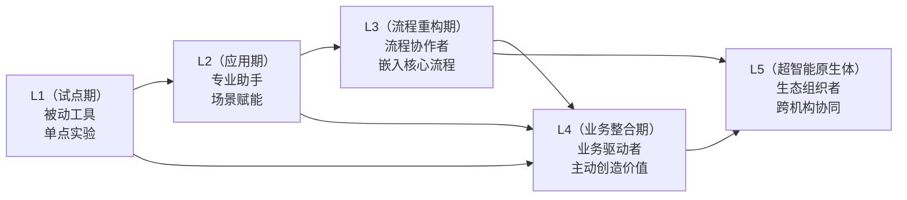

**规划书三大业务领域的 Agent 需求：**

| 业务领域 | Agent 角色 | 核心能力 | 规划书场景 |
|---------|-----------|---------|-----------|
| **Run** | 研发助手 | 代码生成、重构建议 | 科技部研发提效 35% |
| **Protect** | 信贷尽调助理 | 数据提取、报告生成 | 尽调时间压降 70% |
| **Grow** | 财富领航 | 市场监控、客户触达 | 投研雷达 + 客户经理协同 |

### 1.3 Harness SDK 的定位

Harness SDK 是规划书"统一 AI 能力接入网关"的**Agent 实现框架**，为银行业务 Agent 提供技术底座。

**核心价值：**

| 规划书要求 | Harness 实现 |
|-----------|-------------|
| 统一 AI 能力接入 | AgentHarness 统一入口，多 Provider 支持 |
| 乐高组装 | Skill 文件定义业务能力，Agent 实例化即用 |
| 技术硬核控险 | Guardrails 双层护栏，技术一票否决 |
| 企业级部署 | SDK-JAVA + Spring Cloud 多智能体协同 |

**与 OpenAI Swarm 的理念对应：**

| Swarm 概念 | Harness 实现 | 代码位置 |
|-----------|-------------|---------|
| Agent | AgentHarness | `sdk/harness.py` |
| Routine | Skill 文件 | `skills/base.py` |
| Handoff | 工具函数 | `tools/base.py` |
| Orchestrator | AgentLoop | `core/agent_loop.py` |

---

## 二、项目概述

### 2.1 项目背景与核心痛点

**规划书中的技术痛点：**
1. **AI 应用开发门槛高**：业务部门有需求，但缺乏算法团队
2. **重复造轮子**：每个业务场景都要重新实现 Agent 逻辑
3. **安全风险难控制**：Agent 调用工具时可能产生不可控行为
4. **多智能体协同缺失**：复杂业务需要多个 Agent 协作，缺乏编排框架

**Harness SDK 的解决方案：**

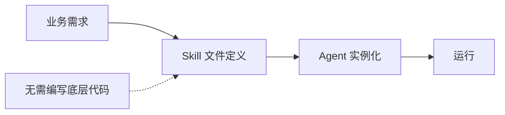

### 2.2 与规划书的对应关系

| 规划书章节 | Harness 模块 | 实现状态 |
|-----------|-------------|---------|
| **统一 AI 能力接入网关** | AgentHarness + LLMClient | ✓ 已实现 |
| **隐私数据动态脱敏** | Guardrails Layer 1 | ✓ 已实现 |
| **输入输出双向护栏** | Guardrails Layer 2 | ✓ 已实现 |
| **IAM 权限强制继承** | Security 模块 | ◐ 基础框架 |
| **乐高组装** | Skill 驱动 + MCP 集成 | ✓ 已实现 |

### 2.3 技术选型与核心特性

| 技术选型 | 选择 | 原因 |
|----------|------|------|
| **执行引擎** | ReAct Loop | 业界标准，可解释性强 |
| **工具系统** | Tool 抽象 + MCP | 支持自定义工具和 MCP 协议 |
| **技能系统** | Markdown + YAML | 业务人员可编写，版本可管理 |
| **安全护栏** | Hook 机制 | 灵活扩展，非侵入式 |
| **状态管理** | Session + Memory | 支持多轮对话和长期记忆 |
| **企业级** | SDK-JAVA + Spring Cloud | 微服务架构，高可用 |

**核心特性：**

| 特性 | 说明 |
|------|------|
| **技能驱动** | 业务能力封装为 Skill 文件，Agent 自动加载 |
| **双层护栏** | Layer 1 PII 规则检测 + Layer 2 LLM Judge |
| **熔断机制** | Circuit Breaker 防止工具循环卡死 |
| **成本控制** | Token 预算管理，超限自动降级 |
| **可观测性** | OpenTelemetry 集成，全链路追踪 |
| **浏览器自动化** | 7 个 Playwright 工具，独立窗口模式，审计友好 |
| **多模态支持** | 图片/文档上传，自动格式转换 |
| **Goal-Driven** | 目标驱动执行，Agent 自主运行直到达成目标 |
| **知识图谱** | code-review-graph MCP 集成，智能代码审查 |

---

## 三、架构设计

### 3.1 整体架构图

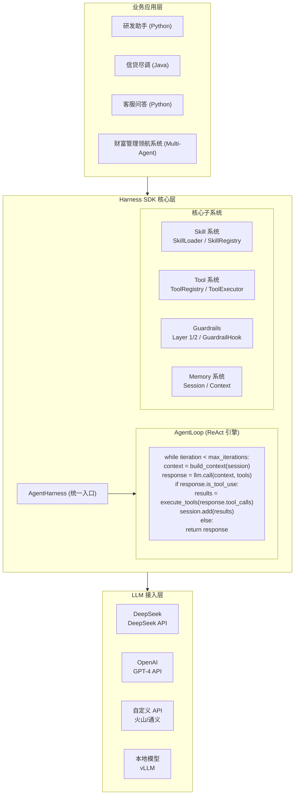

### 3.2 AgentLoop 执行引擎

**ReAct 循环详解：**

```python
# core/agent_loop.py
class AgentLoop:
    """
    核心执行引擎 - ReAct 模式
    
    执行流程：
    1. 构建上下文（系统提示词 + 会话历史 + 技能注入）
    2. 调用 LLM
    3. 如果 LLM 返回工具调用，执行工具
    4. 将工具结果添加到会话
    5. 循环直到 LLM 返回最终答案或达到迭代上限
    """
    
    async def run(self, prompt, session, tools):
        while iteration < self.config.max_iterations:
            # 构建上下文
            context = self.context.build(session)
            
            # 调用 LLM
            response = await self.llm.call(
                messages=context.messages,
                tools=tools,
                system=context.system_prompt
            )
            
            # 检查是否需要工具
            if response.is_tool_use:
                # 执行工具
                results = await self._execute_tools(response.tool_calls, session)
                session.add_messages(results)
                iteration += 1
                continue
            
            # 完成
            return LoopResult.completed(response.content)
```

**关键配置参数：**

| 参数 | 默认值 | 说明 |
|-----|-------|------|
| `max_iterations` | 10 | 最大迭代次数（行业标准） |
| `timeout_per_tool` | 30s | 单工具执行超时 |
| `enable_circuit_breaker` | True | 熔断器开关 |
| `enable_cost_control` | True | 成本控制开关 |

### 3.3 技能驱动架构

**设计理念：**
> 系统提示词极简，技能文件（skill.md）驱动一切。

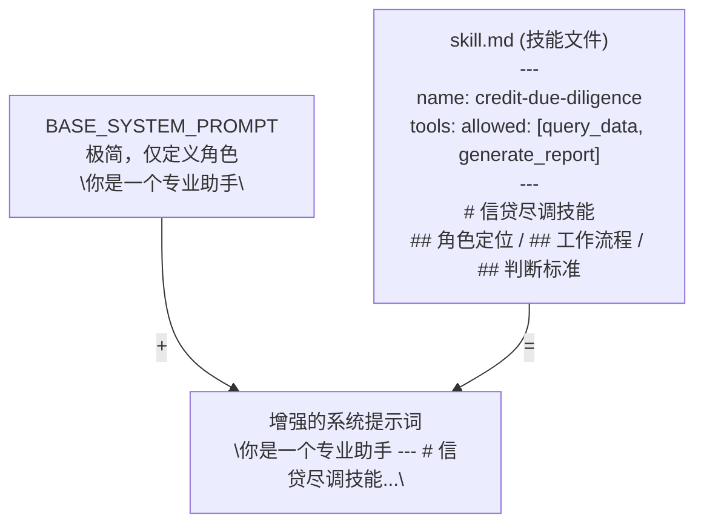

**技能文件结构：**

```markdown
---
name: credit-due-diligence
description: 信贷尽调助理技能
tools:
  allowed:
    - query_data_platform
    - fetch_company_info
    - generate_report
    - read_regulation
  restricted:
    - submit_approval
    - modify_system_data
triggers:
  keywords:
    - 尽调
    - 信贷报告
    - 企业调查
---

# 信贷尽调技能

## 角色定位
你是一个信贷尽调助理，负责将尽调报告推进到 99%。
最后 1% 的审批必须由信贷合规官完成。

## 核心能力
1. 自动从数据中台提取企业财务数据
2. 按照标准模板组装尽调报告初稿
3. 标注风险点供人工复核

## 权限边界
- ✅ 只读：查询数据、生成初稿
- ❌ 禁止：提交审批、修改系统数据

## 工作流程
1. 接收企业名称
2. 查询多源数据（数据中台、工商网、税务）
3. 结构化整理
4. 生成报告初稿
5. 标注待复核点
6. 提交人工审核

## 输出标准
报告必须包含：企业概况、财务分析、风险提示、建议结论
每个结论必须标注：数据来源、计算逻辑、置信度
```

### 3.4 Guardrails 双层护栏

**架构设计：**

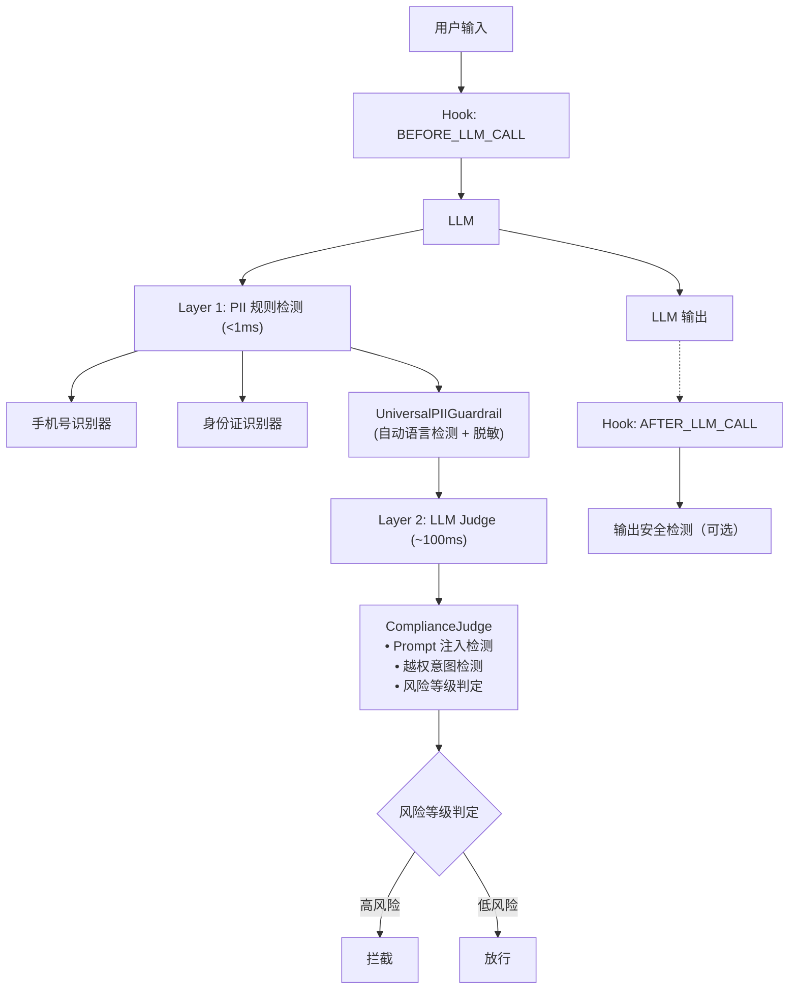

**GuardrailHook 实现：**

```python
# guardrails/hook.py
class GuardrailHook(LifecycleHook):
    """
    Guardrails Hook - 在 LLM 调用前后执行安全检查
    
    功能：
    - BEFORE_LLM_CALL: 检查用户输入
        - Layer 1: PII 检测和脱敏
        - Layer 2: Judge 语义风险检测
    - AFTER_LLM_CALL: 检查 LLM 输出
        - Layer 2: 输出安全性检测
    """
    
    @property
    def hook_points(self) -> list[HookPoint]:
        """Hook 订阅的点"""
        points = []
        if self.config.layer1_enabled or self.config.layer2_enabled:
            points.append(HookPoint.BEFORE_LLM_CALL)
        if self.config.layer2_enabled:
            points.append(HookPoint.AFTER_LLM_CALL)
        return points
    
    async def execute(self, context: HookContext) -> HookResult:
        if context.hook_point == HookPoint.BEFORE_LLM_CALL:
            return await self._handle_before_llm_call(context)
        elif context.hook_point == HookPoint.AFTER_LLM_CALL:
            return await self._handle_after_llm_call(context)
        return HookResult.continue_()
```

---

## 四、核心组件详解

### 4.1 AgentHarness - 统一入口

**初始化参数：**

```python
# sdk/harness.py
class AgentHarness:
    def __init__(
        self,
        model: str = "deepseek",      # 模型名称
        api_key: str | None = None,             # API Key
        provider: str = "deepseek",            # Provider
        base_url: str | None = None,            # 自定义 API 端点
        tools: list[Tool] | None = None,        # 工具列表
        config: HarnessConfig | None = None,    # 完整配置
        llm_client: LLMClient | None = None,    # 自定义 LLM 客户端
        **kwargs,
    ):
        # 初始化 LLM 客户端
        # 初始化工具注册表
        # 初始化会话存储
        # 初始化技能系统
        # 初始化 Guardrails
```

**使用示例：**

```python
from harness import AgentHarness
from harness.tools.builtins import ReadTool, EditTool, GlobTool

# 基础使用
agent = AgentHarness(
    model="deepseek",
    tools=[ReadTool(), EditTool(), GlobTool()],
)

result = await agent.run("分析 src/ 目录下的代码结构")

# 使用技能文件
agent = AgentHarness(
    model="deepseek",
    skills_dir="./skills",
)
result = await agent.run("尽调报告：某某公司")

# 集成 Guardrails
from harness.guardrails import GuardrailConfig

agent = AgentHarness(
    model="deepseek",
    guardrails=GuardrailConfig(
        enabled=True,
        layer1_enabled=True,
        layer2_enabled=True,
    ),
)
```

### 4.2 Skill 系统 - 业务能力封装

**Skill 数据结构：**

```python
# skills/base.py
@dataclass
class Skill:
    """技能定义"""
    name: str                          # 技能名称
    description: str                   # 技能描述
    content: str                       # 技能内容（Markdown）
    triggers: SkillTrigger             # 触发条件
    tools: SkillTools                  # 工具配置
    parameters: list[SkillParameter]   # 可配置参数
    version: str = "1.0.0"             # 版本号
    author: str = ""                   # 作者
    metadata: dict = field(default_factory=dict)
    source_path: str | None = None     # 源文件路径

@dataclass
class SkillTrigger:
    """触发条件"""
    keywords: list[str] = field(default_factory=list)   # 关键词
    patterns: list[str] = field(default_factory=list)   # 正则模式
    tools: list[str] = field(default_factory=list)      # 工具触发

@dataclass
class SkillTools:
    """工具配置"""
    allowed: list[str] = field(default_factory=list)      # 允许的工具
    restricted: list[str] = field(default_factory=list)   # 禁止的工具
    default_permission: str = "allow"                     # 默认权限
```

**技能加载流程：**

```python
# 从文件加载
skill = Skill.from_file(Path("./skills/credit-due-diligence.md"))

# 检查是否应该激活
if skill.should_activate("请生成信贷尽调报告"):
    # 注入到系统提示词
    enhanced_prompt = f"{base_prompt}\n\n---\n\n{skill.content}"
```

### 4.3 Tool 系统 - 可执行能力

**Tool 抽象：**

```python
# tools/base.py
class Tool(ABC):
    """工具抽象基类"""
    
    @property
    @abstractmethod
    def name(self) -> str:
        """工具名称"""
        pass
    
    @property
    @abstractmethod
    def description(self) -> str:
        """工具描述"""
        pass
    
    @property
    @abstractmethod
    def input_schema(self) -> dict:
        """输入 Schema (JSON Schema)"""
        pass
    
    @abstractmethod
    async def execute(
        self,
        arguments: dict,
        context: ToolContext,
    ) -> ToolResult:
        """执行工具"""
        pass
```

**内置工具：**

| 工具 | 用途 | 适用场景 |
|------|------|---------|
| `ReadTool` | 读取文件 | 代码审查、文档查询 |
| `WriteTool` | 创建文件 | 代码生成、配置创建 |
| `EditTool` | 编辑文件 | 代码修改、配置更新 |
| `GlobTool` | 文件搜索 | 项目结构分析 |
| `GrepTool` | 内容搜索 | 代码查找、日志分析 |
| `BashTool` | 执行命令 | 运行测试、构建项目 |

**浏览器自动化工具（2026-07 新增）：**

| 工具 | 用途 | 适用场景 |
|------|------|---------|
| `browser_navigate` | 导航到 URL | 网页浏览、信息收集 |
| `browser_click` | 点击元素 | 表单提交、按钮操作 |
| `browser_type` | 输入文本 | 表单填写、搜索输入 |
| `browser_extract` | 提取页面内容 | 数据抓取、内容分析 |
| `browser_screenshot` | 截图 | 审计记录、视觉验证 |
| `browser_wait` | 等待元素加载 | 动态页面处理 |
| `browser_close` | 关闭浏览器 | 清理资源 |

**特性**：
- 支持 **独立窗口模式**：用户可实时观看 Agent 操作
- 支持 **内网环境**：使用系统已安装浏览器（Edge/Chrome/Firefox）
- **审计友好**：自动截图功能支持合规审计
- **Playwright 底层**：跨浏览器兼容

**MCP 工具包装：**

```python
# mcp/tool_wrapper.py
class MCPToolWrapper:
    """
    MCP 工具包装器 - 将 MCP 工具转化为 Harness Tool
    
    实现：
    - MCP 工具自动注册为 Harness Tool
    - 工具名前缀 `mcp_{server}_{tool}` 避免冲突
    - JSON Schema 参数验证
    - 超时控制
    """
    
    @property
    def name(self) -> str:
        return f"mcp_{self._server_name}_{self._original_name}"
    
    async def execute(self, args: dict, ctx: ToolContext) -> ToolResult:
        result = await self._mcp_client.call_tool(
            self._original_name,
            args,
            timeout=self._timeout,
        )
        return ToolResult(
            success=not result.get("is_error"),
            content=result.get("content", ""),
        )
```

### 4.4 Circuit Breaker - 熔断机制

**设计理念：**
> 简单规则优于复杂启发式，信任模型自我纠正。

```python
# core/circuit_breaker.py
class CircuitBreaker:
    """
    熔断器 - 防止工具循环卡死
    
    检测：
    - 同一工具 + 同一参数组合重复调用
    - 短时间内大量错误
    
    状态：
    - CLOSED: 正常运行
    - OPEN: 阻止调用
    - HALF_OPEN: 测试恢复
    """
    
    def record_call(self, tool_name: str, arguments: dict):
        """记录工具调用"""
        args_key = self._make_args_key(tool_name, arguments)
        self._tool_args_counter[args_key] += 1
        self._check_patterns()
    
    def is_open(self) -> bool:
        """检查熔断器是否打开"""
        if self._state == CircuitState.CLOSED:
            return False
        # 检查恢复超时...
```

**配置参数：**

| 参数 | 默认值 | 说明 |
|-----|-------|------|
| `same_args_threshold` | 3 | 同工具同参数触发阈值 |
| `error_threshold` | 5 | 错误次数阈值 |
| `error_window_seconds` | 60 | 错误统计窗口 |
| `recovery_timeout_seconds` | 30 | 恢复超时 |

---

## 五、SDK-JAVA 企业级版本

### 5.1 模块结构

```mermaid
flowchart TD
    ROOT["packages/sdk-java/"]
    ROOT --> CORE["harness-sdk-core/ (核心模块)"]
    CORE --> AgentLoop["AgentLoop.java (ReAct 执行引擎)"]
    CORE --> Tool["Tool.java (工具抽象)"]
    CORE --> ToolExecutor["ToolExecutor.java (工具执行器)"]
    CORE --> LLMClient["LLMClient.java (LLM 客户端接口)"]
    CORE --> Session["Session.java (会话管理)"]
    ROOT --> LLMM["harness-sdk-llm/ (LLM 实现)"]
    LLMM --> DeepSeek["DeepSeekClient.java (DeepSeek API)"]
    LLMM --> OpenAI["OpenAIClient.java (OpenAI API)"]
    ROOT --> TOOLS["harness-sdk-tools/ (内置工具)"]
    TOOLS --> ReadTool["ReadTool.java"]
    TOOLS --> WriteTool["WriteTool.java"]
    TOOLS --> EditTool["EditTool.java"]
    TOOLS --> BashTool["BashTool.java"]
    ROOT --> SKILLS["harness-sdk-skills/ (技能系统)"]
    SKILLS --> Skill["Skill.java"]
    SKILLS --> SkillRegistry["SkillRegistry.java"]
    ROOT --> MCP["harness-sdk-mcp/ (MCP 集成)"]
    MCP --> McpToolWrapper["McpToolWrapper.java"]
    MCP --> McpManager["McpManager.java"]
    ROOT --> SEC["harness-sdk-security/ (安全模块)"]
    SEC --> InputValidator["InputValidator.java"]
    SEC --> ResultSanitizer["ResultSanitizer.java"]
    SEC --> AuditLogger["AuditLogger.java"]
    ROOT --> MEM["harness-sdk-memory/ (记忆模块)"]
    MEM --> SessionManager["SessionManager.java"]
    MEM --> MemoryFileManager["MemoryFileManager.java"]
```

### 5.2 Python/Java SDK 同步率

基于 code-review-graph 分析，**Python SDK 和 Java SDK 功能同步率达到 99.5%**。

**核心组件对应关系**：

| 组件 | Python SDK | Java SDK | 同步状态 |
|------|-----------|----------|---------|
| Agent 入口 | `AgentHarness` | `AgentHarness` | ✅ 完全同步 |
| 执行引擎 | `AgentLoop` | `AgentLoop` | ✅ 完全同步 |
| 技能系统 | `Skill` / `SkillRegistry` | `Skill` / `SkillRegistry` | ✅ 完全同步 |
| 工具系统 | 11 内置工具 | 11 内置工具 | ✅ 完全同步 |
| 浏览器工具 | 7 Playwright 工具 | 7 Playwright 工具 | ✅ 完全同步 |
| MCP 集成 | `McpManager` | `McpManager` | ✅ 完全同步 |
| 记忆系统 | `MemorySystem` | `MemorySystem` | ✅ 完全同步 |
| 触发器 | `TriggerManager` | `TriggerManager` | ✅ 完全同步 |
| Goal 验证 | `GoalVerifier` | `GoalVerifier` | ✅ 完全同步 |
| PII 检测 | `check_pii()` | `checkPii()` | ✅ 完全同步 |

**唯一差异（0.5%）**：
- Python: `AsyncSQLiteSessionStore`（异步）
- Java: 同步 JDBC 实现（框架差异）

**验证方法**：
```bash
# 检查 Java SDK 中是否有未实现的功能
grep -r "UnsupportedOperationException" packages/sdk-java/
# 结果：无匹配，所有功能已实现
```

### 5.3 Spring Cloud 集成

**多智能体编排架构：**

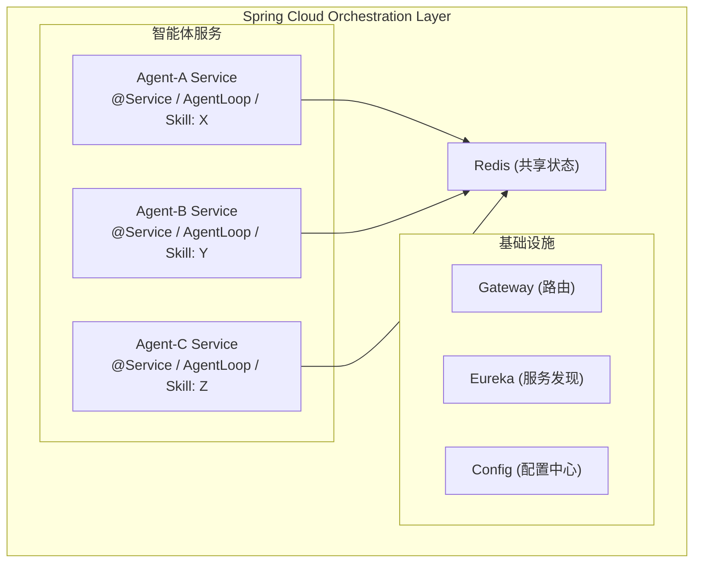

**代码示例：**

```java
@Service
public class WealthOrchestrator {

    @Autowired
    private AgentService marketMonitorAgent;

    @Autowired
    private AgentService clientAdvisorAgent;

    @Autowired
    private AgentService notificationAgent;

    @Autowired
    private RedisTemplate<String, Session> sessionStore;

    public WorkflowResult executeMarketAlert(String event) {
        // 1. 市场 Agent 检测异动
        LoopResult analysis = marketMonitorAgent.run(
            "分析市场异动：" + event
        );

        // 2. 决策 Agent 筛选客户
        LoopResult clients = clientAdvisorAgent.run(
            "筛选受影响的客户：" + analysis.content()
        );

        // 3. 通知 Agent 生成建议
        LoopResult notification = notificationAgent.run(
            "为以下客户生成通知：" + clients.content()
        );

        return WorkflowResult.completed(notification);
    }
}
```

---

## 六、与规划书的映射关系

### 6.1 "底层集约建设" → Harness SDK

| 规划书要求 | Harness 实现 | 代码位置 |
|-----------|-------------|---------|
| 统一 AI 能力接入网关 | AgentHarness 统一入口 | `sdk/harness.py` |
| 标准 API 封装 | LLMClient 抽象 | `llm/base.py` |
| 本地算力调度 | 多 Provider 支持 | `llm/deepseek.py`, `llm/openai.py` |
| 成本控制 | CostController | `core/cost_controller.py` |

### 6.2 "上层乐高组装" → Skill 驱动

| 规划书要求 | Harness 实现 | 代码位置 |
|-----------|-------------|---------|
| 业务部门快速组装 | Skill 文件即业务能力 | `skills/base.py` |
| 无需算法底层代码 | 技能文件驱动工具选择 | `skills/loader.py` |
| 几天快速交付 | 技能注册 + Agent 实例化 | `skills/registry.py` |

### 6.3 "技术硬核控险" → Guardrails

| 规划书要求 | Harness 实现 | 代码位置 |
|-----------|-------------|---------|
| 隐私数据动态脱敏 | PII Recognizers | `guardrails/chinese_pii_recognizers.py` |
| 输入输出双向护栏 | GuardrailHook | `guardrails/hook.py` |
| LLM Judge 语义检测 | ComplianceJudge | `guardrails/judge.py` |
| 权限强制继承 | Security 模块 | `security/validation.py` |

### 6.4 "业务三步演进" → L1-L5 路径

| 业务阶段 | Harness 支撑 | 成熟度对应 |
|---------|-------------|-----------|
| Run（运营提效） | Python SDK + Skill | L1-L2 |
| Protect（流程重构） | SDK-JAVA + Guardrails | L3 |
| Grow（智能原生） | 多智能体 + Spring Cloud | L4-L5 |

---

## 七、使用示例

### 7.1 研发智能助手

```python
from harness import AgentHarness
from harness.tools.builtins import ReadTool, EditTool, GlobTool, GrepTool

agent = AgentHarness(
    model="deepseek",
    tools=[ReadTool(), EditTool(), GlobTool(), GrepTool()],
)

result = await agent.run("""
请分析 src/legacy 目录下的老旧代码，给出重构建议：
1. 扫描所有 Python 文件
2. 分析代码结构和依赖关系
3. 输出重构建议和单元测试用例
""")

print(result.content)
```

### 7.2 信贷尽调助理

```python
from harness import AgentHarness
from harness.guardrails import GuardrailConfig

# 定义技能文件 credit-due-diligence.md
# 加载技能

agent = AgentHarness(
    model="deepseek",
    skills_dir="./skills",
    guardrails=GuardrailConfig(
        enabled=True,
        layer1_enabled=True,
    ),
)

result = await agent.run("""
请为"某某科技有限公司"生成信贷尽调报告初稿
""")
```

### 7.3 多智能体协同（Java）

```java
// 财富管理多 Agent 场景
@Service
public class MarketRadarAgent {
    @Scheduled(fixedRate = 60000)
    public void scan() {
        LoopResult result = loop.run("""
            分析最新市场动态：
            1. 检查重大新闻
            2. 计算对各标的的影响
            3. 识别风险阈值突破
            """);
        
        if (result.hasAlerts()) {
            eventPublisher.publish(new MarketAlertEvent(result));
        }
    }
}
```

---

## 八、Harness Client：从 SDK 到"数字员工工作台"

### 8.1 Client 的战略定位

Harness Client 是 SDK 的图形化客户端，解决"最后一公里"问题：将技术能力转化为业务人员可直接使用的工具。

**规划书对应**：
> "L2（应用期 - 工具化铺开）：将验证通过的单点模型能力封装为标准的'行内内部接口（API）'，固化为全行科技研发及日常行政条线的外挂式'提效工具'。"

### 8.2 Client 架构设计

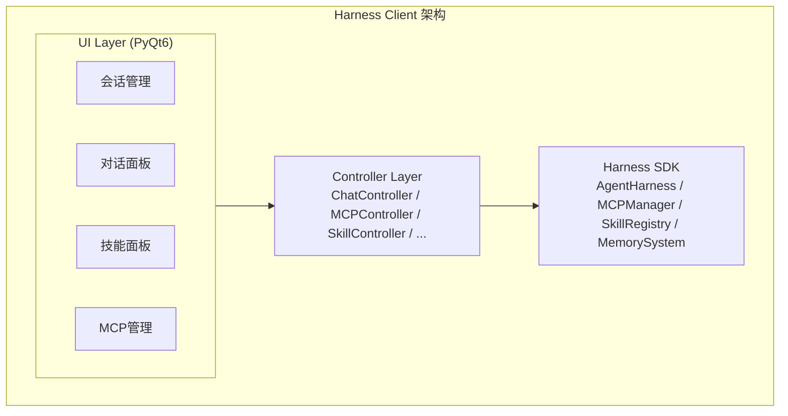

### 8.3 核心功能

#### 功能一：技能可视化管理

```python
# 技能目录自动扫描
```

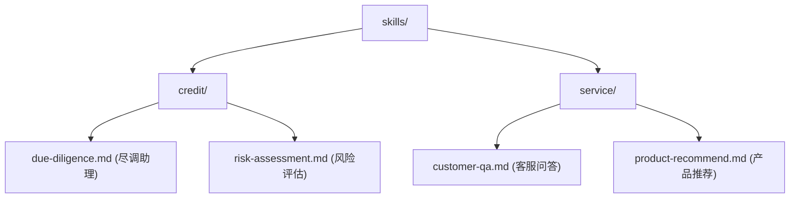

```python
# 用户视角
# 1. 右侧面板显示"技能货架"
# 2. 点击技能激活
# 3. 输入 "/" 触发自动补全
```

#### 功能二：MCP 服务器管理

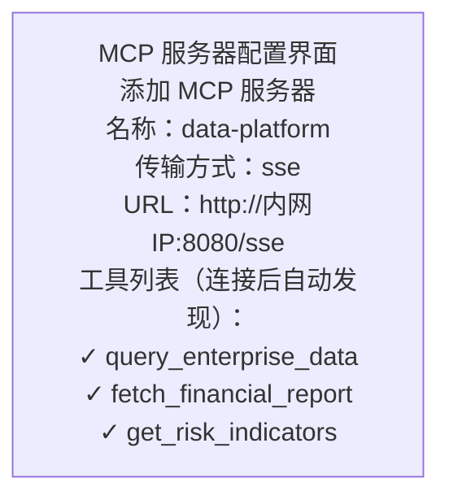

#### 功能三：多会话管理

```python
class SessionManager:
    """会话状态管理 - 支持多任务并行"""
    
    def create(self) -> Session:
        """创建新会话（对应新任务）"""
        
    def switch_to(self, session_id: str):
        """切换会话（对应任务切换）"""
        
    def add_message_to_current(self, role: str, content: str):
        """添加消息到当前会话"""
```

### 8.4 企业级部署

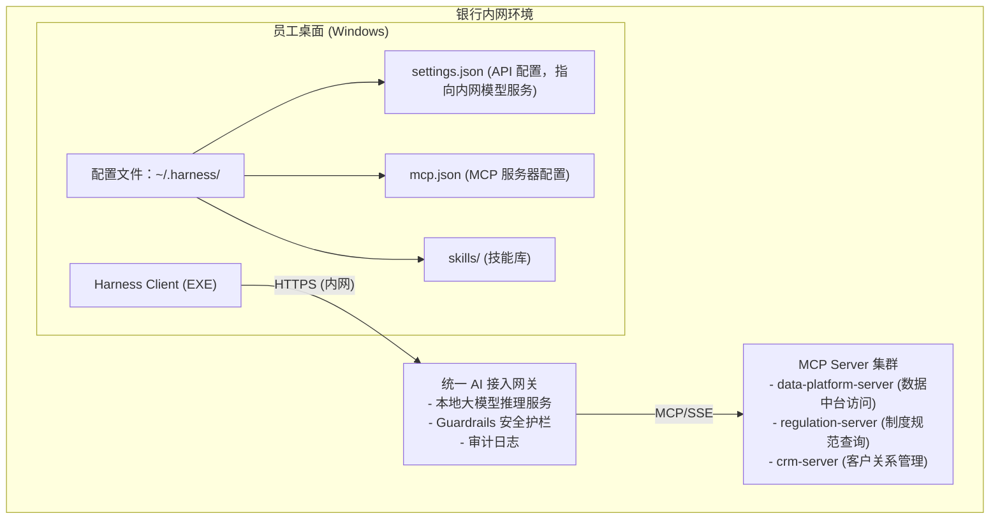

### 8.5 打包与分发

```powershell
# 打包为 Windows EXE
cd packages/client
uv run python build.py

# 输出：dist/HarnessClient.exe
# 体积：~150MB（含 Python 运行时 + PyQt6 + SDK）
```

### 8.6 与规划书场景的映射

| 规划书场景 | Client 支撑能力 | 用户操作 |
|-----------|----------------|---------|
| **研发智能助手** | 技能激活 + 代码工具 + MCP 集成 | 点击"代码审查"技能 |
| **制度百事通** | 知识库 MCP 连接 + 问答界面 | 输入问题，自动检索 |
| **信贷尽调助理** | 尽调技能 + 数据中台 MCP | 选择企业名称，自动生成报告 |
| **财富领航系统** | 多会话管理 + 实时通知 | 弹出提示，一键生成建议信 |

### 8.7 与 IDE 智能插件的互补分工（open_ide 文件锁）

**定位：AI 是「人在回路监管下的强执行受控岗」，活它干、权在人。**

Harness Client 的工作流解决「管得住、看得懂、算得清」，而同事在自有 IDE（VS Code / IntelliJ IDEA）里用 Cursor、Copilot 等智能插件写码解决「写得更快」——两者互补共存，不是替代关系。opencode 上游的 `open_ide` 文件锁机制把「IDE 手写」安全地接回「治理流程」，使两路 AI 不会互相覆盖。

**AI 与人的「执行 / 签核」双泳道：**

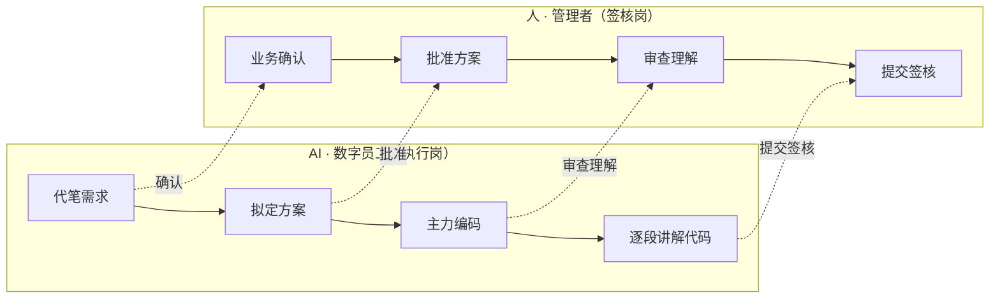

**open_ide 文件锁协作流程：**

```mermaid
flowchart TD
    S1["开发者在 IDE 手工/插件写码"] --> S2["调 open_ide(file) 打开并锁定该文件"]
    S2 --> S3["Agent 不得 write/edit/apply_patch 覆盖<br/>（tool.execute.before 硬拦截）"]
    S3 --> S4["开发者确认改完（\"改完了/可以继续\"）"]
    S4 --> S5["unlock_file(developer_confirmed=true)"]
    S5 --> S6["Agent 重新读取最新文件内容后继续测试/审查/提交"]
```

- **混合开发原则**：需求 / 设计 / 测试 / 审查走工作流，代码部分可人工在 IDE 写；锁定期间 Agent 可继续其它任务，但不得改被锁定文件。
- **谁写的审谁**：AI 生成的代码逐段 `comprehension_add` 登记并经人确认；人工写的代码不进理解确认片段，由人整体把关（详见第十二章）。
- **安全边界**：文件锁仅为本地元数据（会话 ID + 文件路径），不含代码内容，不随汇报上行；锁按会话隔离、持久化到 SQLite，daemon 重启自动恢复。

---

## 九、扩展开发指南

### 9.1 添加新工具

```python
from harness.tools.base import Tool, ToolContext
from harness.types import ToolResult

class CustomDataQueryTool(Tool):
    """自定义数据查询工具"""
    
    @property
    def name(self) -> str:
        return "query_internal_data"
    
    @property
    def description(self) -> str:
        return "查询行内数据中台"
    
    @property
    def input_schema(self) -> dict:
        return {
            "type": "object",
            "properties": {
                "query": {
                    "type": "string",
                    "description": "查询语句"
                }
            },
            "required": ["query"]
        }
    
    async def execute(
        self,
        arguments: dict,
        context: ToolContext
    ) -> ToolResult:
        query = arguments["query"]
        # 实现查询逻辑
        result = await self._execute_query(query)
        return ToolResult(
            success=True,
            content=result
        )
```

### 9.2 添加新技能

创建 `skills/custom-skill.md`：

```markdown
---
name: custom-business-skill
description: 自定义业务技能
tools:
  allowed:
    - query_internal_data
    - generate_report
triggers:
  keywords:
    - 业务关键词
---

# 自定义业务技能

## 角色定位
...

## 工作流程
...
```

### 9.3 自定义 Guardrail Hook

```python
from harness.core.hooks import LifecycleHook
from harness.types import HookPoint, HookContext, HookResult

class CustomSecurityHook(LifecycleHook):
    """自定义安全检查 Hook"""
    
    @property
    def hook_points(self) -> list[HookPoint]:
        return [HookPoint.BEFORE_TOOL_EXECUTE]
    
    async def execute(self, context: HookContext) -> HookResult:
        # 检查工具参数
        if context.tool_name == "bash":
            if "rm -rf" in context.tool_args.get("command", ""):
                return HookResult.abort("禁止执行危险命令")
        
        return HookResult.continue_()
```

---

## 十、AI 编码质量管控框架（四支柱）

> 对应 opencode `opencode-session-mgmt` 的方法论主线。把「AI 写代码质量不可控」拆成可治理的四个维度，构成闭环；缺一便会在某个环节失控。

### 10.1 为什么需要框架

| 风险 | 表现 | 失控后果 |
|------|------|----------|
| 约束缺失 | 无统一规约，模型各写各的 | 风格 / 安全 / 异常处理不一致，不可维护 |
| 上下文缺失 | 模型不掌握架构与功能语义 | 改对一处、破坏一片，幻觉式实现 |
| 过程缺失 | 无标准化流程与人在回路 | 跳步、漏审、需求与代码脱节 |
| 度量缺失 | 改了规则 / 提示词但无基线对照 | 凭直觉调优，弱模型遵循度悄然退化 |

### 10.2 四支柱框架

| 支柱 | 业界概念 | Harness 落地 | 载体 |
|------|----------|--------------|------|
| ① 制定规约 | Guardrails / Policy-as-Code（Linter、Style Guide、ADR） | 机构规约按工作流类型放入 `conventions/<type>/*.md`，frontmatter 声明 `stage`，每轮只注入 global + 当前阶段；基线随框架打包，项目根 `conventions/<type>/*.md` 覆盖不跨流泄漏 | `conventions/` 目录 + 阶段化注入机制 |
| ② 增强知识 | Context Engineering / Repo-level RAG | 架构 / 功能级知识由业务 / 技术侧经项目材料目录 + `reqdoc_scan` 提供，不进插件、不依赖 AGENTS.md；会话内理解沉淀为可检索知识库 | Context7（详见 doc 6）+ comprehension 知识库 |
| ③ 智能协同 | Agentic Workflow + Human-in-the-loop | sdlc / reqdoc 五阶段完成门禁，AI 主动提议、人确认；理解确认闭环 | 工作流引擎（第十一章） |
| ④ 度量反馈 | LLM evals / 回归测试 | 评测基线 + `--fail-on-regression`，改规则前跑基线、改后对比，通过率 / 维度分不降才保留 | 效能看板（第十三章） |

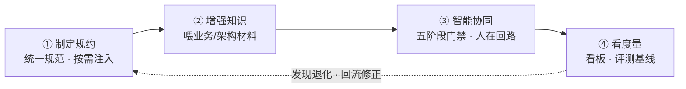

### 10.3 银行业覆盖层规约（① 的银行落地）

第①柱的「机构规约」在银行业需叠加合规覆盖层。opencode 上游已将银行专属规约做成按工作流类型组织的阶段化注入文件（机构覆盖目录 `<项目根>/conventions/<type>/*.md`），与基线规约叠加：

| 工作流 | 银行业覆盖层规约文件 | 覆盖要点 |
|--------|----------------------|----------|
| sdlc（研发） | `10-银行加密与数据安全` / `11-银行审计留痕与双签` / `12-银行交易一致性与合规` | 加密存储、审计留痕、双签、交易一致性、合规校验 |
| reqdoc（需求） | `10-银行监管合规与数据安全` / `11-银行交易安全与灾备` / `12-银行权限隔离与四眼原则` | 监管合规、交易安全与灾备、权限隔离、四眼原则 |

> 每个 `.md` 头部 frontmatter 声明 `stage:`（如 `implementation` / `review`），只在对应阶段注入；`global` 常驻全程。新增银行规约 = 往目录丢一个带 frontmatter 的 `.md`，零代码。通用常驻机构规则写机构 `AGENTS.md`，不进 conventions 目录。

### 10.4 支柱关系：约束 → 信息 → 过程 → 度量

- **约束（①）** 给模型划定边界；**信息（②）** 补足架构 / 功能语义，让它在该边界内做对的事；
- **过程（③）** 把单次交互编排为标准流程，关键节点让人确认；**度量（④）** 用基线量化前三者的实效，发现退化即回流修正规约与提示词。

---

## 十一、研发工作流引擎（sdlc / reqdoc 完成门禁）

> 对应 opencode `workflow-sdlc.md` / `workflow-reqdoc.md`。把 AI 辅助研发从「不可控的对话」治理为「需求走流程、代码被理解、产出可度量、质量有护栏」的标准化过程。

### 11.1 完成门控模型（而非严格流水线）

真实开发本质是迭代的：编码时发现需求不清要回需求分析，测试失败要回改代码。因此采用**完成门控**——约束点不是「当前处于哪个阶段」，而是「所有必需产物是否都已完成」。

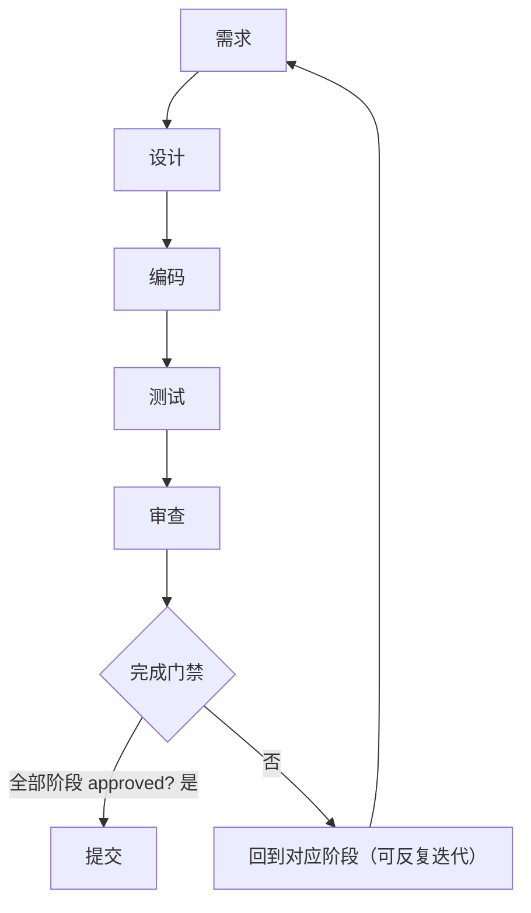

- 五阶段可自由跳转、反复迭代（`workflow_revisit`），审查与编码 / 测试形成迭代循环。
- **提交是唯一的硬门禁**（`hasCommitGate=true`）：`tool.execute.before` 拦截 `git commit`，未过审查全部阶段则阻断。
- **审查是唯一不可被 AI 自行推进的阶段**：AI 只提议，须经 `review_submit` 由人通过；审查不仅查代码正确性，更查「人是否真正理解」。

### 11.2 阶段检测：AI 提议 + 开发者确认

唯一真正知道「当前在哪个阶段、是否完成」的是开发者本人。阶段转换的唯一来源是开发者的明确操作；AI 只能提议，绝不自行推进。

| 工具 | 用途 | 服务端校验 |
|------|------|-----------|
| `workflow_advance` | 提议进入下一阶段 / 标记当前阶段 approved | 必须携带开发者确认语义；阶段运行时校验须在定义内 |
| `workflow_revisit` | 回退到指定阶段（revision++） | 级联回退其后所有已 approved 的下游阶段 |
| `review_submit` | 提交审查清单结果 | 前序阶段须全部 approved；有片段时须全部终态，不允许悬空 |
| `commit_gate_check` | 提交前门禁检查 | 返回未完成阶段列表；未通过时阻断 `git commit` |
| `commit_force_unlock` | 强制提交授权（逃生口） | `developer_confirmed=true`、原因必填，留痕一次性放行 |

### 11.3 两条工作流

| 工作流 | 适用角色 | 阶段 | 要点 |
|--------|----------|------|------|
| **sdlc** | 开发者 | 需求→设计→编码→测试→审查→提交 | 有提交门禁；代码片段逐段理解确认 |
| **reqdoc** | 需求分析师 | 需求书代写，含功能点拆解、八维打分卡门禁、渲染结构校验、Word 导出 | 无 `git commit` 门禁；review 语义为业务确认 PRD 要点 |

> sdlc 的审查清单四检查项（业务意图 / 逻辑可解释 / 行为可验证 / 设计推导）见第十二章；reqdoc 的八维打分卡门禁按 `workflow-reqdoc.md` 落地，本框架不重复展开。

---

## 十二、理解保障与逐段确认（监管可接手标准）

> 对应 opencode `comprehension_*` 工具与 `workflow-sdlc.md` 第五章。直接回答管理层的「退出风险」：AI 写的代码，人能不能接、能不能改、AI 停了怎么办。

### 12.1 逐段理解确认

审查阶段，AI 将每个**自己生成的代码变更**拆分为可理解片段，逐段登记解释：

- **做了什么 / 为什么这样写 / 被放弃的替代方案 / 潜在风险**；
- 开发者逐段 `comprehension_confirm`（**单次只接受一个片段**，防批量走过场）；
- 可 `comprehension_ask` 追问、`comprehension_reject` 拒绝重写、`comprehension_manual` 自处理；
- 每个片段须达成终态（接受 / 自处理），不允许 pending / rejected 悬空，才可 `review_submit`。

**手工写的代码不进理解确认片段**（AI 不解释它没写的代码），由开发者经审查清单整体把关——「谁写的审谁」。

### 12.2 审查四清单（sdlc）

| 检查项 | 要求 |
|--------|------|
| `businessIntent` | 公共方法必须有注释，说明业务意图而非只描述参数 |
| `logicExplainable` | 圈复杂度 > 10 的方法必须有行内注释 |
| `behaviorVerifiable` | 每个 Service 方法至少有一个集成测试，测试即使用文档 |
| `designRationale` | AI 必须为每个代码变更输出设计推导：为什么这样写、放弃哪些替代方案、潜在风险 |

### 12.3 可接手与可维护

理解确认产出的解释本身即一个**可检索知识库**：三个月后接手者先读解释理解意图，再读代码验证匹配，疑问时由「替代方案与风险」判断改动安全边界。这把一次对话中沉淀的理解，固化为后续维护可消费的知识，而非随会话结束流失。

### 12.4 一次通过率

`review_submit` 通过时自动计算 `firstPassRate`（sdlc 分母为「代码片段」、reqdoc 分母为「PRD 要点」），作为质量度量核心指标之一（见第十三章）。

---

## 十三、度量反馈与 ROI（效能看板）

> 对应 opencode `session-management.md` 第九章与 `leadership-brief.md`。回答管理层的「ROI 验证」：Token 投入产出合不合理、预算怎么定。

### 13.1 三级统计看板

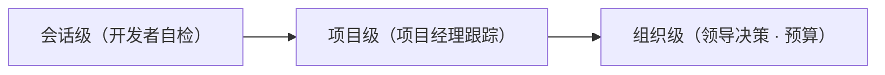

- **会话级**：阶段耗时、迭代轮次、AI 净增行数（业务 / 测试 / 配置三分类）、一次通过率；
- **项目级**：合并后指标（返工率 `reworkRate` / 测试覆盖率 `testCoverage`，由 CI 按 sessionID 回写）；
- **组织级**：费用、Token、提效百分比，自下而上汇聚成决策依据。

### 13.2 核心质量维度

| 指标 | 说明 |
|------|------|
| 一次通过率 `firstPassRate` | 审查一次通过比例，越低说明返工越多 |
| 迭代轮次 `iterationCount` | 阶段反复次数，反映需求 / 设计清晰度 |
| 返工率 `reworkRate` | 合并后由 CI 回写，衡量重做成本 |
| 费用 / Token | 经上游 SDK 获取，daemon 不可达时显示 N/A（而非误导的 $0） |

### 13.3 评测基线驱动规则迭代

第④柱不是一次性配置，而是「实践 → 规约 → 再实践」的资产化闭环：

- 改规则 / 提示词前冻结基线，改后对比，通过率 / 维度分不降才保留（`--fail-on-regression`）；
- 每轮评测发现的弱模型遵循短板，反向沉淀进 `conventions/` 与规则文本；
- 子代理会话不计入统计（避免污染本地统计与组织聚合）。

### 13.4 零侵入部署形态（银行内网可落地）

整套治理能力以「**插件 + 独立 CLI `opencode-sm` + 内网收集服务**」形态交付，对 OpenCode 上游**零修改**：

- 可随上游升级、可随时卸载还原；
- 每台开发机一次性约 2 分钟安装配置；
- 收集服务需在内网部署一次，上报不含代码内容、身份以哈希标识，满足审计与隐私要求。

---

## 附录A：配置参数详解

### AgentHarness 配置

| 参数 | 类型 | 默认值 | 说明 |
|------|------|-------|------|
| `model` | str | "deepseek" | LLM 模型 |
| `provider` | str | "deepseek" | Provider |
| `max_iterations` | int | 10 | 最大迭代次数 |
| `temperature` | float | 0.7 | 温度参数 |
| `system_prompt` | str | None | 系统提示词 |
| `skills_dir` | Path | None | 技能目录 |

### GuardrailConfig 配置

| 参数 | 类型 | 默认值 | 说明 |
|------|------|-------|------|
| `enabled` | bool | True | 是否启用 |
| `layer1_enabled` | bool | True | Layer 1 开关 |
| `layer2_enabled` | bool | False | Layer 2 开关 |
| `min_score` | float | 0.5 | PII 置信度阈值 |
| `judge_endpoint` | str | None | Judge 服务端点 |

---

## 附录B：关键代码索引

| 模块 | 文件路径 | 核心能力 |
|------|---------|---------|
| Agent 入口 | `sdk/harness.py` | 统一入口，初始化所有组件 |
| 执行引擎 | `core/agent_loop.py` | ReAct 循环，工具执行 |
| 技能系统 | `skills/base.py` | 技能定义，文件加载 |
| 工具系统 | `tools/base.py` | 工具抽象，执行器 |
| MCP 集成 | `mcp/tool_wrapper.py` | MCP 工具包装 |
| 安全护栏 | `guardrails/hook.py` | Hook 集成，双层检测 |
| 熔断器 | `core/circuit_breaker.py` | 循环检测，熔断 |
| 成本控制 | `core/cost_controller.py` | Token 预算管理 |

---

## 附录B-2：2026-06/07 新增功能

### B.2.1 文档大小验证（2026-07）

防止过大文档影响处理性能，支持可配置的文档大小检查：

```python
from harness import AgentHarness, HarnessConfig

config = HarnessConfig(
    max_document_size=5 * 1024 * 1024,      # 5MB 单个文档上限
    max_total_documents_size=20 * 1024 * 1024,  # 20MB 总文档上限
    document_size_action="warn",  # warn/error/truncate
)

agent = AgentHarness(config=config)
```

**配置选项**：

| 参数 | 默认值 | 说明 |
|------|--------|------|
| `max_document_size` | 10MB | 单个文档解码后大小限制 |
| `max_total_documents_size` | 20MB | 所有文档总大小限制 |
| `document_size_action` | `warn` | 超限行为：warn/error/truncate |

**行为说明**：

| action | 行为 |
|--------|------|
| `warn` | 记录警告，继续处理 |
| `error` | 抛出 `DocumentTooLargeError` 异常 |
| `truncate` | 截断文档内容 |

### B.2.2 多模态内容支持（2026-06）

支持图片和文档上传，自动转换为 LLM 兼容格式：

**Python SDK**：
```python
from harness import AgentHarness
from harness.types import Message, Content

agent = AgentHarness(model="deepseek")

# 支持多模态消息
result = await agent.run([
    Message(role="user", content=[
        Content(type="text", text="分析这张图片"),
        Content(type="image", source={"type": "base64", "media_type": "image/png", "data": "..."}),
    ])
])
```

**Java SDK**：
```java
import com.harness.types.Message;
import com.harness.types.Content;

List<Content> contents = List.of(
    Content.text("分析这张图片"),
    Content.imageBase64("image/png", imageData)
);

LoopResult result = agent.run(Message.user(contents)).join();
```

**兼容性处理**：
- OpenAI 兼容 API：自动将 `image` 内容转换为 `image_url` 格式
- 文档类型：自动提取文本内容或返回描述

### B.2.3 Goal-Driven 执行（2026-06）

让 Agent 自主运行直到目标达成，无需手动逐轮提示：

```python
from harness import AgentHarness, GoalStatus
from harness.loop import GoalConfig, GoalLoop

agent = AgentHarness(model="deepseek")

# 方式 1：使用 run_goal()
result = await agent.run_goal("修复所有类型错误")

# 方式 2：使用 GoalLoop 精细控制
config = GoalConfig(
    goal="测试覆盖率达到 80%",
    max_iterations=50,
    verifier="auto",  # 自动验证或自定义验证函数
)

goal_loop = GoalLoop(agent, config)
result = await goal_loop.run()

if result.status == GoalStatus.ACHIEVED:
    print(f"目标达成，共 {result.total_iterations} 轮迭代")
```

**核心组件**：

| 组件 | 说明 |
|------|------|
| `GoalConfig` | 目标配置（目标描述、最大迭代、验证方式） |
| `GoalVerifier` | 无状态验证器，支持自定义验证逻辑 |
| `GoalLoop` | 目标驱动执行循环 |
| `ParallelGoalExecutor` | 并行多目标执行 |

### B.2.4 渐进式技能加载（2026-06）

支持技能延迟加载，减少启动时间：

```python
from harness import AgentHarness
from harness.skills import ProgressiveSkillLoader

# 按需加载技能
loader = ProgressiveSkillLoader(
    skills_dir=Path("./skills"),
    lazy=True,  # 延迟加载
)

agent = AgentHarness(
    model="deepseek",
    skill_loader=loader,
)

# 技能在首次匹配时才加载
```

### B.2.5 内网浏览器支持（2026-06）

专为银行内网环境设计，使用系统已安装的浏览器：

```python
from harness.tools.browser import BrowserManager

# 自动检测系统已安装的浏览器
manager = BrowserManager(
    browser_type="msedge",  # 推荐：Windows 企业环境自带
    headless=False,  # 显示浏览器窗口，支持审计
    auto_screenshot=True,  # 每次操作后自动截图
)

# 支持的浏览器类型
browsers = manager.get_available_browsers()
# ["msedge", "chrome", "chromium", "firefox"]
```

**特性**：
- 无需 `playwright install`，使用系统已安装浏览器
- 独立窗口模式：用户可实时观看 Agent 操作
- 审计友好：自动截图功能

### B.2.6 实时监控与可观测性 UI（2026-06）

客户端内置实时监控面板：

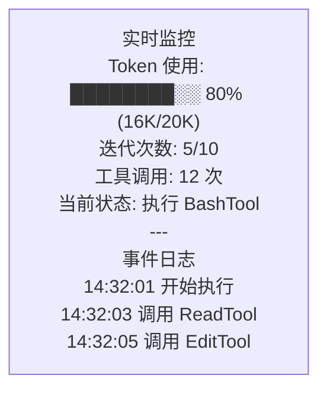

**配置**：
```python
config = HarnessConfig(
    observability=ObservabilityConfig(
        enabled=True,
        otel_endpoint="http://otel-collector:4317",
        export_metrics=True,
    ),
)
```

---

## 附录C：知识图谱工具（code-review-graph）

Harness 项目集成了 **code-review-graph** MCP 服务器，提供代码结构分析和智能代码审查能力。

### 核心功能

| 功能 | 工具 | 说明 |
|------|------|------|
| **结构化搜索** | `semantic_search_nodes` | 基于图谱的语义搜索，比 Grep 更高效 |
| **影响分析** | `get_impact_radius` | 理解代码变更的影响范围（blast radius） |
| **架构洞察** | `get_architecture_overview` | 自动检测代码社区和关键节点 |
| **智能审查** | `detect_changes` | 风险评分和优先级建议 |
| **执行流分析** | `list_flows` | 发现关键执行路径 |
| **高连接节点** | `get_hub_nodes` | 识别架构热点，修改需谨慎 |

### Graph 分析结果

| 指标 | 数值 |
|------|------|
| 总节点数 | 8,368 |
| 总边数 | 47,115 |
| 文件数 | 588 |
| 测试节点 | 1,263 |
| 类 | 1,089 |
| 函数 | 5,428 |
| TESTED_BY 边 | 6,714 |

**边类型分布**：
- CALLS: 28,107（函数调用）
- CONTAINS: 8,029（包含关系）
- IMPORTS_FROM: 3,665（导入依赖）
- INHERITS: 273（继承关系）
- TESTED_BY: 6,714（测试覆盖）

### 高连接节点（需谨慎修改）

| 节点 | 连接数 | 说明 |
|------|--------|------|
| `AgentLoop._run_impl` | 128 | ReAct 循环核心 |
| `ToolResult` | 79 | 工具结果类型 |
| `get_theme()` | 77 | 主题获取函数 |
| `ChatPanel._setup_ui` | 172 | 客户端 UI 初始化 |

### 使用示例

```python
# 在 OpenCode 中使用 graph 工具
# 1. 查找函数的调用者
query_graph(pattern="callers_of", target="AgentHarness.run")

# 2. 分析变更影响
detect_changes(base="HEAD~5")

# 3. 查找测试覆盖
query_graph(pattern="tests_for", target="AgentLoop")
```

---

*文档版本：v1.2*
*最后更新：2026-07-05*
*对应规划书：《银行大模型本地化落地与AI转型全景规划书_修订版.md》*
*项目代码：`/data/harness/`*
*Graph 分析：基于 code-review-graph MCP 服务器*
*新增功能：浏览器自动化、文档大小验证、多模态支持、Goal-Driven 执行*
