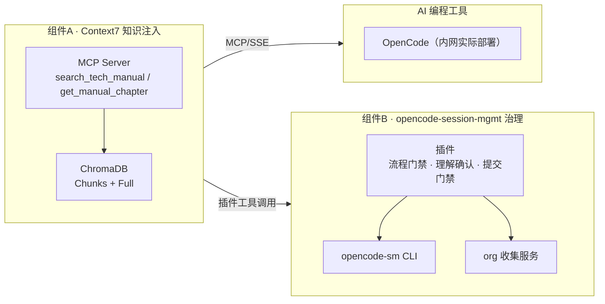
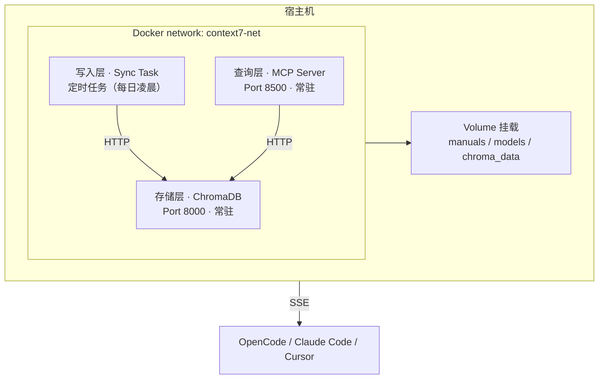
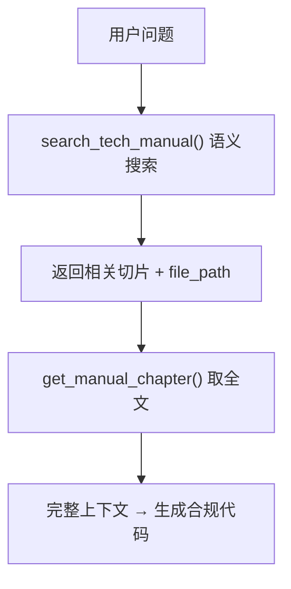
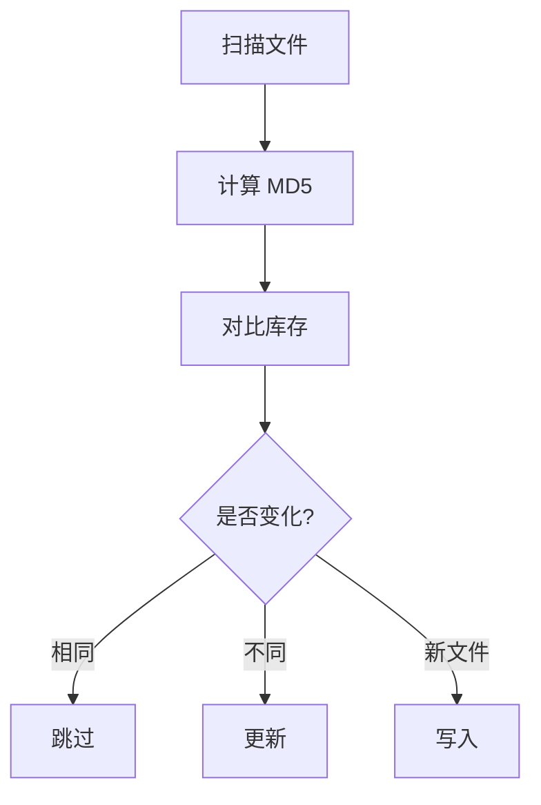
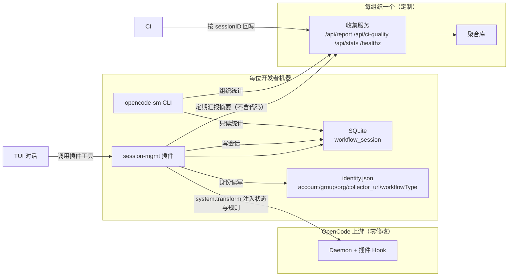
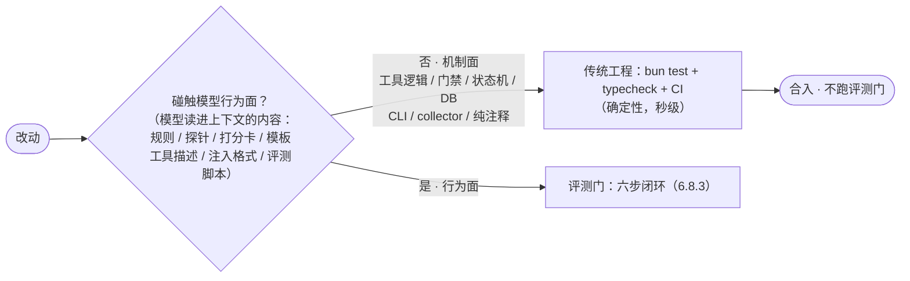

# 银行研发智能助手技术说明书

> **本文面向谁：** 立项评审的领导、落地的技术负责人、接入的开发者。主线回答五个问题：为什么需要（一）→ 方案是什么（二）→ 知识库如何落地（三）→ 客户端如何接入与使用（四、五）→ 全过程如何管理、效益如何证明（六、七）。
>
> **阅读说明**：核心组件代码已落地为独立仓库，本文只讲架构、接口契约与运行要点，不重复粘贴源码。代码位置见「八、代码仓库指引」。

---

## 一、为什么：AI 编程范式与银行研发的根本矛盾

### 1.1 变化：开发者从"写代码"变成"提需求"

AI 原生编程客户端（业内以 Claude Code 为能力标杆，兼容 MCP 的同类产品还包括 OpenCode、Cursor）把软件开发从"程序员逐行手写"推进到"自然语言描述目标、AI 自主执行"的阶段。它不是传统 IDE 里的"补全助手"，而是能跨文件完成多步骤任务的**执行者**：

| 维度 | 传统 IDE | AI 编程客户端 |
|------|----------|------------|
| AI 角色 | 辅助者（补全、高亮） | 执行者（理解意图并自主执行） |
| 交互方式 | 菜单与快捷键 | 自然语言对话 |
| 任务范围 | 单文件、单操作 | 跨文件、多步骤 |
| 典型诉求 | "补全这个函数" | "把单利改复利，保留兼容" |

> **能力口径说明**：本文以 Claude Code 描述能力口径；我行内网实际部署的客户端是 **OpenCode**，Claude Code / Cursor 作为能力对照。接入方式见第四章。

对开发流程的影响是结构性的。传统流程是一条刚性流水线，需求、设计、编码、测试、修复依次进行，把工期拉长到十个工作日量级；AI 时代压缩成"AI 理解并执行 + 人类审核"两个环节，单功能可以做到一天量级。规划书给出的提效预期与此一致：科技部研发综合提效 **35% 以上**，信贷经理合稿时间压降 **70%**，审批流转天数由 5 天缩至 1 天。

范式之变不是"打字更快"，而是角色转变：写代码变成描述需求，试错成本大幅下降，知识断层被填平——初级开发者通过 AI 获得资深者的经验。

### 1.2 银行能用"通用的"客户端吗：能力边界

通用模型强的领域，正好也是公开知识多的领域：通用编程语言、主流开源框架、标准协议与 API。银行真正关心的恰恰是它们没有的部分:

- **企业内部框架**：银行核心系统的接口定义
- **私有库与定制组件**：行内自研的 XCore 类框架
- **业务特定规范**：行内编码规范、安全守则
- **内网专属配置**：数据库连接参数、服务地址

**直接后果是"猜"**：模型遇到不熟悉的内部框架时，不会承认"我不知道"，而是用训练数据里最相近的通用知识去推断。这场错误在 Harness 的项目记录中有实例：

> 修复"代理 API 不支持 tool role"问题时，AI 凭 OpenAI API 的惯例，假设 Anthropic API 也有 `role:"tool"` 角色，实际并没有，三次修改才找到正确写法。根因不是能力不足，而是**不查文档、凭假设**。

如果这样的"三次返工"发生在银行核心系统上，会被放大为合规与生产风险。这正是银行不能把通用客户端直接搬进内网的原因。

### 1.3 目标：三大差距与本文骨架

把"通用 AI 变成银行研发智能助手"这件事，拆成三个可回答的问题，正好是本文的骨架：

| 问题的本质 | 回答的问题 | 承接组件 |
|-----------|------------|-------------------|
| 查得准 | AI 认不认识行内规范？会不会凭空猜？ | Context7 内网知识库（三章） |
| 管得住 | 流程走没走完？代码人能否接手？提效能否证明？ | opencode-session-mgmt 治理（六、七章） |
| 用得来 | 内网用哪个客户端？怎么接入？ | 客户端接入与使用（四章） |

### 1.4 项目背景：为什么是"研发智能助手"

规划书将这条线划在 **Run（卓越运营）领域**：内网部署离线编程大模型，智能助手自动扫描历史代码、生成重构建议，引导"研发智能助手与老旧系统跨代重构"。L1 阶段验证内网单节点算力与安全合规边界，L2 阶段封装为行内标准接口、固化为全行提效工具。

本文对应的，正是这个"研发智能助手"从理论到落地的那张技术地图：**让它认识内部规范（Context7）、让它接进内网（客户端）、让它产出可控（全过程治理）、让它能证明效益（ROI 验证）**。

---

## 二、方案：双组件 + 客户端的总体架构

### 2.1 三个组件，各回答一个问题

研发智能助手不是单一服务，而是两层能力叠加在 AI 编程客户端上的组合体：

| 组件 | 角色 | 回答的核心问题 | 对应章节 |
|------|------|---------------|---------|
| Context7 知识库（MCP 服务） | **查得准** | AI 认不认识内部规范？会不会凭通用知识猜测 | 三章（落地） |
| opencode-session-mgmt 三件套 | **管得住** | 流程走没走完？代码人能否接管？提效能不能证明 | 六、七章 |
| AI 编程工具（OpenCode 等） | **用得来** | 内网用哪个客户端？怎么接入？ | 四章 |


### 2.2 技术选型与核心特性

| 技术选型 | 选择 | 原因 |
|----------|------|------|
| 协议 | MCP (Model Context Protocol) | 客户端原生支持、标准化的工具接口 |
| 向量数据库 | ChromaDB | 轻量、本地部署、Python 原生 |
| Embedding 模型 | bge-small-zh-v1.5 | 中文优化、CPU 可跑、体积小 |
| 传输 | SSE（Server-Sent Events） | 流式响应、防火墙友好 |
| 容器化 | Native Docker Run | 避开 Compose 编排依赖，行为确定 |
| 客户端 | **OpenCode**（内网实际部署）+ Claude Code / Cursor（对照） | 开源私有化、双组件体系加持 |
| 治理组件 | **opencode-session-mgmt**（插件+CLI+收集服务） | 补齐流程、理解与度量 |

**核心特性一览：**

| 特性 | 说明 |
|------|------|
| 增量同步 | MD5 变更检测，跳过未变化文件，少耗算力 |
| 智能切片 | 按文件类型选择最优切片策略 |
| 读写分离 | 同步（一次性）与查询（常驻）容器独立 |
| 宿主机零污染 | 所有依赖在容器内，无需装 Python 环境 |
| 双工具接口 | 语义搜索 + 全文读取，"先定位再通读" |

### 2.3 能力分层：从"查得准"到"能量化"

四个由浅入深的能力，正好对应研发智能助手要跨过的四道坎：

| 能力 | 工具/组件 | 解决的问题 |
|------|----------|-----------|
| 查规范（知识） | `search_tech_manual` / `get_manual_chapter` | 犯错源于"不认识内部框架" |
| 走流程（过程） | 插件工作流门禁 | 需求被逐个走完不遗漏 |
| 看得到底（理解） | comprehension + 设计推导 | 人能够真正接管代码 |
| 能量化（度量） | `opencode-sm stats` + CI 回写 | 证明 ROI、支撑预算决策 |

---
## 三、落地：Context7 内网知识库（服务端）

> **本章定位**：Context7 是"查得准"的载体。本章描述它的架构、接口契约与运行要点；切片算法、同步任务、容器编排等实现代码在 context7 仓库（见八章）。

### 3.1 三层容器，读写分离

Context7 用三个容器承载三件事：存文档、写向量、查结果。



| 层级 | 容器 | 职责 | 运行模式 |
|------|------|------|----------|
| 存储层 | ChromaDB | 向量与文档存储 | 常驻 |
| 写入层 | Sync Task | 解析文档、向量化、写入 | 每日定时 |
| 查询层 | MCP Server | 响应客户端查询 | 常驻 |

两个设计要点：

- **读写分离**：向量计算耗时长，与高频查询的容器资源隔离，查询不被同步拖慢。
- **双集合**：切片库（`internal_tech_chunks`，供语义搜索）与全文库（`internal_full_docs`，供按文件名精准读取）并存——既保证语义召回，又保留完整上下文。

### 3.2 接口：两个工具，"先定位再通读"

Context7 通过 MCP 暴露两个工具，协同完成"发现相关文档 → 拿全文档"两步走：

| 工具 | 参数 | 返回 | 适用场景 |
|------|------|------|---------|
| `search_tech_manual(query)` | 自然语言问题 | 至多 3 条相关切片（file_path / 章节 / 更新日期 / 正文） | 模糊定位 |
| `get_manual_chapter(file_path)` | 上一步的 file_path | 完整正文（含 MD5 前 8 位校验） | 精准取全文 |

**返回示例（`search_tech_manual`）：**

```
📍 [file_path]: 核心系统接口规范.md  📌 [章节]: 账户查询接口
📅 更新时间: 2026-06-15
📄 片段正文:
## 账户查询接口
**请求地址**：`/api/v1/account/query`  **请求方式**：POST
```

**调用链：**



### 3.3 切片策略：不同的文件，不同切法

| 文件类型 | 策略 | 说明 |
|----------|------|------|
| Markdown (.md) | 按标题层级（#~######） | 保住章节语义 |
| 代码文件 (.py/.java/.go/.sql/.sh) | 按函数/类/语句 | 保持代码块完整 |
| PDF / DOCX | 段落 + Token 上限（默认 512） | 无明显结构时按语义分段 |

**Token 估算**（中英混合）：中文约 1.5 字/token，英文约 4 字/token。估算是切片与上下文规划的公共基础。

### 3.4 增量同步：只处理变化的部分

技术手册变化不频繁，全量重算会浪费算力。方案以 **MD5** 做变更检测，只处理变化或新增的文件：



同步任务返回统计报告（总文件数 / 更新 / 跳过 / 失败），由 crontab 在**每日凌晨 2 点**触发（`0 2 * * *`）。

### 3.5 部署与资源

| 容器 | 镜像 | 职责 | 运行模式 | 资源 |
|------|------|------|----------|------|
| internal-chromadb | chromadb/chroma:latest | 向量存储 | 常驻 | 默认 |
| mcp-api-service | mcp-server:latest | MCP 查询 | 常驻 | 2 核 / 2GB |
| tmp-mcp-syncer | sync-task:latest | 同步 | 一次性 | - |

**运行环境变量：** `CHROMA_HOST`（ChromaDB 服务地址）、`MODEL_PATH`（Embedding 模型路径，默认 `/app/models`）。

### 3.6 两点边界：与算力层的分工、与编排的解耦

Context7 **只做知识检索**——文档向量化用小体量 Embedding 模型，在 CPU 上即可运行；**不做大模型推理**。推理由接入网关路由到大模型集群（DeepSeek-V4-Flash / Qwen3.6-27B）。

内网防火墙严格、网络栈复杂，因此采用**原生 docker run 原子化部署**，不引入 Docker Compose 等编排层：

| 层面 | 方式 | 说明 |
|------|------|------|
| 启动 | Native Docker run | Bash 脚本部署，行为确定 |
| GPU 绑定 | 显式 `--gpus` | 直接绑物理 GPU，不经编排层 |
| 网络 | 显式 IP/容器名 | 不依赖 overlay 自动发现 |
| 故障隔离 | 独立生命周期 | 单容器故障不影响其他服务 |

这条解耦原则同时答了运维一个现实问题：**推理容器故障只影响推理，不影响知识检索**；反之亦然。

---
## 四、怎么用：客户端接入与使用引导

### 4.1 首选 OpenCode：内网实际部署的客户端

OpenCode 是开源 AI 编程客户端，支持内网私有化部署、MCP 与插件体系。**配置 MCP 服务器**（写入 `~/.config/opencode/opencode.json` 或项目级 `.opencode/opencode.json`）：

```jsonc
{
  "mcpServers": {
    "internal-docs": {
      "type": "sse",
      "url": "http://10.x.x.x:8500/sse"
    }
  }
}
```

**启用流程治理插件**（对应六章治理，本地路径或内网 npm 源包名）：

```jsonc
{
  "plugin": [
    "opencode-session-mgmt/packages/plugin"
  ]
}
```

**验证**：启动后，TUI 会话里应能直接调用 `search_tech_manual` / `get_manual_chapter`，以及治理工具 `workflow_advance` / `comprehension_confirm` / `review_submit`。

### 4.2 对照接入：Claude Code 与 Cursor

**Claude Code**（能力对照）：

```bash
claude mcp add --transport sse internal-docs -- http://10.x.x.x:8500/sse
claude mcp list   # 应看到 internal-docs (SSE)
```

使用中，"根据行内规范写账户查询接口"这类需求会触发的链路：`search_tech_manual("账户查询接口")` → 返回相关切片 → `get_manual_chapter("核心系统接口规范.md")` → 生成符合行内规范的代码。

**Cursor**：在 Settings → MCP Servers 中新增，Name 填 `internal-docs`，Type 选 SSE，URL 填 `http://10.x.x.x:8500/sse`。

**内网共性注意**：IP 必须内网可达，端口 8500 放行，SSE 需要长连接。

### 4.3 行为引导：工具存在 ≠ 工具会被用

部署了 MCP，客户端不会"自动"用它。需要一份每次对话都会注入的引导文件，告诉 AI 什么时候必须先查规范、什么时候不许猜。Claude Code 读 `CLAUDE.md`，OpenCode 读 `AGENTS.md`——**同一套规则，两份文件，内容通用**。

推荐骨架（以 CLAUDE.md 为例）：

```markdown
# 项目说明
本项目使用我行内部框架开发，涉及核心系统接口、内网定制库。

## ⚠️ 重要原则：银行内部框架开发
**涉及银行内部框架的任何开发，必须先查询内部规范！**

### 强制查询场景
开发新接口 → "接口规范""API标准"
使用内部库 → 库名称（如 "XCore"）
数据库操作 → "数据库规范""SQL标准"
重构老旧系统 → 系统名 + "架构文档"
安全相关 → "安全守则""加密规范"

### 禁止行为
- ❌ 禁止凭经验猜测内部框架行为
- ❌ 禁止假设内部 API 与开源框架相同
- ❌ 禁止在未查文档时使用内部库

### 工具使用流程
收到任务 → 是否涉及内部框架？
  是 → search_tech_manual("关键词") → get_manual_chapter() → 按规范写码
  否 → 直接开发
```

**配置位置与取舍：**

| 配置方式 | 优点 | 缺点 |
|----------|------|------|
| CLAUDE.md / AGENTS.md | 跟随仓库、团队共享 | 每个项目都要配 |
| 全局注入文件 | 一次生效 | 影响所有项目 |
| 手动提醒 | 灵活 | 依赖人，易忘 |

推荐做法：把引导文件纳入版本控制，团队共维护，随内部框架演进持续更新。

### 4.4 三个典型使用场景

**场景一，日常规范查询**——"我们行数据库连接规范是什么？" `search` 命中「数据库连接规范.md」的连接参数章节，`get_manual_chapter` 取全文，客户端整理出主/从库地址、端口、连接池建议。

**场景二，老旧系统重构**——"重构 AccountService，用最新行内规范"。客户端先查 AccountService 相关的服务层规范，再按规范补 `@Transactional` 注解、行内日志格式、行内异常体系。

**场景三，新框架上手**——新员工问"XCore 框架怎么用"，客户端检索框架手册，返回 XController / XService / XRepository 三个核心组件及合规示例，等于把资深者的经验交给新人。
## 五、扩展能力：Harness Client 集成场景

> **本章导读**：前两章讲的是"读规范、写代码"。更广的场景里，研发智能助手还能联动浏览器自动化、多模态、知识图谱与目标驱动（面向 OA 操作、数据采集、代码审查等），由 Harness Client 提供。

### 5.1 浏览器自动化

打开客户端侧边栏"浏览器"，即可让 Agent 在独立浏览器窗口中操作，内置 7 个工具：`navigate`、`click`、`type`、`extract`、`screenshot`、`wait`、`close`。可在行内 OA、报表系统上做数据采集、表单填写、审批提交。

| 配置 | 默认 | 说明 |
|------|------|------|
| 浏览器类型 | msedge | Edge / Chrome / Chromium / Firefox |
| 无头模式 | 关闭 | 后台运行不弹窗 |
| 自动截图 | 开启 | 每次操作截图（审计留痕） |
| 超时 | 30000ms | 页面加载超时 |

### 5.2 多模态与附件

支持图片（PNG/JPEG/GIF/WebP）、文档（PDF/Word/Excel/PPT）、代码文本上传。Agent 可读取截图与报表内容，把"看附件"变成对话的一环。

### 5.3 知识图谱

集成 **code-review-graph** MCP 服务器，基于代码图谱做结构化搜索、变更影响分析、架构洞察与风险排序。典型用途：审查中定位影响范围、重构前标记高风险节点、评估测试覆盖缺口。

### 5.4 Goal-Driven 执行模式

支持给 Agent 一个目标（"修复所有类型错误"），它自主迭代直到完成，期间在监控面板实时可见：Token 用量、迭代次数、工具调用次数、事件日志。释放了"一步一步盯着"的精力，让 AI 从问答工具进一步走向执行者。

---

## 六、全过程治理：让 AI 产出"可控、可接管"

### 6.1 为什么需要治理

第三、四章解决了"认不认识规范"，但真正兑现效率与质量承诺，还差三个深层次问题：

| 层次 | 问题 | 本质 |
|------|------|------|
| 过程管理 | 多需求并行，会话间切换，流程如何走完 | 效率 |
| 理解保障 | AI 写了代码，人是否真看懂？三个月后谁能维护？ | **控制权** |
| 效能度量 | AI 到底提效多少？Token 花得值不值？ | 可证明性 |

这两块痛点，正好对应规划书"科技自我造血"落地时被问得最多的两个问题：**退出风险**（AI 停了，代码人接不接得住）与 **ROI 验证**（Token 投下去值不值）。opencode-session-mgmt 用「插件 + CLI + 收集服务」三件套补齐，全程不修改上游 OpenCode / Claude Code 代码。

### 6.2 三件套架构



| 组件 | 职责 | 部署位置 |
|------|------|----------|
| 插件 | 按工作流定义跟踪阶段（sdlc 五阶段 / reqdoc 五阶段）、审查门禁、提交门禁、理解确认、重复编辑检测 | 每台机器 `config.plugin` 加载 |
| `opencode-sm` CLI | 会话管理、`init` 身份、`stats` 统计 | 每台机器 |
| org 收集服务 | 会话摘要、CI 质量回写、组/组织统计 | 每组织内网一个 |

**三个要点**：插件与 Context7 是两个正交插件（`{ "plugin": ["internal-docs-mcp", "opencode-session-mgmt/packages/plugin"] }`）；开发者首次用执行 `opencode-sm init` 五问（账号 / 组 / 组织 / 地址 / 工作流类型，缺省 sdlc），身份存 `identity.json`；上报 payload 只含时间戳、Token、质量指标三类，**不含代码与文件路径**，满足内网合规。

**规则如何进上下文（阶段化注入）**：工作流规则按**定义驱动**组织——插件内置两套工作流定义（`sdlc` 开发流程 / `reqdoc` 需求书），init 第五问选主要工作流类型，每条规则带阶段归属；每轮 system prompt 只注入 **global + 当前进行中阶段**的规则（`rulesForStage`），当前状态以**一行状态条**展示，替代冗长 JSON。全部阶段完成后不再注入常规规则，改为注入**专用完成块**：提交（尚未则 `commit_gate_check`）→ 引导 `/new` 开新需求（保持统计隔离）→ `workflow_revisit` 改本需求。

### 6.3 工作流模型：完成门控，而非严格流水线

真实研发是迭代的。方案采用「自由迭代区 + 提交硬门禁」：需求 / 设计 / 编码 / 测试可任意反复，**唯一硬约束是提交时全部阶段已审批**，而审查是唯一 AI 不能自行推进的环节。

回退走 `workflow_revisit`：把目标阶段回退到进行中（revision++）的同时，**级联回退其后所有已 approved 的下游阶段**——下游结论建立在被回退阶段之上，须重走。阶段定义按工作流类型分两套：`sdlc` 为需求/设计/编码/测试/审查；`reqdoc` 为 goal/rules/edge/prd/review（需求书工作流，见 6.9）。**提交门禁只有 sdlc 启用**（`hasCommitGate`），reqdoc 定稿无 git 门禁。

### 6.4 阶段推进与理解保障（人看懂）

阶段推进遵循"AI 提议 + 开发者确认"：转换的唯一来源是开发者的明确确认，AI 只能提建议。最关键的一环是**逐段理解**——AI 把每次变更拆成片段，为每段输出自然语言 explain（做了什么、为什么、放弃了什么方案、有什么风险），开发者逐段处置：

| 行为 | 工具 | 说明 |
|------|------|------|
| 登记 | `comprehension_add` | 新增一个片段/要点 + 自然语言解释 |
| 接受 | `comprehension_confirm` | 确认理解，通过 |
| 拒绝 | `comprehension_reject` + 意见 | 附意见重写 |
| 重写 | `comprehension_rewrite` | 待审，rewrites++ |
| 人工处理 | `comprehension_manual` | 开发者自己改/删 |
| 追问 | `comprehension_ask` | 反问"为什么"。问答留痕 |

审查通过（`review_submit`）要求所有片段落终态，不允许悬空。防批量走过场：`comprehension_confirm` **单次只认一个片段**（传多个直接报错）。重复编辑不设硬上限——插件用内存短记忆做 stuck 检测（同文件连续 3 次相同操作、或短时高频编辑），命中只注入警告、不拒绝生成，避免对正常迭代误伤。这些 `ComprehensionRecord[]` 本身就是知识库——三个月后接手的人先读 explain 理解意图，再看代码，从根上回答"AI 停了代码谁能维护"。

### 6.5 两条硬拦截：提交门禁与手工修改锁定

**提交门禁**：插件在 `tool.execute.before` 钩子识别 bash 工具中的 `git commit`，工作流尚有未通过阶段时抛错阻断——即使大模型不守规矩也被拦，硬约束不依赖 LLM 自觉。提交前可调 `commit_gate_check` 查看未完成阶段清单；特殊紧急时可用 `commit_force_unlock` 放行一次，但须开发者确认并填原因，这条"绕过审查"写入一次性授权、留痕后随汇报上行。仅 sdlc 启用（`hasCommitGate=true`），reqdoc 定稿无 git 门禁。

**手工修改锁定（open-ide 已合并进本工程）**：开发者要手工改代码时，AI 先调 `open_ide`（必须带 `file` 参数）锁定该文件——锁定期间 AI 可继续其它任务，但对被锁文件的 write/edit/apply_patch 会被服务端**硬拦截**，防止 AI 覆盖手工改动；解锁须开发者明确确认后 `unlock_file`（多锁逐个确认），并重新读取最新内容。锁持久化进 SQLite `file_lock` 表，daemon 重启自动恢复；SDLC 完结时完成态注入块会提示开发者逐个解锁。这一层直接服务"人接管"：AI 与人在同一代码上协同，各改各的互不覆盖。

### 6.6 效能度量：会话内与合并后两层

会话内由插件自动记录：Token/费用、阶段耗时、需求迭代数、编码-测试循环、一次通过率、AI 净增行数（业务/测试/配置三分类）。**Token/费用需常驻 daemon**（`opencode serve --port <端口>` 常驻本地服务，并设 `OPENCODE_SM_SERVER` 指向它），daemon 不可达时相关统计显示 N/A。合并后由 CI 回写：返工率、AI 参与模块增量覆盖率。

再叠加**基线预期**：`workflow_baseline` 录入基线预估工时（须开发者确认），会话结束按 `（预估工时 − 实际周期）/ 预估工时` 算 **AI 提效百分比**，形成研发提效曲线——这正是规划书 35% 的实测参照。无基线的会话提效率显示 N/A。

| 统计层级 | 命令 | 用途 |
|----------|------|------|
| 会话级 | `opencode-sm stats <id>` | 开发者自检 |
| 项目级 | `opencode-sm stats --project` | 项目经理跟踪 |
| 组级 | `opencode-sm stats --group "前端组"` | 组长汇报、对比 |
| 组织级 | `opencode-sm stats --org` | 领导汇报、预算 |

`stats` 额外支持 `--workflow <sdlc\|reqdoc>`、`--period <N>d`、`--json` 过滤与导出。会话/项目级统计本机组合插件库 + 上游 SDK；组/组织级由收集服务聚合（`GET /api/stats`）。

### 6.7 三件套落地：安装、接口与部署

三件套均为内网制品，源码与构建见 **opencode-session-mgmt 仓库（见八章）**，随行内制品 npm 源/内部仓库分发，不依赖公网。

**安装与接入（插件 + CLI）：**

| 步骤 | 操作 | 说明 |
|------|------|------|
| 1 启用插件 | `config.plugin` 加 `"./opencode-session-mgmt/packages/plugin"`（相对 opencode.json 所在目录，异地克隆用绝对路径） | 与 Context7 正交，可共存；Windows 路径用正斜杠或双反斜杠（JSON 里单反斜杠是转义符） |
| 2 初始化身份 | `opencode-sm init` 五问 | 账号 / 组 / 组织 / `collector_url` / 工作流类型（缺省 sdlc），写入全局 `~/.config/opencode/session-mgmt/identity.json` |
| 3 会话管理 | `opencode-sm list` / `opencode-sm stats` / `opencode-sm tag` / `opencode-sm workflow` | 列/统计/打标/查看工作流状态；会话创建恢复用上游原生命令（`opencode -c` / `opencode -s <id>`），本项目不重复包装 |
| 4 换工作流类型 | `opencode-sm workflow-type set sdlc\|reqdoc` | 轻量改角色（比重跑 init 少填四问，只影响此后新会话，历史归属不追溯） |

**org 收集服务（HTTP 接口契约）：**

| 路由 | 方法 | 职责 |
|------|------|------|
| `/api/report` | POST | 接收会话摘要（阶段时间戳、Token/费用、质量指标；**不含代码与文件路径**） |
| `/api/ci-quality` | POST | 接收 CI 按 `sessionID` 回写的合并后质量（返工率、增量覆盖率） |
| `/api/stats` | GET | 组/组织统计查询 |
| `/healthz` | GET | 存活探测 |

上报内容示例（用于设计存储与网关配置的边界参考；`workflow` 为阶段投影摘要，不含代码/文件路径/explanation 正文）：

```jsonc
{
  "sessionID": "s-20260809-001",
  "account": "xxx@bank", "group": "前端组", "org": "科技部",   // init 身份快照（扁平字段）
  "workflow": {                                                // 工作流摘要：类型 + 阶段投影 + 门禁 + 质量 + 基线
    "type": "sdlc",
    "stages": { "requirements": { "status": "approved", "revision": 1, "transitions": [] } },
    "commit": { "status": "allowed", "blocked_by": [] },
    "quality": { "firstPassRate": 0.85, "lines": { "business": 300, "test": 120, "config": 40 } },
    "baseline": { "estimatedHours": 8, "setAt": 1754760000000 }
  },
  "cost": 12.8, "tokensInput": 64000, "tokensOutput": 64000,
  "reportedAt": 1754763600000
}
```

**部署要点：**

1. **接入层**：收集服务挂在内网网关后，注册上述 4 路由并启用鉴权（mTLS / 网关侧 token / 网络 ACL 三者任一），鉴权失败 401/403 会触发插件侧"核对 collector_url"提示；TLS 在网关侧终止，后端明文内网通信。网关鉴权所得身份**不得覆盖**客户端在 `identity.json` 自报的 account/group/org。
2. **网络**：对 `POST /api/report` 不得短超时——插件离线期间积压缓冲（同一会话只保留最新一条），恢复后按序补推，允许突发批量；必须忠实透传上游状态码。汇报节奏：插件启动即推一次、之后每 5 分钟补推。
3. **身份口径**：身份是客户端自报快照（`init` 五问），历史统计归属不追溯；`collector_url` 可不配置，退化为仅本机统计；**account/group/org/collector_url 四字段任一为空时汇报被静默跳过**（组/组织统计归零的常见根因，手工漏填 org 最多）。
4. **规模**：单条几 KB、单组织每日千级请求，SQLite 即可承载，无需重型存储。
5. **Token/费用统计前提**：需常驻 `opencode serve`（只绑 127.0.0.1）并设 `OPENCODE_SM_SERVER` 指向，否则 cost/tokens 显示 N/A。

### 6.8 评测驱动规则迭代：让治理规则本身可演进、可验证

三件套治理的是"AI 的产出"——门禁、审查、度量把产出框在可控范围内。但还有一层没人看住：**治理规则本身**。流程门禁的判定词、阶段推进的提示词、工具的描述与参数名、提交门禁的规则文本——它们同样是"模型直接读进上下文、然后照着执行"的行为规格，会随措辞漂移、会因某次改动悄悄退化。谁在改版时验证它们没坏？

本节引入研发智能助手落地这套新范式的关键一环：**评测驱动规则迭代**——用真实模型端点批量跑场景、凭通过率数据而非直觉来改规则。这是"深度整合 AI 应用"（行为由模型读了规则文本后怎么执行决定，而非由编译器语义决定）的通用开发范式，本说明书作为该范式的完整落地实例。

#### 6.8.1 两个面，两套验证（行为面 vs 机制面）

不是所有改动都需要跑评测门。按"改的东西会不会被模型读进上下文"一刀切：

| 类别 | 走什么验证 | 范围 |
|------|-----------|------|
| **机制面** | `bun test` + `typecheck` + CI | 工具逻辑 / 门禁 / 状态机 / DB / CLI / collector——仍是确定性软件工程，**且更要守住**（模型行为不可编译验证，机制层更依赖单测兜底） |
| **行为面** | 评测门（本小节） | 规则文本 / 探针清单 / 打分卡 / 模板 / 工具描述 / 注入格式 / 评测脚本自身——模型读进上下文的内容 |

区别的本质：传统测试断言"代码做对没"（编译器保证确定性），这里断言"模型会不会照规则调工具、产出质量达不达标"（模型遵循度是概率性的）。因此唯一可信的验证是拿**真实模型端点**批量跑场景，对比改前/改后通过率。

#### 6.8.2 改动分级：哪些改动才跑评测门



#### 6.8.3 六步闭环：一次只改一处

改任何注入规则/提示词前，凭数据而非直觉：

1. **写场景集**：每个关键规则一个场景，`userTurn` 是对应触发语，判定断言"模型应调用哪个工具 + 哪些参数谓词"（如 approve 时 `developer_confirmed` 必须 true）。状态夹具直接构造（不跑真实工具循环），隔离"规则遵循度"与"工具机制"两个变量。
2. **冻结基线**：跑 `--variant baseline` 记录通过率快照（结果 json 入库 + 冻结旧规则全文，可复现旧注入格式）；`--dry` 只打印注入片段与判定期望、不调模型，先验证渲染。
3. **改一处规则/脚本**：一次只改一处，避免多变量无法归因。
4. **对比**：跑 `--variant new` 自动对比基线，通过率不降才保留改动。
5. **逐个归因失败场景**：按「规则措辞 / 判定口径 / 场景二义性」三类归因——优先调脚本适配与判定口径，其次修场景，**规则文本保持简洁**（弱模型对复杂措辞极敏感，为提升某模型把规则写细实测反而伤害弱模型）。
6. **`--repeat N` 多次取通过率**（聚合按运行次数统计），防单次抖动掩盖趋势。

#### 6.8.4 关键纪律

- **判定一律 rule-based，不用 LLM judge**：避免"用模型判断模型、判卷口径漂移"。行为类断言 `tool` / `no_tool` / `text`（所有工作流通用）；产出类断言 `score` / `render`（需产出度量的工作流，见下节质量飞轮）。
- **判定口径适配模型能力**：`exactCount`（恰 N 次）对推理模型过苛，可放宽为「≥1 次 + `distinctArg` 不重复」，反映能力基线而非单次抖动。
- **userTurn 须与规则前提一致且无二义性**：场景输入要先满足规则触发条件再期望动作（曾有用未指明文件的发言却期望模型杜撰文件调 `open_ide`，两模型均失败）；发言词不要同时像阶段名又像要点 id。
- **基线纪律**：baseline 与 new 共用同一夹具；结果 json 入库可重跑对比。
- **多模型验证防过拟合**：本地弱模型 + 远端强模型各跑一遍——弱模型对规则措辞最敏感，是主要回归面；对某模型过拟合的改动往往以伤害弱模型为代价。
- **模型适配**：推理模型 `content` 空时回退 `reasoning_content`；`max_tokens` 可配（慢速弱模型默认 2048，推理模型 4096 留 thinking 空间）；超时 + 网络错误重试（HTTP 4xx/5xx 不重试），否则偶发超时会中断整轮评测。

#### 6.8.5 落地实例：opencode-session-mgmt `scripts/eval-rules` + 质量飞轮

本方法论在研发智能助手上的完整落地，新插件/新工作流可照抄骨架：

| 组件 | 参考文件 |
|------|---------|
| 场景集 | `scripts/eval-rules/src/scenarios.ts`（每场景 = name + 工作流类型 + 状态夹具 + userTurn + judge） |
| 工具契约同步 | `scripts/eval-rules/src/tool-defs.ts`——评测用精简工具定义须与插件真实工具 description/参数名一致（改插件工具时同步改这里，否则测的不是真实契约） |
| 状态夹具 | `scripts/eval-rules/src/scenarios.ts` 顶部辅助（`enter`/`approve`/`addSegment` 等，按阶段重算 commit）——直接构造状态，不跑真实工具循环 |
| 运行入口 | `scripts/eval-rules/run.ts`（`--variant baseline\|new`、`--repeat N`、`--dry`） |
| 冻结快照 | `scripts/eval-rules/fixtures/baseline/`（旧规则全文）+ `results/{baseline,new}.json`（通过率快照入库） |
| 模型适配 | `scripts/eval-rules/src/client.ts`（content 空回退 `reasoning_content`、max_tokens 可配、超时/重试） |
| 判定口径适配 | `scripts/eval-rules/src/judge.ts`（按场景放宽/收紧断言） |

**质量飞轮（进阶）**：把通过/不通过升级为 **0-100 数字度量**——把打分卡（五维扣分标准，单一事实源注入）接进评测，让确定性评分器对每个场景渲染出的产出自动评分，获得每维数字基线、回归检测（哪一维掉了）与归因（哪个维度系统性薄弱 → 对应哪根支柱）。质量飞轮是 **reqdoc 专属**（见 6.9），sdlc 走共享评测门只看通过率。

**方法与实例索引**：本小节是落地视角；完整方法论（单一事实源）见 `plugin-guide/eval-driven-rule-iteration.md`，opencode-session-mgmt 设计文档第 13 章为运行/判定/实测记录，`workflow-rules-eval` 技能（`.opencode/skills/workflow-rules-eval/SKILL.md`）为改评分标准的 8 步操作手册。

### 6.9 治理向需求侧延伸：reqdoc 需求书工作流（PRD 质量打分卡）

三件套不止管代码。同一治理体系延伸出第二个工作流 **reqdoc**——面向业务/需求分析师，目标「尽量通过 AI 与流程辅助业务写需求」：业务「口述 + 丢材料」，AI 扫描提取、提问补缺、拆功能点、按模板代笔成稿，业务逐项确认。五阶段 `goal/rules/edge/prd/review`（目标与场景 / 流程与规则 / 边界与异常 / 需求规格书 / 业务确认），与 sdlc 共用同一套 WorkflowState、理解确认与 `review_submit` 闭环，只是审查语义从「代码理解确认」变成「业务确认 PRD 要点」，且**无提交门禁**（定稿即交付，`hasCommitGate=false`）。

**双通道 + 目录契约**：业务把现成资料放进「需求资料目录」01~04（背景与目标 / 制度与合规 / 流程与数据 / 角色与权限），AI 用 `reqdoc_scan` 扫描提取（解析 docx/pdf/xlsx/txt/md/json/csv，图像显式降级提示文字描述）；缺的经提问通道补——「扫描 + 提问」两条通道并行。prd 阶段先拆功能点：`reqdoc_confirm_features` 确认后建 `05_功能点/N_名称/`（来源摘录）与 `06_需求规格产出/N_名称/` 子目录，再按《业务需求说明书》模板渲染，逐字段标来源 `[文档]/[问答]/[缺省]` 绝不杜撰。

**PRD 质量打分卡（五维 100 分）**：渲染前 `reqdoc_score` 对照打分卡逐维打分——业务目标与价值(15)、主流程逻辑闭环(25)、异常与边界控制(30)、合规与数据安全(20)、权限与机构隔离(10)。`total` 由**服务端汇总**（不信任模型自报总分），`business_confirmed` 强制（防 AI 自评）；**≥85 分且业务确认**才允许进入 prd 渲染与定稿（`workflow_advance enter(prd)` 与 `review_submit` 两处硬拦截，仅 reqdoc）。未达标按三档分级引导：<60 补主流程与异常边界、60-84 补脱敏/权限/逆向撤销、≥85 停止追问；追问严禁纯技术词汇。定稿后 `reqdoc_export` 导出 Word 交付件。

**质量飞轮（可持续改进）**：一句话，**用"需求书打几分"这个信号，去迭代"AI 代笔写需求书"这套应用**——度量落在需求书，改进落在应用行为面。打分卡五维就是可度量的产出基线；追问探针（7 条，与五维一一映射）保证"问到位"、渲染结构校验（对照模板 schema）保证"渲染不偏"，三者（追问→打分→模板）构成三支柱。结合 6.8 评测门，每个评测场景渲染出的 PRD 都得到五维数字分数，做回归检测（哪一维掉了）与归因（哪个维度系统性薄弱 → 补对应支柱）。**注意区分两个"质量"**：飞轮度量的是**需求书质量**（产出），迭代的是应用的**行为面能力**（规则/探针/打分卡/模板/工具描述——模型读进上下文的内容）；应用**机制面**的代码质量（工具逻辑/门禁/状态机/DB/CLI）不在此列，走 `bun test` + typecheck + CI（见 6.8.1）。这让"需求写得好不好"从主观评审变成可对比、可追踪的数字，是规划书"提效算得清"向需求侧的自然延伸。

**别当全自动优化：人机协同迭代，收敛有界**：飞轮的目的确实是"迭代出一套让模型产出高五维分需求书的提示词"，但它**不自动改提示词**——每次迭代都是「跑基线 → 看归因 → 改一处 → 再跑」，人始终在环里，飞轮只指方向。"合适"的范围由两个输入框死：**打分卡五维**（没覆盖的质量——业务洞察深度、创新性、可读性——飞轮看不见，也不优化）与**评测场景集**（提示词只对场景覆盖的需求形态泛化）。防过拟合靠**多模型复验**（本地弱模型是主要回归面）；**收敛判据** = 连续几轮分数稳定、回归检测无回退、场景全达标 → 停手重新冻结基线，别无限跑（场景集有限，后期只是在过拟合场景集本身）。一句话：**"跑飞轮 + 按归因人工改提示词 + 多模型复验"迭代出一套在五维与场景覆盖范围内适配多模型的提示词**——人机协同的迭代，不是全自动优化。

**改评分标准的操作流程（提示词自动派生，改"源 + 评测镜像"）**：打分卡改动有一个最容易踩的坑——**提示词是自动派生的**：`reqdocScoreRubric()` 把打分卡同源注入 reqdoc-r21 规则文本与 `reqdoc_score` 工具描述，所以你要改的是**打分卡源 + 评测镜像**，不是提示词文本本身。加扣分条件（A 类，最常见，加行内特定要求走这条）改 `REQDOC_SCORE_DIMS` 后，必须**同步 `score.ts` 的 `PREDICATES` 手工镜像**——condition 需逐字一致（含「」），且无测试强制同步，漏改时 `bun test` 全绿但评测测的是旧打分卡；新增维度（B 类大改）还牵动探针清单、模板字段映射、场景阈值，且各维 max 之和必须仍 = 100（`total = Σ dims` 硬契约）。收尾**重冻结基线**——打分卡变了旧基线失效。完整 8 步操作手册见 opencode-session-mgmt 的 `workflow-rules-eval` 技能（`.opencode/skills/workflow-rules-eval/SKILL.md`）。

---

## 七、效益证明：与规划书映射与 ROI 验证

### 7.1 L1 阶段：内网部署与安全边界

规划书 L1 要求在全物理隔离的内网搭首个 GPU 算力单节点，验证离线模型的吞吐与安全合规边界。Context7 在此阶段已完成：内网物理隔离部署、容器化部署（宿主机零污染）、CPU 可运行的 Embedding 模型。

### 7.2 L2 阶段：封装为行内提效工具

规划书 L2 要求把验证过的单点能力封装为标准的"行内内部接口（API）"。Context7 已完成 MCP 标准接口封装、双工具接口（search + get）、与客户端集成，让"研发智能助手"固化为全行外挂式提效工具。

### 7.3 科技自我造血：腾出人力去接更难的活

规划书的自我造血逻辑：科技部"自己先用 AI 解放自己"，腾出核心人力去承接业务条线更复杂的智能化急单。Context7 从两个层面支撑：

- 把"查文档"从 15 分钟压到 1 分钟级，把"凭猜测开发"导致的返工压到最低；
- 初级开发者靠 AI 补足"资深者经验"。

治理组件则保证"腾出人力"这件事可汇报：哪个环节提效、提效多少、成本几何，都能在效能数据里找到依据，让"自我造血"不是一句口号。

### 7.4 实战教训的验证闭环

回到第一章那个"三次返工"的案例——Context7 与治理组件分别从两端拦截：

- **Context7（知识侧）**：编码前先查行内规范，用准确上下文替代凭经验猜测。
- **全过程治理（过程侧）**：每一次变更必须输出设计推导（为什么这么写、放弃了什么、风险）；重写轮次与一次通过率可量、可查，能定位是哪个环节反复出错；提交门禁强制审查先于入库，杜绝"三次改码流进主线"。

两条线叠起来，把"不查文档凭假设"从个人偶然失误，变成流程上设计上就几乎不可能的空间。

### 7.5 领导汇报两问（退出风险 + ROI）

**疑问一：退出风险——AI 写的代码，人能不能接？**

| 风险点 | 应对机制 | 闭环验证 |
|--------|----------|----------|
| 无人能接管代码 | 每个片段留 explain 设计推导 | 审查清单 designRationale 逐段确认 |
| 维护期如何交接 | ComprehensionRecord[] = 可检索知识库 | 审查清单 + 门禁强制 |
| AI 停更/停止 | 三件套不改上游，升级只影响插件适配层 | 随时可停用回退传统流程，无依赖 |
| 依赖成瘾 | AI 只提议，理解权在开发者 | 组级统计展示依赖度与实际提效 |

**疑问二：ROI —— Token 投下去值不值？**

| 度量项 | 数据来源 | 汇报口径 |
|--------|----------|----------|
| Token 消耗 | 上游 daemon 读取 | 会话/项目/组/组织四级汇总 |
| 一次通过率 | 插件自动计算 | 拟合返工信号，不做硬阈值 |
| 返工率/覆盖率 | CI 回写 | 合并后质量趋势 |
| 研发提效曲线 | （基线 − 实际）/ 基线 | 规划书 35% 的实测参照 |

**ROI 换算**：把规划书假设的提效比例，换成 `opencode-sm stats` 实测数据折算年度提效收益，再扣掉 Token/算力成本，得出**实测 ROI**——这就是"可证明工程"的最后一环，也是向领导汇报的完整闭环。

---

## 八、代码仓库指引

三件套与知识库的实现代码均独立维护，本文只讲架构与接口契约，避免与代码版本脱节：

| 组件 | 仓库/目录 | 说明 |
|------|----------|------|
| Context7 内网知识库 | https://github.com/wonglaitung/context7 | 切片、MCP Server、同步任务、Docker 部署 |
| opencode-session-mgmt | https://github.com/wonglaitung/opencode/tree/dev/opencode-session-mgmt | 全过程治理三件套：插件（packages/plugin）、CLI（opencode-sm）、org 收集服务（packages/collector）、共享契约包（packages/shared）；双工作流 sdlc/reqdoc；open-ide 手工修改锁定已合并（packages/plugin/src/open-ide/）；评测驱动规则迭代落地：scripts/eval-rules（场景集 / 运行入口 / 冻结快照）；设计文档族 docs/（session-management + workflow-sdlc + workflow-reqdoc） |

---

*文档版本：v4.3（同步 opencode-session-mgmt 新增澄清：质量飞轮人机协同迭代非全自动优化、改评分标准 SOP 与 PREDICATES 镜像坑）*
*最后更新：2026-08-16*
