# 银行研发智能助手技术说明书
## 一、技术背景：AI 驱动的开发范式变革

### 1.1 Claude Code 是什么（能力口径）

Claude Code 是 Anthropic 官方推出的 AI 原生开发环境（CLI 工具），它代表了软件开发范式的根本性变革。

> **部署口径说明**：本说明书以 Claude Code 描述的能力为"能力口径"。我行实际操作可选兼容 MCP 的 AI 编程客户端（如 Claude Code、OpenCode、Cursor 等）接入，其中 **OpenCode** 是内网环境实际部署的首选客户端——详见第六章「AI 客户端接入」与第九章「研发智能助手全过程治理」。

**核心能力：**
- **代码生成**：根据自然语言描述生成完整代码
- **代码重构**：自动扫描历史代码、生成重构建议
- **调试修复**：分析错误日志、定位问题根源、生成修复方案
- **测试编写**：自动输出标准的单元测试用例
- **Git 操作**：提交代码、创建分支、解决冲突
- **文件操作**：读取、编辑、创建文件

**与传统 IDE 的本质区别：**

| 维度 | 传统 IDE | Claude Code |
|------|----------|-------------|
| AI 角色 | 辅助者（代码补全、语法高亮） | 执行者（理解意图并自主执行） |
| 交互方式 | 手动操作菜单和快捷键 | 自然语言对话 |
| 任务范围 | 单文件、单操作 | 跨文件、多步骤复杂任务 |
| 学习曲线 | 需要记忆命令和快捷键 | 用自然语言描述需求即可 |

**示例对比：**

```
传统流程（重构一个函数）：
1. 找到函数定义文件
2. 理解函数逻辑
3. 手动修改代码
4. 更新所有调用点
5. 编写测试用例
6. 运行测试验证
耗时：30分钟 - 2小时

Claude Code 流程：
用户："把 calculate_interest 函数从单利改为复利，保留向后兼容"
Claude Code：
1. 自动定位函数
2. 理解现有逻辑
3. 生成新实现
4. 更新所有调用点
5. 编写测试用例
6. 运行测试
耗时：2-5分钟
```

### 1.2 引入 AI 后开发流程的巨大变化

**传统开发流程：**
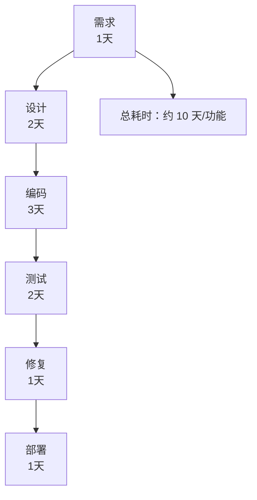

**AI 时代开发流程：**
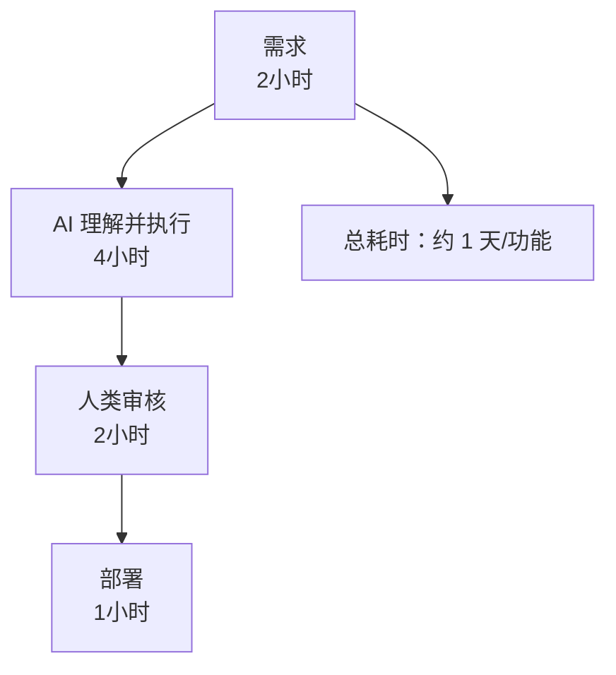

**效率提升数据（来自规划书）：**
- 科技部研发综合提效 **35% 以上**
- 信贷经理手工合稿时间压降 **70%**
- 信贷审批流转天数（TAT）从 **5 天缩短至 1 天**

**核心变化：**
1. **"写代码"变成"描述需求"**：开发者角色从编码者转变为需求描述者和审核者
2. **"试错成本"大幅降低**：AI 快速生成多个方案，人类只需选择和微调
3. **"知识断层"被填补**：初级开发者通过 AI 获得高级开发者的经验

### 1.3 Claude Code 的能力边界与局限

**强项：**
- ✅ 通用编程知识（Python、Java、Go、SQL 等）
- ✅ 常见框架（Spring Boot、Django、FastAPI、React 等）
- ✅ 标准 API（REST、gRPC、OAuth 等）
- ✅ 开源库文档（可访问互联网上的官方文档）

**弱项：**
- ❌ 企业内部框架（如银行核心系统接口）
- ❌ 私有库和定制组件
- ❌ 业务特定规范（如行内编码规范、安全守则）
- ❌ 内网专属配置（如数据库连接参数、服务地址）

**风险：凭训练数据中的通用知识"猜测"内部框架行为**

**真实案例（来自 `/data/harness/lessons.md`）：**

> **2026-06-05: 不查 API 文档凭假设修改导致错误**
> 
> 修复"代理 API 不支持 tool role"问题时，AI 凭假设修改了代码：
> - **假设**：Anthropic API 有 `role: "tool"` 这个角色（因为 OpenAI API 有）
> - **实际**：Anthropic API 根本没有 tool role，工具结果是 user message
> - **结果**：三次修改才找到正确方案
>
> **根本原因**：AI 凭训练数据中 OpenAI API 的知识"猜测" Anthropic API 的行为，而不是查阅官方文档。

这个案例揭示了一个核心问题：**当 AI 遇到不熟悉的框架时，它会用"通用知识"去"猜测"，而不是承认"我不知道"。**

### 1.4 从"通用 Claude Code"到"银行专用 Claude Code"

**核心差距：**
通用 Claude Code 缺少银行内部技术规范的实时查询能力：
- 不知道银行核心系统的接口定义
- 不知道内网定制库的使用方法
- 不知道行内编码规范和安全守则
- 不知道老旧系统的历史架构和依赖关系

**Context7 的角色：为 Claude Code 注入"银行大脑"**

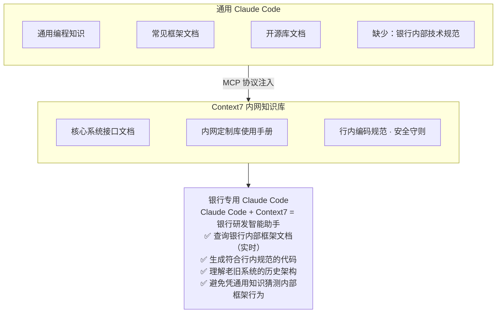

**最终形态：Claude Code + Context7 = 银行研发智能助手**

---

---

## 二、项目概述

### 2.1 项目背景与核心痛点

**规划书中的核心痛点：**
> "当前科技条线人员编制有限，天天深陷在业务部门排队堆积的需求单（如存量业务系统维护、报表微调）中，根本抽不出人手和精力进行系统的大模型应用研发，科技部门成为全行数字化转型的瓶颈。"

**技术层面的具体痛点：**
1. **内部框架文档分散**：技术手册散落在多层级文件夹、多个系统，检索困难
2. **AI 不认识内部框架**：大模型训练时没有银行内部框架数据，经常"自以为是地乱开发"
3. **老旧系统知识断层**：历史代码缺乏注释，原开发者离职，难以理解和维护

### 2.2 与规划书的对应关系

**规划书中的相关场景：**
- Run（卓越运营领域）场景A：科技部"研发智能助手与老旧系统跨代重构"
- L1/L2 阶段：在内网部署专用的离线编程大模型，智能助手自动扫描历史代码、生成重构建议

**本项目定位：**
为 L1/L2 阶段的"研发智能助手"提供基础设施 —— 内网技术手册的 MCP 检索服务。


---

## 三、总体架构：知识注入与全过程治理双组件

### 3.1 双组件体系定位

研发智能助手并非单一服务，而是「Context7 知识注入」与「opencode-session-mgmt 全过程治理」两大组件叠加在 AI 编程客户端之上的组合体，各自回答一个问题：

| 组件 | 角色 | 回答的核心问题 | 对应章节 |
|------|------|---------------|---------|
| **Context7 知识库（MCP）** | 查得准 | AI 认不认识内部规范？会不会凭通用知识猜测 | 第四章（服务端实现）、第五章（运行与部署） |
| **opencode-session-mgmt 三件套** | 管得住 | 流程走没走完？代码人能否接管？提效能不能证明 | 第九章 |
| **AI 编程工具** | 用得来 | 内网用哪个客户端、怎么接入 | 第六章、第七章 |

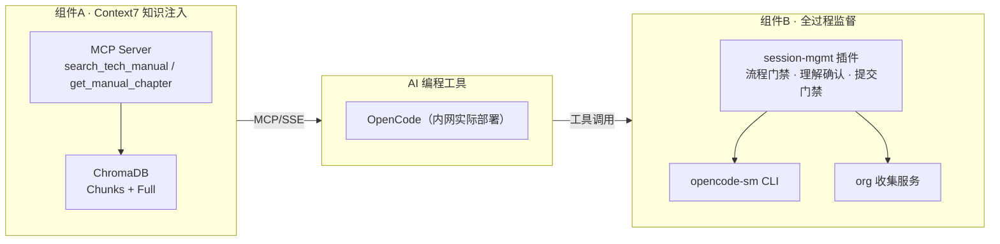

---

### 3.2 技术选型与核心特性

| 技术选型 | 选择 | 原因 |
|----------|------|------|
| 协议 | MCP (Model Context Protocol) | Claude Code 原生支持，标准化工具接口 |
| 向量数据库 | ChromaDB | 轻量级、支持本地部署、Python 原生 |
| Embedding 模型 | bge-small-zh-v1.5 | 中文优化、CPU 可运行、体积小 |
| 传输方式 | SSE (Server-Sent Events) | 支持流式响应、防火墙友好 |
| 容器化 | Native Docker Run | 避免 Docker Compose 依赖，确定性强 |
| AI 编程客户端 | **OpenCode**（内网实际部署）+ Claude Code / Cursor（能力对照） | OpenCode 开源私有化、支持 MCP 与插件体系；Claude Code/Cursor 作能力口径参照 |
| 流程治理组件 | **opencode-session-mgmt**（插件 + CLI `opencode-sm` + org 收集服务） | 补齐标准化流程、理解保障与效能度量，回答"退出风险与 ROI 验证"两大疑问 |

**核心特性：**

| 特性 | 说明 |
|------|------|
| **增量同步** | 基于 MD5 变更检测，跳过未变化文件，减少计算开销 |
| **智能切片** | 根据文件类型自动选择最优切片策略 |
| **读写分离** | 同步容器（一次性）+ 查询容器（常驻）独立运行 |
| **宿主机零污染** | 所有依赖在容器内，无需安装 Python 环境 |
| **双工具接口** | 语义搜索 + 全文读取，"先定位再通读" |

---

---

## 四、Context7 MCP 服务端实现

**本章说明：** 完整实现 Context7 MCP 服务端，覆盖三层容器架构、双工具接口与智能切片策略三大模块。


### 4.1 整体架构图（三层容器设计）

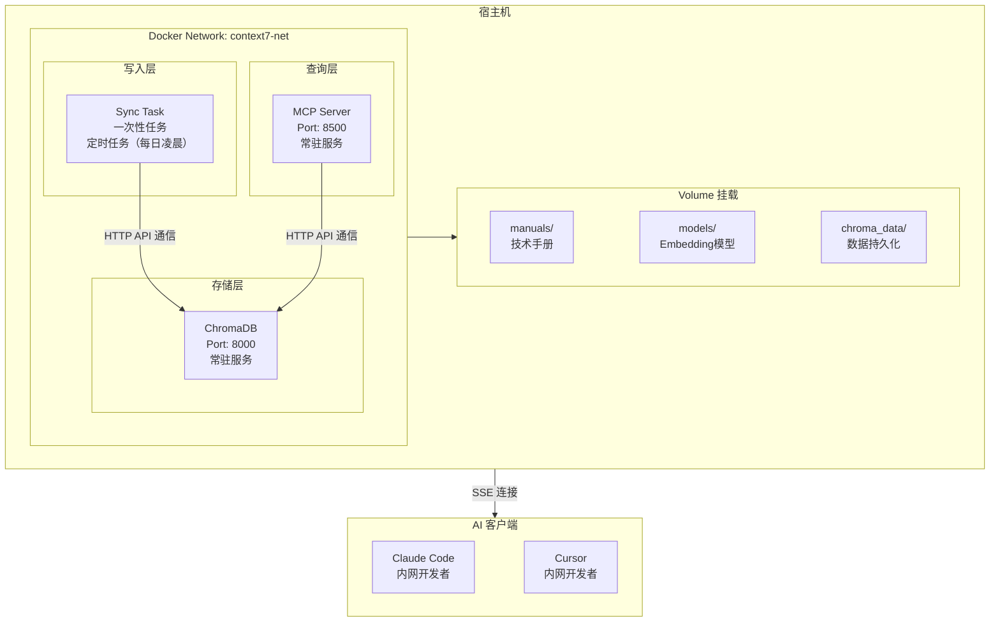

**三层职责：**

| 层级 | 容器 | 职责 | 运行模式 |
|------|------|------|----------|
| 存储层 | ChromaDB | 存储向量数据和文档 | 常驻服务 |
| 写入层 | Sync Task | 解析文档、计算向量、写入 ChromaDB | 定时任务（每日凌晨） |
| 查询层 | MCP Server | 响应 Claude Code 的查询请求 | 常驻服务 |

### 4.2 读写分离设计原理

**为什么需要读写分离？**

1. **写入层需要大模型资源**：Sync Task 需要加载 Embedding 模型计算向量
2. **查询层需要快速响应**：MCP Server 不应被模型加载拖慢
3. **资源隔离**：写入任务可能耗时较长，不应阻塞查询服务

**实现方式：**

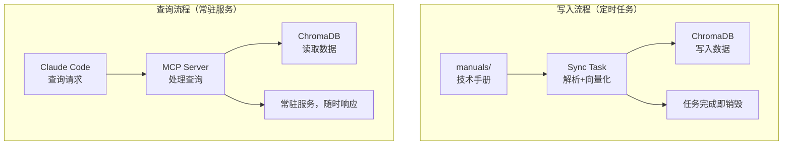

### 4.3 双集合设计（Chunks + Full）

**为什么需要双集合？**

| 需求 | 单一切片库的问题 | 双集合解决方案 |
|------|------------------|----------------|
| 语义搜索 | 需要返回完整文档时，切片库需要拼接 | Full 集合直接返回完整文档 |
| 精准读取 | 切片可能丢失上下文 | Full 集合保留完整上下文 |
| 语义匹配 | 完整文档向量过于粗糙 | Chunks 集合提供精准语义匹配 |

**设计：**

```python
# 集合一：切片库（语义搜索）
col_chunks = client.get_or_create_collection(
    "internal_tech_chunks",
    embedding_function=embedding_func
)
# 用途：模糊语义搜索，返回最相关的切片

# 集合二：全文库（精准读取）
col_full = client.get_or_create_collection(
    "internal_full_docs",
    embedding_function=embedding_func
)
# 用途：根据文件名返回完整文档
```

**工具调用流程：**

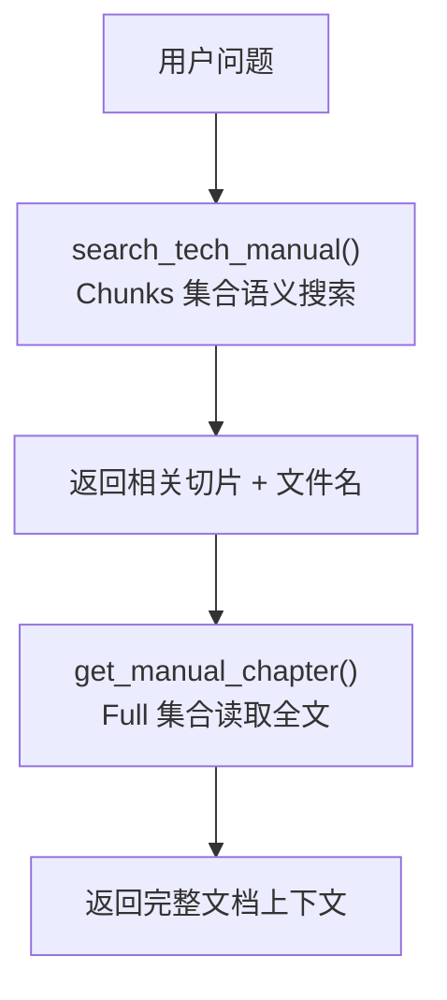

---

### 4.4 search_tech_manual() - 语义搜索

**功能描述：**
搜索公司内部技术手册（语义匹配），返回最相关的文档片段。

**适用场景：**
- 用户询问"技术规范"、"架构文档"、"API指南"、"安全守则"、"开发手册"
- 需要查询内部技术资料

**接口定义：**

```python
@mcp.tool()
def search_tech_manual(query: str) -> str:
    """
    搜索公司内部技术手册（语义匹配）。
    
    参数说明：
    | 参数 | 类型 | 必需 | 说明 |
    |------|------|------|------|
    | query | str | 是 | 自然语言查询，支持模糊语义匹配 |
    
    返回内容：
    - 最多返回 3 条最相关的技术手册片段
    - 每条包含：file_path（文件路径）、chunk_title（章节标题）、
      last_updated（更新时间）、content（正文片段）
    - 结果按更新时间倒序排列，优先展示最新文档
    """
```

**返回格式示例：**

```
📍 [file_path]: 核心系统接口规范.md
📌 [章节]: 账户查询接口
📅 更新时间: 2026-06-15
📄 片段正文:

**请求地址**：`/api/v1/account/query`
**请求方式**：POST
**认证方式**：JWT Token

===

📍 [file_path]: 安全守则.md
📌 [章节]: 密码存储规范
📅 更新时间: 2026-06-10
📄 片段正文:

所有密码必须使用 bcrypt 加密存储，禁止明文存储...
```

### 4.5 get_manual_chapter() - 全文读取

**功能描述：**
获取指定技术手册的完整全文内容。

**适用场景：**
- 需要查看某个文档的完整内容
- 获取完整代码示例
- `search_tech_manual()` 返回的片段信息不足时

**接口定义：**

```python
@mcp.tool()
def get_manual_chapter(file_path: str) -> str:
    """
    获取指定技术手册的完整全文内容。
    
    参数说明：
    | 参数 | 类型 | 必需 | 说明 |
    |------|------|------|------|
    | file_path | str | 是 | 文件路径，来自 search_tech_manual() 返回的 [file_path] 字段 |
    
    返回内容：
    - 指定文件的完整正文内容
    - 包含：文件名、最后更新时间、MD5 校验码（前8位）
    - 支持格式：.md（Markdown）、.docx（Word）、.pdf、.py/.java/.go/.sql/.sh（代码）
    """
```

**返回格式示例：**

```
> **[内部规范全文]** 正在阅读: 核心系统接口规范.md (最后更新: 2026-06-15, MD5: a1b2c3d4)
> AI 请基于此完整上下文，给出最契合当前内网架构要求的编码或修改建议。

--- 章节全文开始 ---

# 核心系统接口规范


本文档定义了我行核心系统的标准接口规范...

[完整内容...]
```

### 4.6 工具调用流程（先定位再通读）

**推荐的使用模式：**

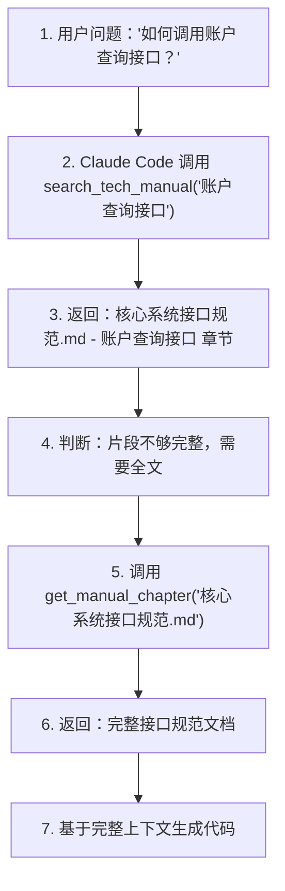

**代码实现：**

```python
# mcp_server/mcp_api.py

@mcp.tool()
def search_tech_manual(query: str) -> str:
    results = col_chunks.query(query_texts=[query], n_results=5)
    if not results['documents'] or len(results['documents'][0]) == 0:
        return "未在内部技术手册中找到相关规范片段。"
    
    items = []
    for i in range(len(results['documents'][0])):
        items.append({
            "content": results['documents'][0][i],
            "metadata": results['metadatas'][0][i]
        })
    
    # 按更新时间排序
    items.sort(key=lambda x: datetime.strptime(x['metadata']['last_updated'], "%Y-%m-%d"), reverse=True)
    
    formatted_chunks = []
    for item in items[:3]:
        chunk_title = item['metadata'].get('chunk_title', '段落切片')
        formatted_chunks.append(
            f"📍 [file_path]: {item['metadata']['file_path']}\n"
            f"📌 [章节]: {chunk_title}\n"
            f"📅 更新时间: {item['metadata']['last_updated']}\n"
            f"📄 片段正文:\n{item['content']}"
        )
    return "\n\n===\n\n".join(formatted_chunks)

@mcp.tool()
def get_manual_chapter(file_path: str) -> str:
    result = col_full.get(ids=[file_path])
    if result['documents'] and len(result['documents']) > 0:
        md5_hash = result['metadatas'][0].get('md5', 'N/A')[:8]
        return (
            f"> **[内部规范全文]** 正在阅读: {file_path} "
            f"(最后更新: {result['metadatas'][0]['last_updated']}, MD5: {md5_hash})\n"
            f"> AI 请基于此完整上下文，给出最契合当前内网架构要求的编码或修改建议。\n\n"
            f"--- 章节全文开始 ---\n\n"
            f"{result['documents'][0]}"
        )
    return f"未能在内网向量库中找到路径为 {file_path} 的完整章节内容。"
```

### 4.7 SSE Transport 配置

**为什么使用 SSE？**
- 支持流式响应，适合长时间运行的查询
- 防火墙友好，使用标准 HTTP 端口
- Claude Code 原生支持 SSE transport

**服务端配置：**

```python
# mcp_server/mcp_api.py

if __name__ == "__main__":
    import uvicorn
    # FastMCP 的 sse_app() 返回 ASGI 应用
    uvicorn.run(mcp.sse_app(), host="0.0.0.0", port=8500)
```

**客户端接入：**

```bash
# Claude Code 接入
claude mcp add --transport sse internal-docs -- http://10.x.x.x:8500/sse

# Cursor 接入配置
# Name: internal-docs
# Type: SSE
# URL: http://10.x.x.x:8500/sse
```

---

### 4.8 Markdown 按标题层级切片

**策略原理：**
Markdown 文档通常有清晰的标题层级结构（# ## ###），按标题切片可以保持章节语义完整性。

**实现代码：**

```python
def chunk_markdown_by_headers(content):
    """
    按 Markdown 标题层级 (# ## ### #### ##### ######) 切片
    保持每个章节的语义完整性
    """
    lines = content.split('\n')
    chunks = []
    current_chunk = []
    
    for line in lines:
        # 匹配 Markdown 标题 (1-6级)
        header_match = re.match(r'^(#{1,6})\s+(.+)$', line)
        
        if header_match:
            # 遇到新标题，保存当前 chunk
            if current_chunk:
                chunk_text = '\n'.join(current_chunk).strip()
                if chunk_text:
                    chunks.append(chunk_text)
            # 开始新 chunk（包含标题行）
            current_chunk = [line]
        else:
            current_chunk.append(line)
    
    # 保存最后一个 chunk
    if current_chunk:
        chunk_text = '\n'.join(current_chunk).strip()
        if chunk_text:
            chunks.append(chunk_text)
    
    # 合并过小的 chunk（小于 50 字符的合并到上一个）
    merged = []
    for chunk in chunks:
        if len(chunk) < 50 and merged:
            merged[-1] = merged[-1] + '\n\n' + chunk
        else:
            merged.append(chunk)
    
    return merged if merged else [content]
```

**切片效果示例：**

```
原文档：
# 账户查询接口
...
...
# 账户创建接口
...

切片结果：
Chunk 1: "# 账户查询接口\n## 请求参数\n..."
Chunk 2: "## 响应格式\n..."
Chunk 3: "# 账户创建接口\n## 请求参数\n..."
```

### 4.9 代码文件按函数/类切片

**策略原理：**
代码文件按语法单元（函数、类、方法）切片，保持代码块完整性。

**支持的代码类型：**

| 文件类型 | 切片方式 |
|----------|----------|
| Python (.py) | 按 `def`/`class` 分割 |
| Java (.java) | 按 `class`/`method` 分割 |
| Go (.go) | 按 `func`/`type` 分割 |
| SQL (.sql) | 按语句分割（`;` 分隔） |
| Shell (.sh) | 按 `function` 分割 |

**Python 代码切片实现：**

```python
def chunk_code_by_functions(content, filename):
    """代码文件按函数/类级别切片"""
    ext = filename.split('.')[-1].lower()
    chunks = []
    
    if ext == 'py':
        lines = content.split('\n')
        current_block = []
        in_function = False
        
        for line in lines:
            # 检测函数/类定义开始
            if re.match(r'^(def |class |@)', line):
                if current_block:
                    chunks.append('\n'.join(current_block))
                current_block = [line]
                in_function = True
            elif in_function:
                # 检测块结束（缩进回到原级别或更少）
                if line.strip() and not line.startswith(' ') and not line.startswith('\t'):
                    chunks.append('\n'.join(current_block))
                    current_block = [line] if line.strip() else []
                    in_function = False
                else:
                    current_block.append(line)
            else:
                current_block.append(line)
        
        if current_block:
            chunks.append('\n'.join(current_block))
    
    # 添加代码块标记
    result = []
    for chunk in chunks:
        chunk = chunk.strip()
        if chunk:
            result.append(f"```{ext}\n{chunk}\n```")
    
    return result if result else [f"```{ext}\n{content}\n```"]
```

### 4.10 PDF/DOCX 按段落+Token上限切片

**策略原理：**
PDF 和 Word 文档通常没有明确的语义分割点，采用"段落完整性 + Token 上限"策略。

**实现代码：**

```python
CHUNK_MAX_TOKENS = 512  # Token 上限

def chunk_by_paragraphs_with_limit(content, max_tokens):
    """
    PDF/DOCX 按段落 + Token 上限切片
    段落间保持完整，当累计 token 超过上限时开始新切片
    """
    paragraphs = [p.strip() for p in content.split('\n\n') if p.strip()]
    chunks = []
    current_chunk = []
    current_tokens = 0
    
    for para in paragraphs:
        para_tokens = estimate_tokens(para)
        
        # 如果当前段落本身超过上限，单独成为一个切片
        if para_tokens > max_tokens:
            if current_chunk:
                chunks.append('\n\n'.join(current_chunk))
                current_chunk = []
                current_tokens = 0
            chunks.append(para)
            continue
        
        # 累加段落，超过上限则开始新切片
        if current_tokens + para_tokens > max_tokens and current_chunk:
            chunks.append('\n\n'.join(current_chunk))
            current_chunk = [para]
            current_tokens = para_tokens
        else:
            current_chunk.append(para)
            current_tokens += para_tokens
    
    if current_chunk:
        chunks.append('\n\n'.join(current_chunk))
    
    return chunks if chunks else [content]
```

### 4.11 Token 估算算法（中英文混合）

**策略原理：**
中文和英文的 Token 消耗不同，需要分别计算：
- 中文：约 1.5 字/token
- 英文：约 4 字/token

**实现代码：**

```python
def estimate_tokens(text):
    """估算文本 Token 数（中文约 1.5 字/token）"""
    chinese_chars = len(re.findall(r'[\u4e00-\u9fff]', text))
    other_chars = len(text) - chinese_chars
    return int(chinese_chars / 1.5 + other_chars / 4)
```

---

---

## 五、增量同步与容器化部署

**本章说明：** 合并增量同步机制与容器化部署两大部分，涵盖 MD5 变更检测、部署脚本与镜像构建；原附录 A 的 Dockerfile 与 5.7 节重复已去重，原附录 C 配置参数并入本章末尾。


### 5.1 MD5 变更检测原理

**为什么需要增量同步？**
- 技术手册通常不会频繁变化
- 完整重新计算所有文档的向量会消耗大量 CPU 资源
- 增量同步可以跳过未变化的文件

**实现原理：**

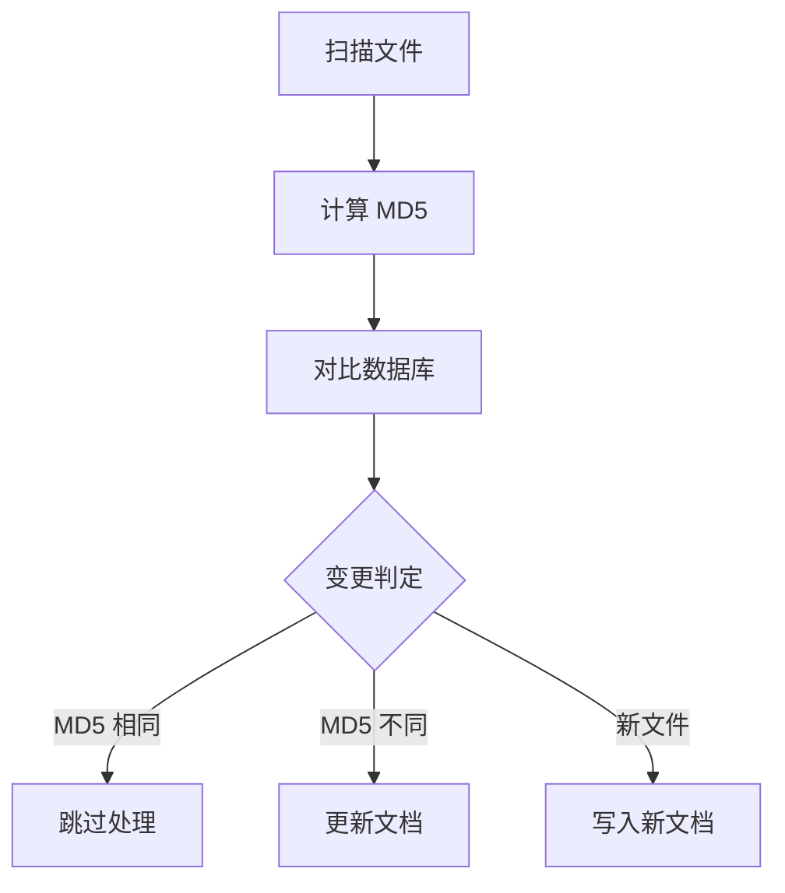

**代码实现：**

```python
def get_file_md5(filepath):
    """计算文件完整 MD5（用于变更检测）"""
    hasher = hashlib.md5()
    with open(filepath, 'rb') as f:
        hasher.update(f.read())
    return hasher.hexdigest()

def check_file_changed(col_full, filepath, current_md5):
    """
    检查文件是否发生变化
    返回: (is_changed, old_metadata)
    """
    filename = os.path.basename(filepath)
    try:
        result = col_full.get(ids=[filename])
        if result['metadatas'] and len(result['metadatas']) > 0:
            old_md5 = result['metadatas'][0].get('md5', '')
            return old_md5 != current_md5, result['metadatas'][0]
    except Exception:
        pass
    return True, None  # 新文件或查询失败，视为需要更新
```

### 5.2 同步流程与统计报告

**完整同步流程：**

```python
def main():
    # 连接 ChromaDB
    client = chromadb.HttpClient(host=CHROMA_HOST, port=8000)
    
    # 获取集合
    col_chunks = client.get_or_create_collection("internal_tech_chunks", ...)
    col_full = client.get_or_create_collection("internal_full_docs", ...)
    
    # 统计
    stats = {'total': 0, 'updated': 0, 'skipped': 0, 'failed': 0}
    
    # 扫描文件
    for root, _, files in os.walk(MANUALS_IN_CONTAINER):
        for file in files:
            stats['total'] += 1
            
            # 计算当前文件 MD5
            current_md5 = get_file_md5(filepath)
            
            # 增量检测
            is_changed, old_meta = check_file_changed(col_full, filepath, current_md5)
            
            if not is_changed:
                stats['skipped'] += 1
                continue
            
            # 解析并写入
            # ...
            stats['updated'] += 1
    
    # 输出统计报告
    print(f"总文件数: {stats['total']}")
    print(f"已更新: {stats['updated']}")
    print(f"已跳过(未变化): {stats['skipped']}")
    print(f"失败: {stats['failed']}")
```

### 5.3 Crontab 定时配置

**配置示例：**

```bash
# 每日凌晨 2 点执行同步
0 2 * * * docker run --rm --name tmp-mcp-syncer \
  --network host \
  -v /data/context7/models/bge-small-zh-v1.5:/app/models \
  -v /data/context7/manuals:/app/manuals \
  -e CHROMA_HOST="127.0.0.1" \
  sync-task:latest \
  >> /data/context7/sync_task/cron_run.log 2>&1
```

---

### 5.4 三层容器架构

**容器列表：**

| 容器名 | 镜像 | 职责 | 运行模式 |
|--------|------|------|----------|
| internal-chromadb | chromadb/chroma:latest | 向量数据库 | 常驻 |
| mcp-api-service | mcp-server:latest | MCP 查询服务 | 常驻 |
| tmp-mcp-syncer | sync-task:latest | 同步任务 | 一次性任务 |

### 5.5 网关与算力解耦原则（核心设计）

**设计背景：**

在银行内网环境中，网络栈配置复杂，防火墙规则严格。如果将 MCP 网关与底层的私有化大模型或代理引擎强行绑定，或者采用微服务编排工具（如 Docker Compose）进行联合启动，会引入极大的不确定性：

| 风险 | 说明 |
|------|------|
| 配置解析失败 | Docker Compose 的 YAML 解析在特定环境下可能失败 |
| 启动顺序依赖 | 编排工具的依赖解析可能导致启动卡死 |
| 网络栈冲突 | overlay 网络与行内网络策略冲突 |
| 故障扩散 | 单容器故障可能影响整个编排链 |
| 排查困难 | 编排层错误日志难以定位根因 |

**核心原则：网关与底层算力彻底解耦**

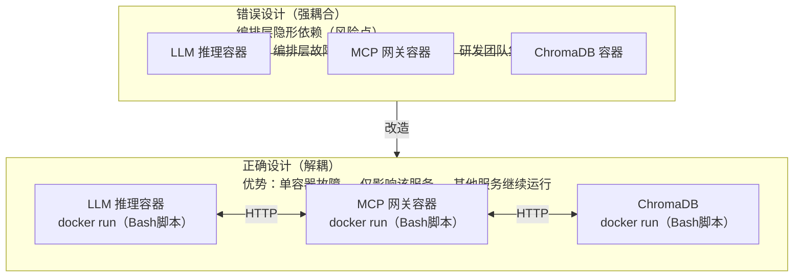

**解耦要点：**

| 层面 | 解耦方式 | 说明 |
|------|----------|------|
| 启动方式 | 原生 Docker Run | 通过 Bash 脚本进行原子化单容器部署 |
| GPU 绑定 | 显式 `--gpus` 参数 | 直接绑定物理 GPU，不依赖编排层解析 |
| 网络通信 | 显式 IP/容器名 | 直接指定，不依赖 overlay 网络自动发现 |
| 故障隔离 | 独立容器生命周期 | 单容器故障不影响其他服务 |
| 配置管理 | 环境变量 + 配置文件 | 不依赖编排层的变量替换 |

### 5.6 Native Docker Run 部署方案

**为什么不用 Docker Compose？**

| 维度 | Docker Compose | Native Docker Run |
|------|----------------|-------------------|
| 依赖管理 | 需要 docker-compose 二进制 | 仅需 docker 命令 |
| 配置解析 | YAML 解析可能失败 | Bash 脚本，行为确定 |
| GPU 绑定 | 需要配置 runtime | 直接 `--gpus` 参数 |
| 网络控制 | overlay 网络抽象 | 直接控制网络模式 |
| 故障排查 | 编排层日志混杂 | 单容器日志清晰 |
| 启动顺序 | depends_on 不保证运行就绪 | 手动控制，显式等待 |

**原子化部署脚本：**

```bash
#!/bin/bash
# deploy.sh - 原子化单容器部署脚本
# 用途：规避编排层隐形依赖，确保部署确定性

set -e  # 遇错即停

echo "=== Context7 部署脚本 ==="

# 1. 创建专用网络（幂等操作）
echo "[1/4] 创建网络..."
docker network create context7-net 2>/dev/null || echo "网络已存在"

# 2. 启动 ChromaDB（存储层）
echo "[2/4] 启动 ChromaDB..."
docker run -d \
  --name internal-chromadb \
  --restart always \
  --network context7-net \
  -p 8000:8000 \
  -v /data/context7/chroma_data:/chroma/chroma \
  chromadb/chroma:latest

# 等待 ChromaDB 就绪
echo "等待 ChromaDB 启动..."
for i in {1..30}; do
  if curl -s http://localhost:8000/api/v1/heartbeat > /dev/null 2>&1; then
    echo "ChromaDB 就绪"
    break
  fi
  sleep 1
done

# 3. 启动 MCP Server（查询层）
echo "[3/4] 启动 MCP Server..."
docker run -d \
  --name mcp-api-service \
  --restart always \
  --network context7-net \
  -p 8500:8500 \
  --cpus="2" \
  --memory="2g" \
  -v /data/context7/models/bge-small-zh-v1.5:/app/models \
  -e MODEL_PATH="/app/models" \
  -e CHROMA_HOST="internal-chromadb" \
  mcp-server:latest

# 等待 MCP Server 就绪
echo "等待 MCP Server 启动..."
for i in {1..30}; do
  if curl -s http://localhost:8500/sse > /dev/null 2>&1; then
    echo "MCP Server 就绪"
    break
  fi
  sleep 1
done

# 4. 首次同步（可选）
echo "[4/4] 执行首次同步..."
docker run --rm --name tmp-mcp-syncer \
  --network context7-net \
  -v /data/context7/models/bge-small-zh-v1.5:/app/models \
  -v /data/context7/manuals:/app/manuals \
  -e CHROMA_HOST="internal-chromadb" \
  sync-task:latest

echo "=== 部署完成 ==="
echo "MCP Server: http://$(hostname -I | awk '{print $1}'):8500/sse"
```

**GPU 绑定示例（如需本地推理）：**

```bash
# 显式绑定 GPU，不依赖编排层
docker run -d \
  --name llm-inference \
  --gpus '"device=0"' \  # 绑定第一个 GPU
  --restart always \
  --network context7-net \
  -p 8001:8001 \
  -v /data/models:/app/models \
  -e CUDA_VISIBLE_DEVICES=0 \
  llm-server:latest
```

### 5.7 镜像构建与资源占用

**Sync Task Dockerfile：**

```dockerfile
FROM python:3.10-slim

WORKDIR /app

# 安装 PyTorch CPU 版本和依赖
RUN pip install --no-cache-dir torch --index-url https://download.pytorch.org/whl/cpu && \
    pip install --no-cache-dir sentence-transformers --no-deps && \
    pip install --no-cache-dir chromadb python-docx pdfplumber scikit-learn && \
    pip install --no-cache-dir "transformers>=4.41,<4.50" huggingface-hub

COPY container_sync.py /app/container_sync.py

ENTRYPOINT ["python", "/app/container_sync.py"]
```

**MCP Server Dockerfile：**

```dockerfile
FROM python:3.10-slim

WORKDIR /app

RUN pip install --no-cache-dir torch --index-url https://download.pytorch.org/whl/cpu && \
    pip install --no-cache-dir sentence-transformers --no-deps && \
    pip install --no-cache-dir mcp[cli] chromadb scikit-learn uvicorn && \
    pip install --no-cache-dir "transformers>=4.41,<4.50" huggingface-hub

COPY mcp_api.py /app/mcp_api.py

EXPOSE 8500

ENTRYPOINT ["python", "/app/mcp_api.py"]
```

**镜像大小：**

| 镜像 | 大小 | 说明 |
|------|------|------|
| sync-task:latest | ~1.41GB | 包含 PyTorch CPU 版本 + Embedding 模型 |
| mcp-server:latest | ~1.36GB | 包含 MCP + ChromaDB 客户端 |

### 5.8 网络隔离与容器通信

**网络设计：**

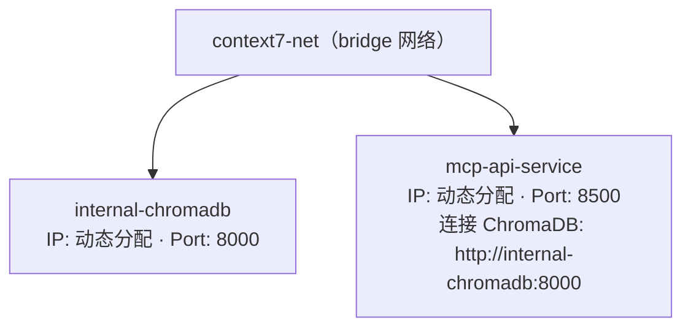

**关键点：**
- 两个容器加入同一 Docker 网络
- MCP Server 通过容器名 `internal-chromadb` 连接 ChromaDB
- IP 变化不影响连接

---


### 环境变量

| 变量名 | 默认值 | 说明 |
|--------|--------|------|
| CHROMA_HOST | 127.0.0.1 | ChromaDB 服务器地址 |
| MODEL_PATH | /app/models | Embedding 模型路径 |

### 切片参数

| 参数 | 默认值 | 说明 |
|------|--------|------|
| CHUNK_MAX_TOKENS | 512 | 单个切片的最大 Token 数 |
| MAX_RETRIES | 3 | ChromaDB 连接最大重试次数 |

### 资源限制

| 容器 | CPU | 内存 |
|------|-----|------|
| mcp-api-service | 2 核 | 2GB |
| internal-chromadb | 默认 | 默认 |

---

---

## 六、AI 客户端接入

**本章说明：** 内网实际部署客户端为 OpenCode；Claude Code / Cursor 作为能力对照与备选方式，均通过 MCP 协议（SSE）接入同一套 Context7 服务。

> **提示：** 客户端接入前的插件与 MCP 配置不冲突，详见 6.1 / 6.5。

### 6.1 OpenCode 接入配置（内网实际部署客户端）

OpenCode 为开源 AI 编程客户端，支持内网私有化部署、MCP 协议与插件体系，是本项目内网环境的首选接入端。

**添加 MCP 服务器（MCP 配置写入 `~/.config/opencode/opencode.json` 或项目级 `.opencode/opencode.json`）：**

```jsonc
{
  "mcpServers": {
    "internal-docs": {
      "type": "sse",
      "url": "http://10.x.x.x:8500/sse"
    }
  }
}
```

**通过流程治理插件启用 session-mgmt（详见第九章「研发智能助手全过程治理」）：**

```jsonc
{
  "plugin": [
    "opencode-session-mgmt/packages/plugin"   // 本地路径，或发布到内网 npm 源后以包名引用
  ]
}
```

**验证连接：**

```bash
opencode --help  # 确认 daemon 启动
# MCP 已在 TUI 会话中自动可用：调用 search_tech_manual / get_manual_chapter
# 流程治理工具自动注入：workflow_advance / comprehension_confirm / review_submit
```

### 6.2 Claude Code 接入配置（能力对照）

**添加 MCP 服务器：**

```bash
claude mcp add --transport sse internal-docs -- http://10.x.x.x:8500/sse
```

**验证连接：**

```bash
claude mcp list
# 输出：internal-docs (SSE) - http://10.x.x.x:8500/sse
```

**使用示例：**

```
用户：请根据行内规范，写一个账户查询接口

Claude Code：
[调用 search_tech_manual("账户查询接口")]
[返回核心系统接口规范.md 的相关切片]
[调用 get_manual_chapter("核心系统接口规范.md")]
[读取完整接口规范]
[生成符合行内规范的代码]
```

### 6.3 Cursor 接入配置

**配置步骤：**
1. 打开 Cursor 设置
2. 进入 MCP Servers 配置
3. 添加新服务器：
   - **Name**: `internal-docs`
   - **Type**: `SSE`
   - **URL**: `http://10.x.x.x:8500/sse`

### 6.4 内网 IP 配置要点

**注意事项：**
- 服务器 IP 必须是内网可达地址
- 端口 8500 必须开放
- SSE 连接需要支持长连接

### 6.5 AI 客户端行为引导（CLAUDE.md / AGENTS.md）

**核心问题：工具存在 ≠ 工具会被使用**

仅仅部署 MCP 服务器，Claude Code 不会"自动"调用它。Claude Code 需要明确的引导才知道：
- 什么时候应该查询内部规范
- 什么时候不应该凭经验猜测

**解决方案：CLAUDE.md 项目级配置**

Claude Code 会在每次对话开始时读取项目根目录的 `CLAUDE.md` 文件，作为 System Prompt 的一部分。这是引导 Claude Code 行为的标准方式。

**推荐配置（`CLAUDE.md`）：**

```markdown
# 项目说明

本项目使用我行内部框架开发，涉及核心系统接口、内网定制库等。

## ⚠️ 重要原则：银行内部框架开发

**涉及银行内部框架的任何开发，必须先查询内部规范！**

### 强制查询场景

以下场景**必须先调用 `search_tech_manual()` 查询内部规范**：

| 场景 | 查询关键词示例 |
|------|----------------|
| 开发新接口 | "接口规范"、"API标准" |
| 使用内部库 | 库名称（如 "XCore"、"CoreAPI"） |
| 数据库操作 | "数据库规范"、"SQL标准" |
| 重构老旧系统 | 系统名称 + "架构文档" |
| 安全相关功能 | "安全守则"、"加密规范" |

### 禁止行为

- ❌ **禁止凭经验猜测内部框架行为**
- ❌ **禁止假设内部 API 与开源框架相同**
- ❌ **禁止在未查文档的情况下使用内部库**

### 工具使用流程

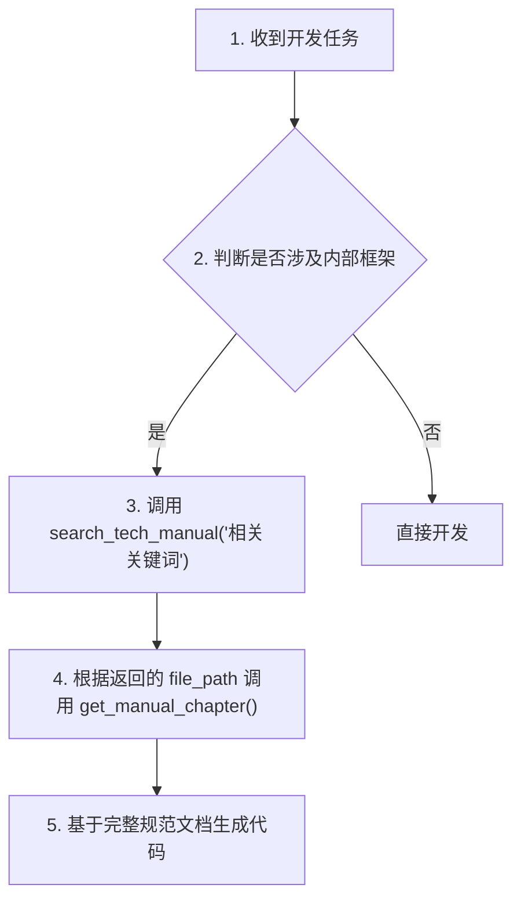

### 示例对话

**错误方式**：
```
用户：写一个账户查询接口
Claude Code：好的，我来写一个标准的 REST API...
（没有查询行内规范，直接凭通用知识编写）
```

**正确方式**：
```
用户：写一个账户查询接口
Claude Code：这涉及行内核心系统接口，我先查询规范。
[调用 search_tech_manual("账户查询接口")]
返回：核心系统接口规范.md - 账户查询接口
[调用 get_manual_chapter("核心系统接口规范.md")]
返回：完整接口规范...
Claude Code：根据行内规范，账户查询接口需要：
1. 使用 XCore 框架的 @XController 注解
2. 请求地址为 /api/v1/account/query
3. 认证方式为 JWT Token
...
```
```

**配置位置：**

| 项目类型 | CLAUDE.md 位置 |
|----------|----------------|
| 单体项目 | 项目根目录 `/path/to/project/CLAUDE.md` |
| Monorepo | 各包目录 `/packages/xxx/CLAUDE.md` |
| 全局配置 | `~/.claude/CLAUDE.md`（影响所有项目） |

**为什么使用 CLAUDE.md 而不是其他方式？**

| 方式 | 优点 | 缺点 |
|------|------|------|
| CLAUDE.md | 项目级配置，跟随代码仓库，团队共享 | 需要每个项目配置 |
| 全局 System Prompt | 一次配置全局生效 | 不跟随项目，可能影响其他项目 |
| 用户手动提醒 | 灵活 | 用户负担重，容易忘记 |

**推荐实践：**
- 将 `CLAUDE.md` 纳入代码仓库版本控制
- 团队共同维护查询规则和关键词
- 定期更新以反映新的内部框架

**OpenCode 的等价机制：`AGENTS.md`**

OpenCode 使用 `AGENTS.md`（代替 `CLAUDE.md`）作为每次对话开始时自动注入的引导文件，机制与上表一致：

| 项目类型 | OpenCode 文件位置 |
|----------|------------------|
| 单体项目 | 项目根目录 `AGENTS.md` |
| Monorepo | 各包目录（按工作区自动发现） |
| 全局配置 | `~/.config/opencode/AGENTS.md`（影响所有项目） |

`AGENTS.md` 与 `CLAUDE.md` 遵照同一套行为规则——「银行内部框架开发强制先查询内部规范」，仅文件名与客户端不同，内容可完全复用。

---

## 七、使用示例

### 7.1 日常开发查询场景

**场景**：开发者需要查询行内数据库连接规范

```
开发者：我们行内数据库连接的规范是什么？

Claude Code：
[调用 search_tech_manual("数据库连接规范")]
返回：
📍 [file_path]: 数据库连接规范.md
📌 [章节]: 连接参数配置
📅 更新时间: 2026-06-01
📄 片段正文:
## 连接参数配置
- 主库地址：db-master.internal
- 从库地址：db-slave.internal
- 端口：5432
- 连接池大小：10-20
...

[调用 get_manual_chapter("数据库连接规范.md")]
返回完整规范文档...

Claude Code 回复：
根据行内规范，数据库连接配置如下：
1. 主库地址：db-master.internal:5432
2. 从库地址：db-slave.internal:5432
3. 连接池大小：建议 10-20
4. 超时时间：30秒
...
```

### 7.2 老旧系统重构场景

**场景**：重构一个使用了内部框架的老旧模块

```
开发者：请重构 AccountService 类，使用最新的行内规范

Claude Code：
[调用 search_tech_manual("AccountService 账户服务")]
[调用 search_tech_manual("服务层开发规范")]
[调用 get_manual_chapter("服务层开发规范.md")]

Claude Code 回复：
我已经查阅了行内服务层开发规范，现在开始重构 AccountService：

1. 按照规范，服务类需要添加 @Transactional 注解
2. 日志格式需要符合行内标准
3. 异常处理需要使用行内定义的异常类
...
```

### 7.3 新框架上手场景

**场景**：新员工需要学习行内定制框架

```
新员工：什么是 XCore 框架？怎么使用？

Claude Code：
[调用 search_tech_manual("XCore 框架")]
[调用 get_manual_chapter("XCore框架使用手册.md")]

Claude Code 回复：
XCore 是我行内部开发的轻量级框架，主要用于...

核心组件：
1. XController - 控制器基类
2. XService - 服务层基类
3. XRepository - 数据访问层

使用示例：
[提供符合行内规范的代码示例]
```

---

---

## 八、能力增强：Harness Client 集成场景

**本章说明：** 研发智能助手除代码生成与知识检索外，还可扩展浏览器自动化、多模态、知识图谱与目标驱动等能力（2026-06/07 新增），落地到同报岗、数据采集等场景。


### 8.1 浏览器自动化集成

Harness Client 现已集成浏览器自动化功能，支持 Agent 自动操作浏览器：

**使用方式**：
1. 点击侧边栏的 **"浏览器"** 按钮启动浏览器
2. 浏览器在独立窗口中打开，用户可实时观看 Agent 操作
3. Agent 自动获得 7 个浏览器工具（navigate, click, type, extract, screenshot, wait, close）

**配置选项**：

| 配置项 | 默认值 | 说明 |
|--------|--------|------|
| 浏览器类型 | msedge | Edge/Chrome/Chromium/Firefox |
| 无头模式 | 关闭 | 后台运行，不显示窗口 |
| 自动截图 | 开启 | 每次操作后自动截图（审计） |
| 超时时间 | 30000ms | 页面加载超时 |

**适用场景**：
- 内网系统操作（OA、报表系统）
- 数据采集和报表生成
- 流程自动化（表单填写、审批提交）

### 8.2 多模态内容支持

支持图片和文档上传：

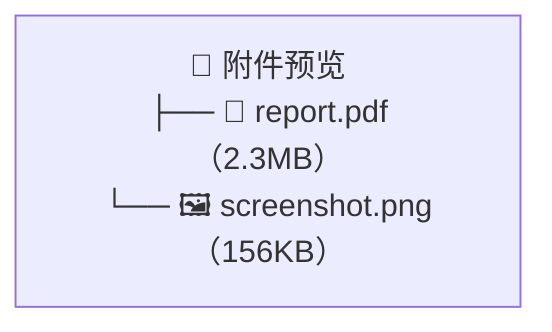

**支持的文件类型**：
- 图片：PNG, JPEG, GIF, WebP
- 文档：PDF, Word, Excel, PowerPoint
- 代码：所有文本文件

### 8.3 知识图谱工具集成

Harness 项目集成了 **code-review-graph** MCP 服务器：

**核心功能**：
- **结构化搜索**：基于图谱的语义搜索
- **影响分析**：理解代码变更的影响范围
- **架构洞察**：自动检测代码社区和关键节点
- **智能审查**：风险评分和优先级建议

**使用场景**：
- 代码审查时快速定位影响范围
- 重构前评估高风险节点
- 测试覆盖分析

### 8.4 Goal-Driven 执行模式

支持目标驱动执行，Agent 自主运行直到目标达成：

```python
# 在客户端中启用
用户: "修复所有类型错误"
Agent: 自动迭代执行直到所有类型错误修复
```

**执行监控面板**：
- Token 使用量
- 迭代次数
- 工具调用次数
- 事件日志

---

*文档版本：v1.1*
*最后更新：2026-07-05*

---

## 九、研发智能助手全过程治理

### 9.1 为什么需要"全过程治理"

MCP 检索服务解决了"AI 认不认识内部规范"的问题，但研发智能助手要真正兑现效率与质量收益，还面临三个深层次问题：

| 层次 | 问题 | 本质 |
|------|------|------|
| 过程管理 | 多个需求并行，如何在会话间切换并走完完整流程 | 效率问题 |
| **理解保障** | AI 生成了代码，人是否真正看懂了？三个月后谁能维护？ | **控制权问题** |
| 效能度量 | AI 到底提效了多少？Token 消耗是否合理 | 可证明性问题 |

这三个层次正是规划书"科技自我造血"落地的两个关键质疑：
- **疑问一（退出风险）**：AI 写的代码，人能不能接、能不能改、AI 停了怎么办
- **疑问二（ROI 验证）**：Token 投入与产出之间的关系，同等产出下资源配置的优化空间

opencode-session-mgmt 以「插件 + 独立 CLI + org 收集服务」三件套形态补齐这两块能力，且全部定制不修改上游 OpenCode/Claude Code 代码。

### 9.2 三件套架构

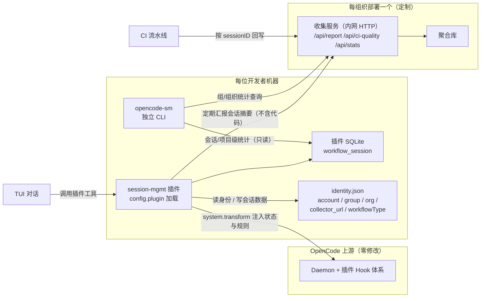

| 组件 | 职责 | 部署位置 |
|------|------|----------|
| 插件 | 五个阶段跟踪、审查门禁、提交门禁、理解确认记录、重复编辑检测 | 每台开发者机器（`config.plugin` 加载） |
| `opencode-sm` 独立 CLI | 会话管理（`sm create/list`）、`sm init` 五问身份、`sm stats` 统计分析 | 每台开发者机器 |
| org 收集服务 | 接收会话摘要（`POST /api/report`）、接收 CI 质量回写（`POST /api/ci-quality`）、提供组/组织统计（`GET /api/stats`） | 每组织内网部署一个 |

**集成要点**：
- MCP 检索（第八、九章）+ 流程治理（本章）是两个正交插件，组合使用：
  ```jsonc
  { "plugin": ["internal-docs-mcp", "opencode-session-mgmt/packages/plugin"] }
  ```
- 开发者首次使用执行 `opencode-sm init` 五问（账号邮箱 / 组名 / 组织名 / 收集服务地址 / 工作流类型），身份存全局 `identity.json`，后续自动带入。
- 插件汇报的 payload 只含阶段时间戳、Token/费用、质量指标三个分类，**不含任何代码内容、文件路径、理解确认正文**，满足内网数据外发合规。

### 9.3 工作流程模型：完成门控（而非严格流水线）

真实研发本质是迭代的。方案采用「自由迭代区 + 提交硬门禁」的**完成门控**模型：需求/设计/编码/测试可在任意阶段反复跳转，唯一硬约束是**提交时所有阶段必须已审批**，审查阶段是唯一不可被 AI 自行推进的阶段。

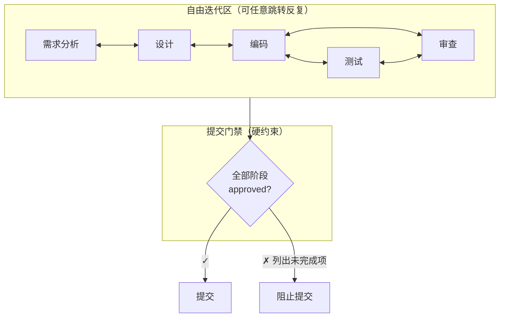

### 9.4 阶段推进与理解保障

**阶段推进（AI 提议 + 开发者确认）**：阶段转换的唯一来源是开发者明确的确认操作；AI 只能发起建议，绝不自行将对话推进到下一个阶段。

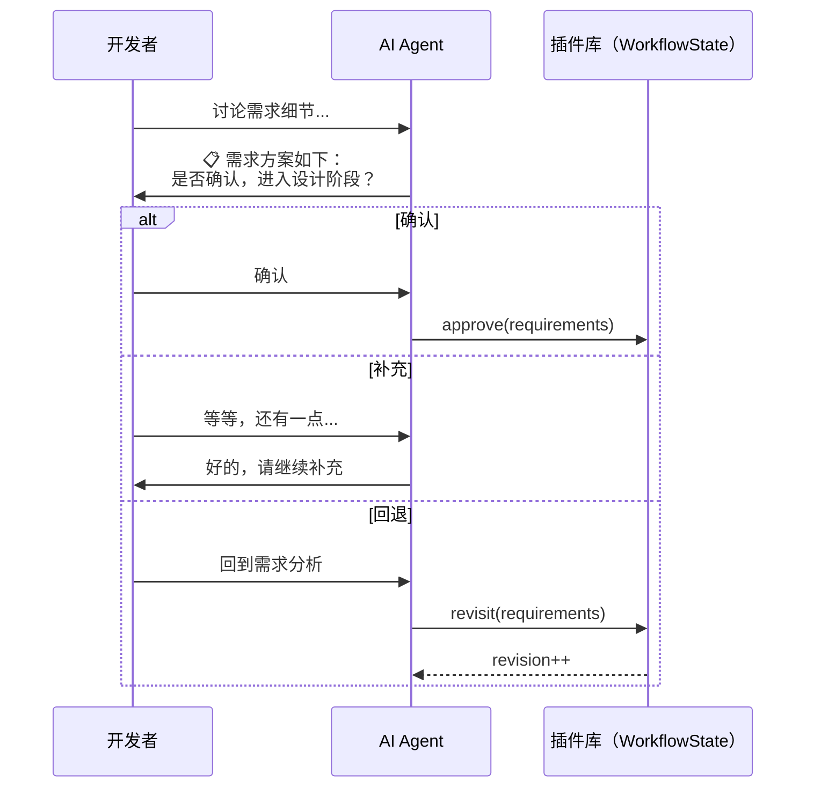

**理解保障（逐段确认，回答"谁看得懂"）**：AI 将每次代码变更拆成片段，为每段输出自然语言 `explanation`（做了什么、为什么这样写、放弃了哪些方案、有什么风险），开发者逐段选择：

| 行为 | 工具 | 说明 |
|------|------|------|
| 接受 | `comprehension_confirm` | 确认理解，片段一次通过 |
| 拒绝 | `comprehension_reject` + 意见 | 附意见供 AI 重写 |
| 重写 | `comprehension_rewrite` | 回到待审，计 `rewrites++` |
| 人工处理 | `comprehension_manual` + 说明 | 开发者自己写/删除 |
| 追问 | `comprehension_ask` | 对任意片段追问"为什么这样写"，问答留痕 |

审查通过（`review_submit`）要求所有片段落终态，不允许"悬空"。这样 **`ComprehensionRecord[]` 本身就是可检索的知识库**——三个月后接手的人先读 explanation 理解意图，再验证代码，替代方案与风险帮助判断改动安全边界，从根本上回答"AI 停了代码谁能维护"。

**审查清单（sdlc）**：业务意图（公共方法须注释）、逻辑可解释（圈复杂度>10 须行内注释）、行为可验证（每个 Service 至少一个集成测试）、**设计推导（AI 必须为每个变更输出：为什么这样写、放弃了哪些方案、有什么风险）**，开发者逐项定夺。

### 9.5 提交门禁与强制留痕

```mermaid
flowchart TD
    REQ["开发者请求提交"] --> CHECK{"检查五阶段"}
    CHECK -->|"全部 approved"| "✓ 放行提交"
    CHECK -->|"有未完成"| BLK["阻止提交"]
    BLK --> FORCE{"已授权强制提交?"}
    FORCE -->|"是（含原因）"| MSG["⚠ 绕过审查（留痕）"]
    FORCE -->|"否"| WAIT["继续工作"]
```

- **硬约束不依赖 LLM 自觉**：插件在 `tool.execute.before` 钩子拦截未过审查的 `git commit`，即使模型不遵守规则也被阻断。
- **逃生口留痕**：确有紧急需求可用 `commit_force_unlock`（须开发者确认 + 填原因）放行一次提交，原因随汇报上行，使"绕过审查"在组/组织统计中可见。

### 9.6 效能分析

**会话内指标（由插件自动记录）**：Token/费用、阶段耗时、需求迭代数（需求质量）、编码-测试循环、一次通过率、AI 净增行数按业务/测试/配置三分类。

**合并后质量指标（由 CI 回写）**：`reworkRate`（合并后重新被修改的比例）、`testCoverage`（AI 参与模块增量覆盖率），按 `sessionID` 回写收集服务。

**基线预估与 AI 提效百分比**：项目成员录入基线预估人工工时（`workflow_baseline`），会话结束后系统按 `（预估工时 − 实际周期）÷ 预估工时` 计算**AI 提效百分比**，形成"研发提效曲线"——规划书 35% 提效目标的实测参照。

**统计层级**：

| 层级 | 聚合维度 | 命令 | 用途 |
|------|----------|------|------|
| 会话级 | 单会话 | `opencode-sm stats <id>` | 开发者自检 |
| 项目级 | 项目+时段 | `opencode-sm stats --project` | 项目经理跟踪 |
| 组级 | 按组 | `opencode-sm stats --group "前端组"` | 组长汇报、组间对比 |
| 组织级 | 按组织 | `opencode-sm stats --org` | 领导汇报、预算决策 |

组级统计回应"各组 AI 使用程度及依赖程度"，展示成员排行、一次通过率分布、返工率、高迭代会话等。

### 9.7 内网部署要点

1. **插件、CLI、收集服务均为内网制品**，随银行内部制品源分发；不依赖公网 npm。
2. 收集服务挂在公司网关后，网关注册 `/api/report`、`/api/ci-quality`、`/api/stats`、`/healthz` 四路由并启用鉴权（mTLS / token / ACL）；网关鉴权所得身份**不得覆盖/改写客户端在 `identity.json` 自报的 account/group/org**。
3. 网关对 `POST /api/report` 不得短超时——插件离线期间积压缓冲，恢复后按序连发，允许突发批量补推；必须忠实透传上游状态码。
4. 身份是客户端自报快照（`init` 五问），历史统计归属不追溯；`collector_url` 可不配置，退化为仅本机统计。
5. 汇报为低频小请求（每条几 KB），单组织每日千级请求量级，SQLite 即可承载。

### 9.8 与上下文（MCP）能力的分层

| 能力 | 工具/组件 | 解决什么问题 |
|------|----------|--------------|
| 查规范（知识） | `search_tech_manual` / `get_manual_chapter`（MCP） | AI 犯错源于"不认识内部框架" |
| 走流程（过程） | 插件工作流五门禁 | 需求被逐个走完不遗漏 |
| 看得到底（理解） | comprehension + 设计推导 | 人能够彻底接管代码 |
| 能量化（度量） | `opencode-sm stats` + CI 回写 | 证明 ROI、支撑预算 |

---

---

## 十、与规划书的映射关系

### 10.1 L1阶段验证 - 内网部署

**规划书 L1 定义：**
> 在我行全物理隔离的内网环境内搭建首个高性能 GPU 算力单节点，验证基础离线大模型的吞吐性能与输入/输出安全合规边界。

**Context7 的 L1 定位：**
- ✅ 已完成：内网物理隔离部署
- ✅ 已完成：容器化部署，宿主机零污染
- ✅ 已完成：CPU 可运行的 Embedding 模型

### 10.2 L2阶段应用 - 研发提效

**规划书 L2 定义：**
> 将验证通过的单点模型能力封装为标准的"行内内部接口（API）"，固化为全行科技研发及日常行政条线的外挂式"提效工具"。

**Context7 的 L2 定位：**
- ✅ 已完成：MCP 标准接口封装
- ✅ 已完成：双工具接口（search + get）
- ✅ 已完成：与 Claude Code/Cursor 集成

### 10.3 科技自我造血逻辑

**规划书原文：**
> 通过科技部"自己先用 AI 解放自己"，将技术人员从简单的修补代码中抽离出来，从而腾出核心人力作为兼任骨干，去承接后续业务条线更复杂的智能化急单，实现团队的"自我造血"。

**Context7 的贡献：**
- 减少"查文档"时间：从 15 分钟缩短至 1 分钟
- 避免"凭猜测开发"导致的返工
- 让初级开发者获得高级开发者的经验

**全过程治理的贡献：**
- 需求 → 编码 → 提交门禁闭环，让 AI 产出可被审计的完整交付
- 逐段理解确认保证"人随时可接管"，避免科技线被 AI 反向绑架
- 效能数据支撑"腾出人力"后的汇报口径：哪个环节、提效多少、成本几何

### 10.4 实战效果：避免"不查文档凭假设"问题

**真实案例（来自 `/data/harness/lessons.md`）：**

> **2026-06-05: 不查 API 文档凭假设修改导致错误**
> 
> 修复"代理 API 不支持 tool role"问题时，凭假设修改了代码：
> - 假设 Anthropic API 有 `role: "tool"` 这个角色
> - 没有查阅官方 API 文档确认正确的消息格式
> - **结果**：三次修改才找到正确方案

**Context7 如何避免类似问题：**

1. **实时查询内部规范**：Claude Code 在编码前先查询行内文档
2. **避免凭经验猜测**：内部框架行为可能与通用框架不同
3. **提供准确上下文**：完整文档 + 代码示例

**全过程治理如何避免类似问题：**
- 每一次 AI 代码变更都必须输出**设计推导**（为什么这样写、放弃哪些、风险）
- 重复轮次（`rewrites`）、一次通过率都有**数据可查**，能定位哪一个提示词环节反复出错
- 提交门禁强制审查先于入库，杜绝"三次改码"流入主线

### 10.5 退出风险与 ROI 验证（领导汇报两问）

**疑问一：退出风险——AI 写的代码，人能不能接、能不能改、AI 停了怎么办**

对策是把"可控可用"原则下沉到每一个界面：

| 风险点 | 应对机制 | 闭环验证 |
|--------|----------|----------|
| 无人能接管代码 | 每个片段留 `explanation` 设计推导（设计理由、替代方案、风险边界） | 审查清单 `designRationale` 逐段确认 |
| 维护期如何交接 | `ComprehensionRecord[]` = 可检索的设计知识库，接手人先读意图再读代码 | 审查清单 + 门禁强制 |
| AI 停更/停止服务 | 三件套不修改上游代码、升级只影响插件适配层 | 已部署的完整闭环随时可停用，回退传统流程无依赖
| 依赖成瘾 | AI 只推进，理解权在开发者手中；拒绝/重写循环留痕 | 组级统计展示各组依赖程度与实际提效 |

**疑问二：ROI 验证——Token 投下去值不值？**

| 度量项 | 数据来源 | 汇报口径 |
|--------|----------|----------|
| Token 消耗 | 经上游 daemon 读取（cost/tokens） | 会话/项目/组/组织四级汇总 |
| 一次通过率 | 插件自动计算（未重写即接受 ÷ 全部片段） | 拟合返工信号，不做硬阈值 |
| 返工率 / 覆盖率 | CI 按 sessionID 回写 | 合并后质量趋势 |
| 研发提效曲线 | `（基线预估工时 − 实际周期）÷ 基线预估工时` | 规划书 35% 目标的实测参照 |

**ROI 换算逻辑（配合规划书 ROI 测算模型）：**

```
年度提效收益（复用规划书 ROI 口径，扣除 Token/算力成本后的净收益）
  = 规划书"研发提效收益" × 实测提效百分比 / 规划假设提效百分比
  − Token 消耗成本（按计量单价折算）
```

即把规划书中的假设性提效比例（如 35%）替换成通过 `opencode-sm stats` 实测的数据，Token 成本计入投入侧，形成**可汇报、可复核的实测 ROI**。这就是"研发智能助手"从提效工具升级为"可证明工程"的关键闭环。

---

---

## 附录：关键代码片段

### 智能切片主函数

```python
def smart_chunk_content(content, filename):
    """
    根据文件类型选择切片策略：
    - Markdown (.md): 按标题层级 (# ## ###) 切片
    - PDF/DOCX: 按段落 + Token 上限 (512) 切片
    - 代码文件 (.py .java .go .sql .sh): 按函数/类级别切片
    """
    ext = filename.split('.')[-1].lower()

    if ext == 'md':
        return chunk_markdown_by_headers(content)
    elif ext in ('py', 'java', 'go', 'sql', 'sh'):
        return chunk_code_by_functions(content, filename)
    else:
        return chunk_by_paragraphs_with_limit(content, CHUNK_MAX_TOKENS)
```

### MCP 工具注册

```python
from mcp.server.fastmcp import FastMCP

mcp = FastMCP("Internal-Tech-Manual-API")

@mcp.tool()
def search_tech_manual(query: str) -> str:
    """搜索公司内部技术手册（语义匹配）。"""
    # 实现见 4.4 节
    pass

@mcp.tool()
def get_manual_chapter(file_path: str) -> str:
    """获取指定技术手册的完整全文内容。"""
    # 实现见 4.5 节
    pass

if __name__ == "__main__":
    import uvicorn
    uvicorn.run(mcp.sse_app(), host="0.0.0.0", port=8500)
```

---

*文档版本：v2.0（整体结构重构：双组件主线，OpenCode 实际部署 + 全过程治理）*
*最后更新：2026-08-09*