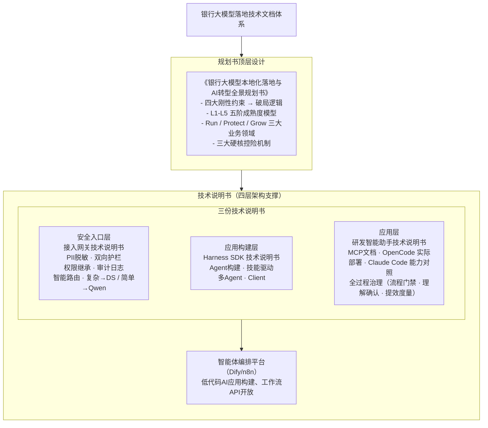

# 银行大模型落地技术文档体系

本目录包含支撑《银行大模型本地化落地与AI转型全景规划书》的技术说明书系列文档。

## 文档全景图



## 四份文档的对应关系

| 文档 | 核心定位 | 规划书对应 |
|------|---------|-----------|
| [1. 银行大模型本地化落地与AI转型全景规划书.md](1.%20银行大模型本地化落地与AI转型全景规划书.md) | 顶层设计 - 四大刚性约束、L1-L5成熟度模型、三大业务领域 | 规划书主体 |
| [2. 银行大模型技术架构总览.md](2.%20银行大模型技术架构总览.md) | 架构总览 - 四层架构、三种构建方式、技术选型 | 技术架构支撑 |
| [3. 银行大模型接入网关技术说明书.md](3.%20银行大模型接入网关技术说明书.md) | 安全入口层 - 统一网关、PII脱敏、双向护栏 | "底层集约建设、技术硬核控险" |
| [4. 银行智能体编排平台技术说明书.md](4.%20银行智能体编排平台技术说明书.md) | 应用构建层 - Dify低代码构建、工作流API开放、RAG知识库 | "上层乐高组装"、L1-L3场景 |
| [5. 银行智能体开发框架技术说明书.md](5.%20银行智能体开发框架技术说明书.md) | 应用构建层 - Agent构建、技能驱动、多智能体协同 | "上层乐高组装"、L3-L5演进路径 |
| [6. 银行研发智能助手技术说明书.md](6.%20银行研发智能助手技术说明书.md) | 应用层 - OpenCode + MCP 内网文档检索，全过程治理（流程门禁、理解确认、提效度量） | Run领域场景A、L1/L2阶段验证 |

## 技术栈对应关系

```
规划书技术要求              技术说明书对应章节
────────────────────────────────────────────────────
底层集约建设         →     接入网关说明书 · 算力调度
                          接入网关说明书 · 智能路由层（快路径规则 + Qwen3.5-0.8B 兜底分类）
                          Harness说明书 · LLMClient
                          智能体编排平台 · 工作流API开放

上层乐高组装         →     Harness说明书 · Skill驱动
                          Harness说明书 · Harness Client
                          智能体编排平台 · 低代码可视化构建

技术硬核控险         →     接入网关说明书 · Guardrails
                          Harness说明书 · Guardrails Hook

L1/L2 单点验证       →     研发助手说明书 · Context7
                          研发助手说明书 · 全过程治理（opencode-session-mgmt）
                          Harness说明书 · Client
                          智能体编排平台 · RAG知识库问答

L3 流程重构          →     Harness说明书 · SDK-JAVA
                          智能体编排平台 · 多步骤工作流
                          Harness说明书 · Spring Cloud集成

L4/L5 多Agent协同    →     Harness说明书 · 多智能体编排
                          Harness说明书 · L4/L5场景实现
```

## 规划书场景与技术支撑映射

| 规划书场景 | 推荐技术 | 关键技术组件 |
|-----------|---------|-------------|
| **场景A：研发智能助手** | Harness Client + OpenCode | Context7 MCP Server + OpenCode + opencode-session-mgmt 全过程治理 |
| **场景B：制度百事通** | 智能体编排平台 | Dify工作流 + 知识库RAG + REST API |
| **场景B：智能客服** | 智能体编排平台 | Dify Chatflow + Guardrails护栏 |
| **场景A：信贷尽调助理** | 智能体编排平台 | Dify工作流 + 数据中台API对接 |
| **场景B：智能支付路由** | Harness SDK（Java） | Agent决策 + Spring Cloud编排 |
| **场景A：智能财资管理** | Harness SDK（Java） | 多Agent协同 + GNN预测引擎 |
| **场景B：财富领航系统** | Harness SDK（多Agent） | 多Agent网络 + Client工作台 |

## 三种应用构建方式对比

| 维度 | 智能体编排平台 | Harness SDK | Harness Client |
|-----|--------------|-------------|----------------|
| **用户角色** | 业务人员、IT通才 | 技术团队 | 个人用户 |
| **开发方式** | 可视化拖拽、低代码 | Python/Java代码 | 配置式、技能文件 |
| **学习曲线** | 低（1-2天） | 高（1-2周） | 中（2-3天） |
| **适用场景** | 标准化场景、快速交付 | 复杂逻辑、深度集成 | 个人办公、研发提效 |
| **部署方式** | 服务端部署、API开放 | 嵌入业务代码 | 桌面客户端 |
| **成熟度阶段** | L1-L3 | L2-L5 | L1-L2 |

## Harness 项目组件与文档对应

```
harness/
├── packages/
│   ├── sdk/                    → Harness说明书 · 核心 SDK
│   │   ├── harness.py          → AgentHarness 入口
│   │   ├── agent_loop.py       → ReAct 执行引擎
│   │   ├── skills/             → 技能系统
│   │   ├── guardrails/         → 安全护栏
│   │   ├── mcp/                → MCP 集成
│   │   └── llm/                → LLM Client
│   │
│   ├── sdk-java/               → Harness说明书 · 企业版
│   │   ├── AgentLoop.java      → Java ReAct引擎
│   │   ├── SkillRegistry.java  → 技能注册
│   │   ├── GuardrailsHook.java → 安全护栏
│   │
│   ├── client/                 → Harness说明书 · Client章节
│   │   ├── ui/                 → PyQt6 界面
│   │   ├── controllers/        → 业务控制器
│   │
│   └── scraper/                → Harness说明书 · 技能驱动模式参考
│       ├── IntelAgent          → 技能驱动实践案例
│       ├── skill.md            → 技能文件范例
```

## 外部项目与文档对应

```
context7/                      → 研发助手说明书
├── MCP Server                 → 内网技术手册检索
├── 智能切片                   → 文档处理策略
├── ChromaDB                   → 知识库存储

opencode-session-mgmt/         → 研发助手说明书 · 全过程治理
├── packages/plugin            → 流程门禁、理解确认、提交门禁
├── packages/cli               → opencode-sm 独立 CLI
├── packages/collector         → org 收集服务（聚合统计）
└── packages/shared            → 共享契约（WorkflowState）
```

## 文档阅读顺序建议

### 快速入门路径

1. **规划书** → 理解整体战略愿景
2. **技术架构总览** → 理解四层架构与三种构建方式
3. **接入网关说明书** → 理解安全入口层设计
4. **智能体编排平台说明书** → 理解低代码应用构建（L1-L3）

### 深度技术路径

1. **规划书** → 理解业务驱动力
2. **技术架构总览** → 掌握整体技术架构
3. **Harness说明书** → 掌握 Agent 开发框架（L3-L5）
4. **接入网关说明书** → 掌握安全护栏设计
5. **研发助手说明书** → MCP 集成实践案例

### 企业落地路径

1. **规划书** → 明确 L1 → L5 演进目标
2. **技术架构总览** → 选择应用构建方式
3. **接入网关说明书** → 部署统一网关
4. **智能体编排平台说明书** → 部署Dify、构建工作流模板
5. **Harness说明书** → Client 章节 → 员工桌面部署
6. **研发助手说明书** → Context7 → 技术团队率先验证

## 参考文档

| 文档 | 来源 | 说明 |
|------|------|------|
| [香港生成式AI技术与应用指南](references/HK_Generative_AI_Technical_and_Application_Guideline_tc.pdf) | 香港金融管理局 | 生成式AI技术架构、风险管理、应用场景指导 |
| [世界经济论坛AI采用洞察报告](references/WEF_Proof_over_Promise_Insights_on_Real_World_AI_Adoption_from_2025_MINDS_Organizations_2026_CN.pdf) | 世界经济论坛 | 2025 MINDS组织AI采用实践洞察 |

## 项目代码仓库

| 项目 | GitHub 地址 | 说明 |
|------|------------|------|
| **Guardrails** | https://github.com/wonglaitung/guardrails | 中文 PII 检测与脱敏护栏系统，Two-Layer Guardrail 架构 |
| **Harness** | https://github.com/wonglaitung/harness | 银行智能体开发框架，Skill 驱动 + 多 Agent 协同 |
| **Context7** | https://github.com/wonglaitung/context7 | MCP Server，内网技术文档检索，研发智能助手核心组件 |
| **opencode-session-mgmt** | https://github.com/wonglaitung/opencode/tree/dev/opencode-session-mgmt | 研发智能助手全过程治理：流程门禁、理解确认、提交门禁与效能度量（插件 + CLI + org 收集服务） |

---

## 版本与维护

| 文档 | 对应项目版本 | 更新日期 |
|------|-------------|---------|
| 全景规划书 | - | 2026-06 |
| 技术架构总览 | - | 2026-06 |
| 接入网关说明书 | guardrail v1.0 | 2026-06 |
| 智能体编排平台说明书 | Dify v1.10.1 | 2026-06 |
| 研发助手说明书 | context7 v1.0 + opencode-session-mgmt | 2026-08 |
| Harness说明书 | harness v0.1.0 | 2026-07 |

### 2026-06/07 新增功能

| 功能 | 说明 | 提交数 |
|------|------|--------|
| **浏览器自动化** | 7 个 Playwright 工具，独立窗口模式，内网环境支持 | 4 |
| **文档大小验证** | max_document_size 配置，warn/error/truncate 行为 | 1 |
| **多模态支持** | 图片/文档上传，OpenAI 兼容格式自动转换 | 3 |
| **Goal-Driven 执行** | GoalLoop, GoalVerifier, ParallelExecutor | 5 |
| **渐进式技能加载** | 延迟加载，减少启动时间 | 1 |
| **实时监控 UI** | Token 使用、迭代次数、事件日志面板 | 1 |
| **知识图谱工具** | code-review-graph MCP 集成 | 1 |

---

## Harness 项目统计数据（Graph 分析）

基于 code-review-graph 的代码结构分析：

| 指标 | 数值 |
|------|------|
| 总节点数 | 8,368 |
| 总边数 | 47,115 |
| 文件数 | 588 |
| 测试节点 | 1,263 |
| 类 | 1,089 |
| 函数 | 5,428 |
| **Python/Java SDK 同步率** | **99.5%** |

**主要代码社区**：

| 社区 | 节点数 | 描述 |
|------|--------|------|
| `core-config` | 1,582 | SDK 核心配置和连接器 |
| `core-builder` | 1,414 | 构建器模式组件 |
| `ui-theme` | 650 | PyQt6 客户端 UI |
| `memory-memory` | 327 | 记忆系统 |
| `mcp-tool` | 120 | MCP 集成 |

**关键执行流**：
- `session_websocket` (criticality 0.77) — WebSocket 会话管理
- `run` / `stream` / `run_goal` (0.71) — Agent 执行入口
- `AgentLoop._run_impl` — ReAct 循环核心（128 连接）