# 银行AI发展整体架构框架

> **监管适用范围**：香港持牌银行
> **核心监管机构**：香港金融管理局(HKMA)
> **主要监管依据**：HKMA《生成式人工智能客户保障指引》、监管政策手册
> **数据隐私法规**：《个人资料（私隐）条例》(PDPO)

---

## 一、全视图：AI银行架构全景

本架构框架采用"六层架构"设计，从战略愿景到组织执行层层递进。

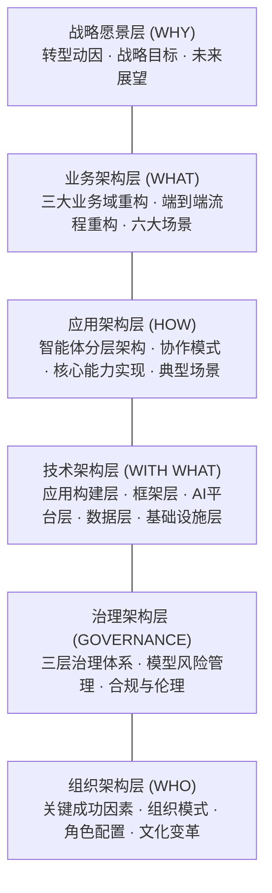
---

## 二、战略愿景层：为什么需要AI银行？

### 2.1 转型动因

**外部压力：**
- **客户期望变化**：数字原生代成为主力客群，期待"即时、个性化、无摩擦"的服务体验
- **竞争格局变化**：金融科技公司、互联网巨头跨界竞争，传统银行护城河被侵蚀
- **监管要求提升**：HKMA等监管机构推动AI治理框架，合规要求日益严格

**技术成熟窗口：**
- **大模型能力突破**：大模型在理解、推理、生成能力上取得实质进展
- **智能体技术可用**：多智能体协作、工具调用、自主规划等技术进入实用阶段
- **部署成本下降**：开源模型、云服务使AI落地门槛降低

**价值机遇：**
- 麦肯锡研究显示，AI可带来14%-24%的潜在利润提升
- 软件开发、运营、市场营销、风控与法务等板块增效潜力较大
- 先行者将在客户体验、风险控制、运营效率上建立竞争优势

### 2.2 战略目标体系

**财务目标：**
- 短期（1年）：2-3个高价值用例规模化，ROI可衡量
- 中期（3年）：AI贡献20-30%运营效率提升，10-15%收入增长
- 长期（5年）：成为行业AI标准制定者，孵化新业务模式

**能力目标：**
- 客户体验：NPS提升30+分，服务解决率>90%
- 运营效率：自动化率>70%，流程时间缩短50%
- 风险管理：实时风险覆盖率>90%，损失减少60%

### 2.3 未来银行展望

AI银行的核心是"智能驱动的增长引擎 + 自主运行的风险体系 + 人机协同的组织范式"。它将金融服务嵌入千行百业，成为无处不在的智能金融能力。

**核心要素对比：**

| 核心要素 | 传统模式 | 未来模式 | AI驱动 |
|---------|---------|---------|--------|
| **智能驱动的增长引擎** | 卖产品、触点运营 | 经营客户生命周期、嵌入式服务 | AI分析客户需求，主动提供个性化方案 |
| **自主运行的风险体系** | 事后止损、规则驱动 | 事前预防、智能学习 | 实时监测、持续优化，将风险控制转化为风险定价能力 |
| **人机协同的组织范式** | 人工流程、部门割裂 | 自主流程、端到端协同 | AI接管标准化流程，人类专注复杂决策与情感连接 |

---

## 三、业务架构层：AI如何重塑银行业务？

业务架构层将战略愿景转化为具体的业务能力与场景。基于银行"增长-保护-运营"三大业务域，AI技术将重构每个领域的核心能力。

### 3.1 业务域重构

业务架构从"横向能力"与"纵向流程"两个维度展开。横向按业务域构建能力矩阵，纵向以客户旅程为主线设计端到端流程。

#### 3.1.1 客户经营域 (Grow the Bank)

客户经营域实现"智能驱动的增长引擎"，从被动响应客户需求转向预测需求、主动服务。

**传统能力 vs AI驱动能力：**
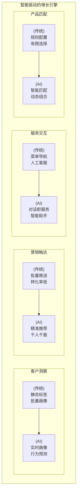

**关键技术：**
- 实时计算引擎：流处理客户行为数据，毫秒级画像更新
- 推荐算法：协同过滤 + 内容推荐 + 深度学习混合模型
- LLM对话：多轮对话理解、意图识别、情感分析
- 知识图谱：产品-客户-场景关联网络

### 3.1.2 风险管理域 (Protect the Bank)

风险管理域实现"自主运行的风险体系"，从规则驱动、被动响应转向模型自我优化、主动预防。

**传统能力 vs AI驱动能力：**
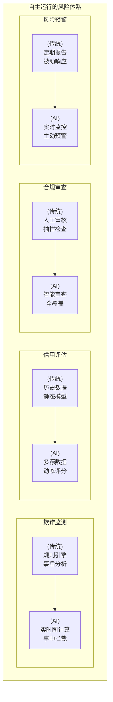

**关键技术：**
- 图神经网络：交易关联网络分析，识别团伙欺诈
- 流计算引擎：毫秒级交易监测，实时拦截异常交易
- 在线学习：模型从新欺诈案例中持续学习，适应新型攻击
- NLP合规审查：监管文本语义理解，自动化合规检查

### 3.1.3 运营管理域 (Run the Bank)

运营管理域实现"人机协同的智能运营"，从人工执行转向AI自动化处理、人工异常介入。

**传统能力 vs AI驱动能力：**
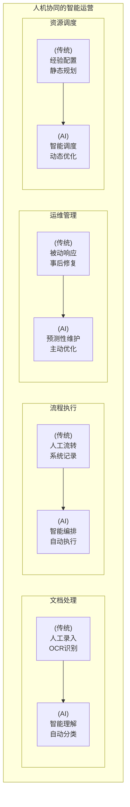

**关键技术：**
- LLM文档智能：非结构化文档理解、信息提取、自动分类
- RPA + 工作流引擎：跨系统流程编排，端到端自动化执行
- AIOps：时序预测、异常检测、根因分析、自动修复
- 运筹优化：资源动态调度、容量规划、成本优化

### 3.2 端到端流程重构

以客户旅程为主线，AI打通业务域边界。

```mermaid
flowchart TB
    subgraph J["客户旅程对比"]
        direction TB
        subgraph J1["需求发现"]
            direction LR
            J1T["传统模式：广告被动推送"] --> J1A["AI模式：行为预测，主动触发"]
        end
        subgraph J2["产品选择"]
            direction LR
            J2T["传统模式：菜单浏览"] --> J2A["AI模式：个性化推荐匹配"]
        end
        subgraph J3["申请办理"]
            direction LR
            J3T["传统模式：表单填写"] --> J3A["AI模式：自动填表，无感审批签约"]
        end
        subgraph J4["使用服务"]
            direction LR
            J4T["传统模式：人工服务"] --> J4A["AI模式：智能服务，主动优化"]
        end
        subgraph J5["问题处理"]
            direction LR
            J5T["传统模式：客服被动响应"] --> J5A["AI模式：预测性干预，问题预防"]
        end
    end
```

### 3.3 高价值应用场景

业务能力与端到端流程的交汇点，是AI价值释放的具体载体。

#### 3.3.1 银行理财经理AI Copilot助手（智能增长）

**业务痛点：** 客户经理人均管理客户数受限（约200户），难以深入洞察每位客户需求；营销话术标准化程度低，合规风险高；产品知识更新频繁，客户经理难以全面掌握。

**AI重构：**
- **实时客户画像**：整合交易、持仓、行为数据，动态识别需求信号（如大额入账、产品到期）
- **智能方案生成**：基于风险偏好与市场数据，自动生成资产配置建议与推荐理由
- **合规话术辅助**：产品条款语义解析，自动生成风险提示与合规表述

**人机协同：** AI生成建议草案，客户经理审核确认；复杂产品配置由人工主导，AI辅助计算

**价值实现：** AUM提升20-30%，客户满意度提升，客户经理服务半径扩展至500+户（来源：McKinsey银行业AI研究报告、安永AI银行研究报告）

#### 3.3.2 智能营销（智能增长）

**业务痛点：** 传统营销依赖批量推送，转化率低（约2-5%）；客户需求识别滞后，错失最佳触达时机；营销策略调整周期长，难以实时优化。

**AI重构：**
- **需求预测引擎**：分析客户行为轨迹，预测购买意向与最佳触达时机
- **超个性化推荐**：实时生成千人千面的产品组合与营销内容
- **策略闭环优化**：A/B测试自动运行，策略参数实时调整

**人机协同：** AI执行触达与优化，营销人员定义策略边界与创意方向；异常转化模式人工介入分析

**价值实现：** 转化率提升40%+，营销ROI改善，触达时效从天级缩短至分钟级（来源：行业AI营销应用案例）

#### 3.3.3 智能信贷审批（自主风控）

**业务痛点：** 传统审批依赖人工审核，周期长（3-5个工作日）；信用评估维度有限，难以覆盖无征信记录人群；审批标准执行不一致，存在道德风险。

**AI重构：**
- **多源数据整合**：接入征信、税务、社保、电商等多维数据，构建全景信用画像
- **智能决策引擎**：机器学习模型实时评估违约概率，生成审批建议与额度
- **可解释风控**：输出风险评估依据，满足监管合规要求

**人机协同：** AI初审自动通过低风险客户（评分≥700），中高风险客户人工终审；大额贷款必须人工确认

**价值实现：** 审批时间缩短80%，风险识别准确率提升35%，覆盖客群扩展30%（来源：McKinsey银行业AI研究报告）

#### 3.3.4 智能反欺诈（自主风控）

**业务痛点：** 规则引擎误报率高（约15%），影响正常交易体验；新型欺诈手段层出不穷，规则更新滞后；事后追损成本高，难以挽回损失。

**AI重构：**
- **实时交易监测**：毫秒级分析交易行为，识别异常模式
- **图计算关联分析**：构建交易关联网络，识别团伙欺诈与账户盗用
- **自适应学习**：从历史欺诈案例中持续学习，自动适应新型攻击

**人机协同：** AI自动拦截高风险交易，人工复核可疑交易；欺诈调查由人工主导，AI提供证据链

**价值实现：** 欺诈识别准确率从85%提升至99.2%，误报率降至2%以下，年挽回损失超2亿元（来源：某大型商业银行反欺诈系统案例）

#### 3.3.5 智能客服（人机协同）

**业务痛点：** 传统IVR菜单层级深，客户体验差；人工客服成本高，7×24小时服务难以保障；知识库更新滞后，回答一致性差。

**AI重构：**
- **自然语言交互**：客户意图自动识别，从"菜单导航"转向"对话即服务"
- **多模态理解**：语音、文本、图像多渠道统一处理，方言自适应
- **知识实时更新**：产品信息、政策变更自动同步至知识库

**人机协同：** AI处理常规咨询（占比约80%），人工介入复杂问题与情感投诉；客户可随时转人工

**价值实现：** 客服自助解决率提升50%，客户满意度提升至98%，人工客服成本降低40%（来源：NVIDIA AI Customer Service报告、行业案例研究）

#### 3.3.6 智能运营（人机协同）

**业务痛点：** 后台运营依赖大量人工处理文档、核对数据、执行流程；跨系统流程割裂，效率低；运维被动响应，故障影响业务。

**AI重构：**
- **文档智能处理**：非结构化文档自动理解、提取、分类，替代人工录入
- **流程自动化编排**：跨系统流程自动执行，端到端无人工干预
- **预测性运维**：系统异常提前预警，主动修复潜在故障

**人机协同：** AI自动执行标准化流程，人工仅介入异常处理与关键审批；运维策略由人工定义，AI执行优化

**价值实现：** 运维工时减少25%+，成本降低500万元+，流程执行时效从小时级缩短至分钟级（来源：McKinsey银行业运营效率研究）

---

## 四、应用架构层：智能体框架设计

应用架构层定义智能体的分层架构与协作模式，将三大核心要素转化为可执行的技术方案。

### 4.1 智能体分层架构

智能体架构采用三层设计：基础智能体层提供通用能力，领域智能体层承载业务逻辑，编排层协调多智能体协作。

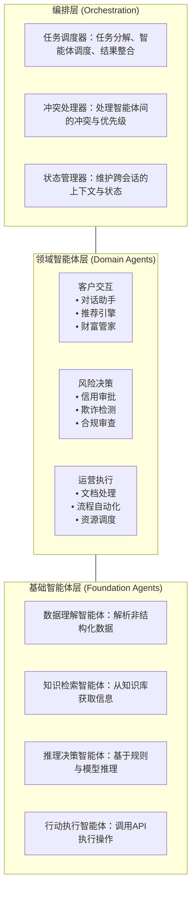

### 4.2 智能体协作模式

多智能体协同通过编排层协调多个领域智能体，完成复杂业务流程。

#### 4.2.1 协作模式核心机制

1. **任务分解**：编排层将复杂业务流程拆解为多个子任务
2. **智能体调度**：根据任务类型调用对应的领域智能体
3. **并行执行**：独立子任务由多个智能体并行处理
4. **结果整合**：编排层聚合各智能体输出，形成最终解决方案
5. **异常处理**：无法自动处理的异常触发人工介入

#### 4.2.2 实践案例：银行理财经理AI Copilot助手

**触发场景：** 客户经理打开客户档案，或系统检测到客户资产变动（大额入账、产品到期）时自动触发。

**智能体协作流程：**
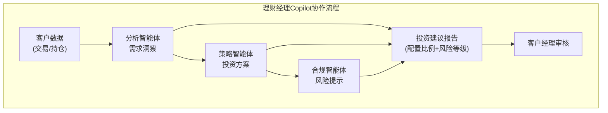

**各智能体职责：**
- **分析智能体**：建模客户交易数据，挖掘隐性需求
- **策略智能体**：动态生成资产配置矩阵，平衡收益与风险
- **合规智能体**：解构产品条款语义，自动化标注风险点

### 4.3 三大核心能力实现

#### 4.3.1 智能驱动的增长引擎

增长引擎通过客户交互智能体与编排层协同，实现从需求预测到问题预防的全链路智能化。

**实现链路：**

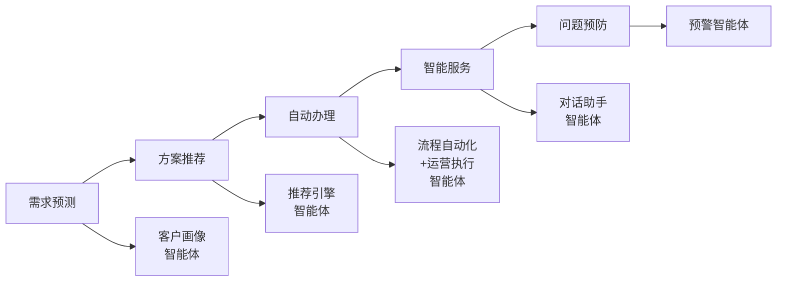

**各环节智能体职责：**

| 环节 | 主导智能体 | 协同智能体 | 输出 |
|------|-----------|-----------|------|
| 需求预测 | 客户画像智能体 | 数据理解智能体 | 客户需求标签、购买意向评分 |
| 方案推荐 | 推荐引擎智能体 | 知识检索智能体 | 个性化产品组合、推荐理由 |
| 自动办理 | 运营执行智能体 | 推理决策智能体 | 自动填表、无感审批 |
| 智能服务 | 对话助手智能体 | 知识检索智能体 | 7×24小时智能应答 |
| 问题预防 | 预警智能体 | 风险决策智能体 | 服务异常预警、主动关怀 |

#### 4.3.2 自主运行的风险体系

风险体系通过风险决策智能体实现持续学习与自我优化，从事后响应转变为事前预防。

**风险智能体能力矩阵：**

| 智能体 | 核心能力 | 学习机制 | 优化周期 |
|--------|---------|---------|---------|
| 欺诈检测智能体 | 实时交易监控、异常模式识别 | 从历史欺诈案例中学习 | 每日增量学习 |
| 信用评估智能体 | 动态信用评分、违约预测 | 从还款行为中学习 | 每周模型更新 |
| 合规审查智能体 | 监管规则匹配、风险提示生成 | 从监管更新中学习 | 规则实时同步 |
| 市场风险智能体 | 波动预测、压力测试 | 从市场数据中学习 | 实时风险计算 |

**自我优化机制：**
1. **数据反馈闭环**：每次人工干预结果自动回流至训练数据
2. **模型漂移监测**：持续监控模型准确率，触发阈值自动重训
3. **A/B测试框架**：新模型与旧模型并行运行，效果验证后切换

#### 4.3.3 人机协同的组织范式

人机协同通过决策边界划分与人工介入机制，实现AI自主执行与人类监督治理的平衡。

**决策边界划分：**

| 决策类型 | AI自主执行 | 人工审批 | 人工介入条件 |
|---------|-----------|---------|-------------|
| **交易授权** | 低风险交易（<5万） | 高风险交易（≥5万） | 金额超限、异常行为 |
| **信用审批** | 白名单客户、小额贷款 | 新客户、大额贷款 | 信用记录不足、评分临界 |
| **投资建议** | 标准产品推荐 | 复杂产品配置 | 高风险产品、客户异议 |
| **欺诈处理** | 交易拦截、账户冻结 | 欺诈调查、客户沟通 | 需要外部取证 |

**人工介入触发机制：**

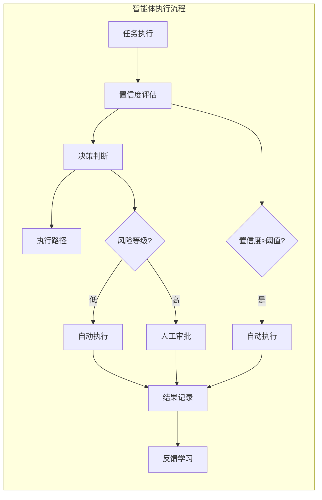

**人类监督治理机制：**
- **实时监控仪表盘**：展示AI决策的关键指标与异常预警
- **抽样审计机制**：定期抽取AI决策样本进行人工复核
- **熔断机制**：当AI准确率下降或异常率上升时，自动切换至人工模式

### 4.4 典型场景：个人贷款端到端实现

以个人贷款申请为例，展示智能体协作与人机协同的完整实现。

#### 4.4.1 流程概览

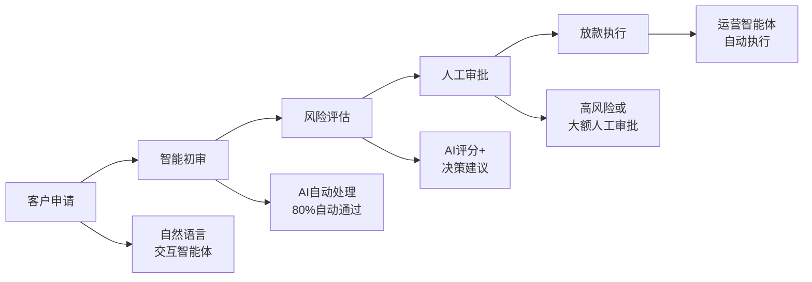

#### 4.4.2 关键设计要点

- **意图识别**：自然语言交互，客户可随时转人工
- **自动初审**：80%自动通过，识别失败材料人工标注
- **风险分级**：低风险自动审批，中高风险人工确认
- **放款执行**：合同生成、资金划转自动化，异常人工介入

#### 4.4.3 价值实现

| 指标 | 传统模式 | AI模式 | 提升幅度 |
|------|---------|--------|---------|
| 审批时效 | 3-5个工作日 | 低风险客户实时审批 | 缩短80%+ |
| 人工干预率 | 100% | 仅20%需人工审批 | 减少80% |
| 风险识别准确率 | 85% | 95% | 提升10个百分点 |
| 客户满意度 | 72% | 92% | 提升20个百分点 |

---

## 五、技术架构层：支撑AI银行的技术栈

技术架构层构建从应用到基础设施的完整技术体系，为智能体架构提供底层支撑。

### 5.1 整体技术架构

技术架构分为六层，自下而上为核心业务提供底层支撑。

```mermaid
flowchart TB
    subgraph APP["应用层 (Business Applications)"]
        APP1["智能客服 | 风险决策 | 运营自动化 | 理财经理Copilot | ..."]
    end
    subgraph BUILD["应用构建层 (Application Building)"]
        B1["智能体编排平台<br/>• 低代码可视化编排<br/>• 快速原型验证<br/>• 标准化场景交付"]
        B2["智能体开发框架<br/>• 代码级深度定制<br/>• 复杂多Agent协同<br/>• 企业系统集成"]
    end
    subgraph FW["智能体框架层 (Agent Framework)"]
        FW0["编排引擎（协同中枢）<br/>• 任务分解 • 智能体路由 • 并行执行 • 结果聚合"]
        FW1["智能体运行时<br/>• ReAct循环<br/>• 状态管理"]
        FW2["记忆系统<br/>• 工作记忆<br/>• 情景记忆"]
        FW3["工具调用<br/>• MCP协议<br/>• 权限控制"]
        FW4["人机协同关卡<br/>• 风险关卡"]
        FW5["可观测性与审计平面<br/>• 决策追踪 • 审计日志 • 合规证据"]
    end
    subgraph AIP["AI平台层 (AI Platform)"]
        P1["MLOps<br/>• CI/CD流水线<br/>• 自动化测试<br/>• 部署编排"]
        P2["模型管理<br/>• 模型仓库<br/>• 版本控制<br/>• 模型服务"]
        P3["特征工程<br/>• 特征库<br/>• 特征监控<br/>• 特征计算"]
    end
    subgraph DATA["数据层 (Data Layer)"]
        D1["实时数据<br/>• 事件流<br/>• CDC<br/>• 消息队列"]
        D2["批处理数据<br/>• 数据湖<br/>• 数据仓库<br/>• 数据建模"]
        D3["外部数据<br/>• 第三方API<br/>• 数据市场<br/>• 合作伙伴"]
    end
    subgraph INFRA["基础设施层 (Infrastructure)"]
        I1["计算<br/>• GPU集群<br/>• 容器平台<br/>• 无服务器"]
        I2["存储<br/>• 对象存储<br/>• 向量数据库<br/>• 图数据库"]
        I3["网络<br/>• 低延迟网络<br/>• 专线连接<br/>• 安全网关"]
    end
    APP --- BUILD --- FW --- AIP --- DATA --- INFRA
```

### 5.2 应用构建层技术方案

应用构建层位于应用层与智能体框架层之间，提供两种互补的应用构建方式：智能体编排平台（低代码）与智能体开发框架（代码级开发），满足不同场景、不同用户群体的需求。

#### 5.2.1 双轨构建策略

| 构建方式 | 目标用户 | 核心价值 | 算力资源 | 典型场景 |
|---------|---------|---------|---------|---------|
| **智能体编排平台** | 业务人员、IT通才 | 低代码可视化、快速原型验证、标准化场景交付 | 总行私有云 | 制度问答、FAQ客服、报告生成、合同质检 |
| **智能体开发框架** | 技术团队（开发人员） | 代码级深度定制、复杂业务逻辑、企业系统深度集成 | 本地算力卡 | 智能支付路由、动态定价、多Agent协同、核心系统集成 |

**算力资源约束：**

由于监管要求，我行无法使用公有云，算力资源分为两种：

| 算力来源 | 适用构建方式 | 特点 |
|---------|-------------|------|
| **总行私有云** | 智能体编排平台 | 统一算力池、按需申请、无需自行运维 |
| **本地算力卡** | 智能体开发框架 | 需自行采购部署、独立运维、完全可控 |

**选择决策原则：**
- 标准化场景优先使用编排平台 + 总行私有云，快速交付、零运维
- 涉及核心系统集成与资产负债表核心业务，需采用开发框架 + 本地算力

#### 5.2.2 智能体编排平台

智能体编排平台提供低代码可视化构建能力，适合业务人员快速构建标准化AI应用。**算力资源使用总行私有云，无需自行采购运维。**

**核心能力：**

| 能力 | 说明 | 技术实现 |
|------|------|---------|
| 可视化编排 | 拖拽式工作流设计 | 画布编辑器 + 节点组件库 |
| RAG Pipeline | 开箱即用的知识检索 | 文档解析→分块→向量化→检索 |
| 工作流API | 一键发布REST API | 自动生成API端点 |
| 多模型支持 | 对接多种LLM推理引擎 | OpenAI兼容接口 |

**与智能体框架层的关系：**
- 编排平台不自行实现编排引擎，而是调用智能体框架层的能力
- 编排平台构建的工作流可通过API暴露，供业务系统调用

#### 5.2.3 智能体开发框架

智能体开发框架提供代码级开发能力，适合技术团队构建复杂AI应用。**算力资源使用本地算力卡，需自行采购部署GPU集群。**

**核心能力：**

| 能力 | 说明 | 技术实现 |
|------|------|---------|
| 技能驱动架构 | 统一运行时 + 技能注入 | YAML配置 + 热加载 |
| 多Agent协同 | 原生支持复杂协同模式 | Supervisor-Worker编排 |
| 企业系统集成 | 深度对接核心系统 | Spring Cloud微服务集成 |

**适用场景判定：**
- 需要集成核心银行系统（存贷汇核心）
- 涉及资产负债表核心业务逻辑
- 需要复杂多Agent协同编排
- 对性能、可靠性有极高要求

#### 5.2.4 双轨协同架构

两种构建方式可以协同使用，形成"编排平台前端 + 开发框架后端"的混合模式：

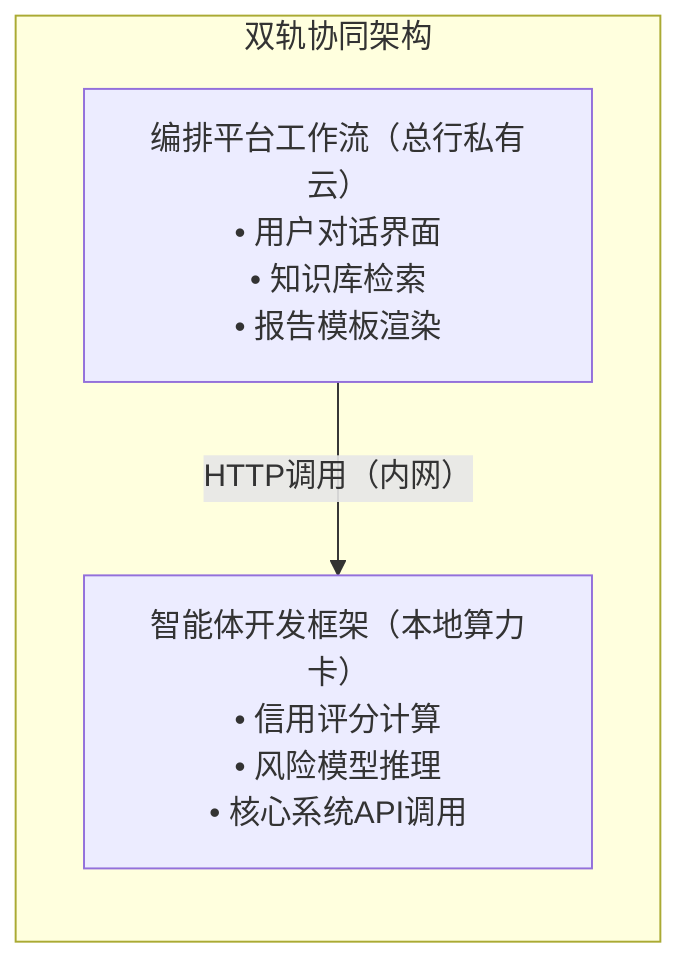

**协同场景示例：**

| 场景 | 编排平台负责（总行私有云） | 开发框架负责（本地算力卡） |
|------|---------------------------|---------------------------|
| 信贷尽调报告 | 对话交互、知识检索、报告生成 | 征信查询、风险评分、核心系统对接 |
| 智能客服 | 前端对话、FAQ问答、意图识别 | 复杂业务查询、工单创建、系统调用 |
| 投研分析 | 报告模板、数据可视化 | 数据分析模型、投资组合计算 |

### 5.3 智能体框架层技术方案

智能体框架层是支撑多智能体协同的核心技术层，采用"统一运行时 + 技能注入"的架构设计，并支持"确定性编排"到"智能编排"的两阶段演进。

#### 5.3.1 两阶段编排架构

业界最佳实践将编排分为两层：**确定性流程编排**处理固定流程，**智能体协调层**处理动态决策。银行场景建议两阶段演进：

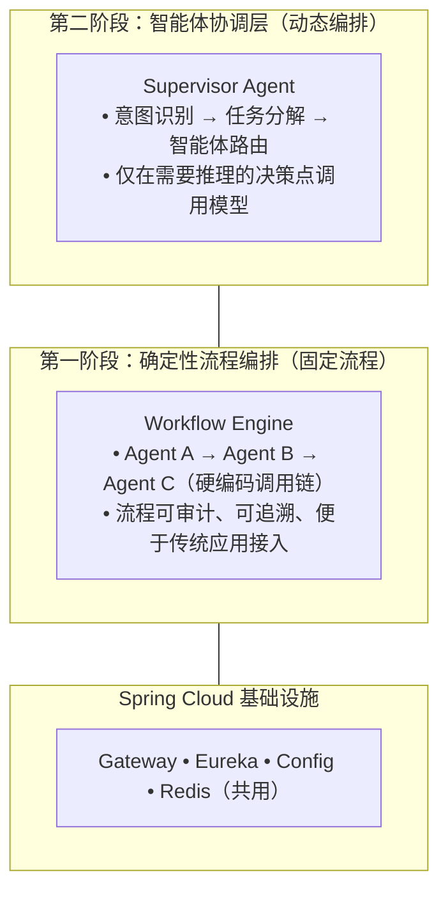

**两阶段演进路径：**

| 阶段 | 编排方式 | 适用场景 | 优势 |
|------|---------|---------|------|
| **第一阶段** | 确定性流程编排 | 流程固定、合规要求高 | 可审计、可追溯、传统应用易接入 |
| **第二阶段** | 智能体协调层 | 任务不确定、需动态决策 | 灵活、自适应、智能路由 |

**银行场景示例：贷款审批流程**

| 步骤 | 编排方式 | 原因 |
|------|---------|------|
| 申请接收 → 材料解析 | 确定性 | 固定流程，无需推理 |
| 信用评分 | 确定性 + 模型调用 | 规则+模型，结果可审计 |
| 风险判断 | 智能决策点 | 需要综合推理 |
| 审批决策 | 确定性 + 人工关卡 | 合规要求，流程固定 |
| 放款执行 | 确定性 | 固定流程 |

#### 5.3.2 统一运行时架构

领域智能体共享统一的技术底座，差异仅在于注入的技能配置。

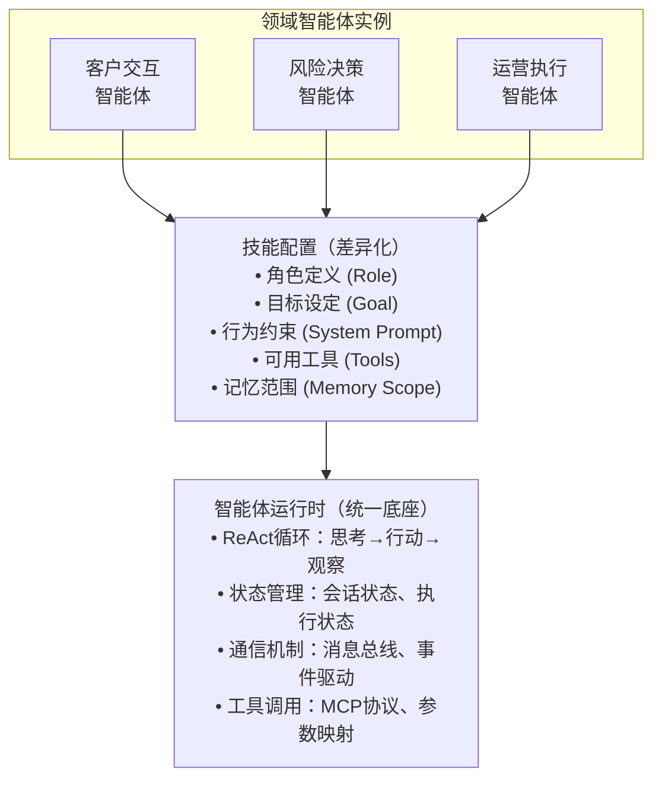

**技能配置示例：**

| 领域智能体 | 角色 | 目标 | 可用工具 |
|-----------|------|------|---------|
| 客户交互智能体 | 客户服务专员 | 解答客户咨询、提供个性化建议 | 知识检索、产品查询、工单创建 |
| 风险决策智能体 | 风险审核员 | 评估风险、生成决策建议 | 征信查询、风险模型、合规规则 |
| 运营执行智能体 | 运营专员 | 自动化执行运营任务 | 文档处理、流程触发、系统调用 |

#### 5.3.3 编排引擎（Orchestrator）

编排引擎分两层实现，支持从确定性编排演进到智能编排。

**第一层：确定性流程编排（第一阶段）**

固定流程的硬编码调用链，基于Spring Cloud实现。

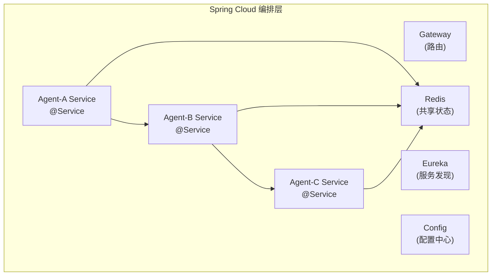

**技术实现：**

| 组件 | 功能 | 技术选型 |
|------|------|---------|
| 服务发现 | Agent服务注册与发现 | Spring Cloud Eureka |
| 配置中心 | 技能配置统一管理 | Spring Cloud Config |
| 状态共享 | 跨Agent会话状态 | Redis |
| 流程编排 | 硬编码调用链 | Spring @Service编排 |

**代码示例：**

```java
@Service
public class LoanOrchestrator {
    @Autowired private AgentService documentAgent;
    @Autowired private AgentService riskAgent;
    @Autowired private AgentService approvalAgent;

    public WorkflowResult processLoan(Application app) {
        // 确定性调用链
        LoopResult docs = documentAgent.run("解析材料：" + app.getDocuments());
        LoopResult risk = riskAgent.run("风险评估：" + docs.content());
        LoopResult decision = approvalAgent.run("审批决策：" + risk.content());
        return WorkflowResult.completed(decision);
    }
}
```

**第二层：智能体协调层（第二阶段）**

Supervisor-Worker分层模式，实现动态任务分解与智能体路由。

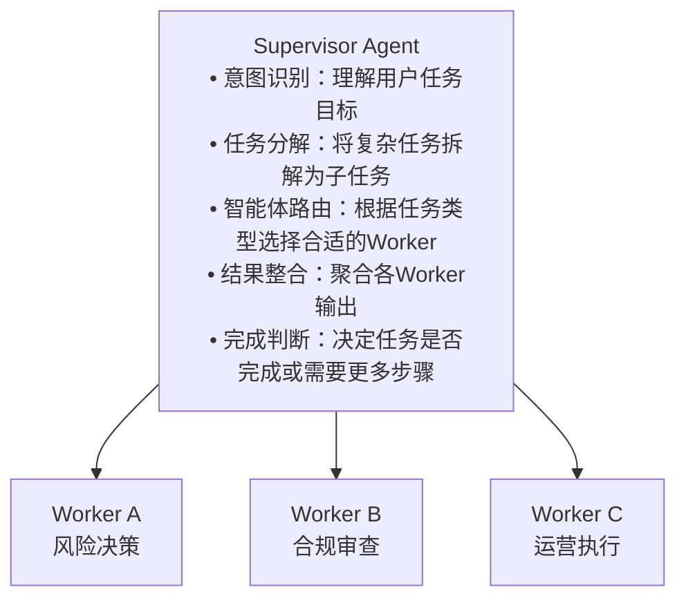

**技术实现：**

| 核心组件 | 功能 | 技术实现 |
|---------|------|---------|
| 意图识别 | 理解用户任务目标 | LLM分类 + 意图槽位 |
| 任务分解 | 将复杂任务拆解为子任务 | LLM任务规划 + DAG依赖图 |
| 智能体路由 | 根据任务类型选择智能体 | 意图分类 + 智能体注册表 |
| 并行执行 | 多智能体并行处理 | 异步消息队列 + 执行池 |
| 结果聚合 | 整合多智能体输出 | 结果融合算法 + 冲突检测 |

**编排模式选择：**

| 模式 | 适用场景 | 特点 | 演进阶段 |
|------|---------|------|---------|
| 确定性流程编排 | 结构化流程、合规要求高 | 可审计、可追溯 | 第一阶段 |
| Supervisor-Worker | 任务可分解、需专业化 | 分层治理、智能路由 | 第二阶段 |
| Graph编排 | 条件分支、状态机 | 可观测性强 | 第一/二阶段均可 |

#### 5.3.4 智能体运行时（Agent Runtime）

智能体运行时提供单个智能体的执行环境，支持ReAct循环。

| 能力 | 说明 | 技术实现 |
|------|------|---------|
| 智能体加载 | 动态加载智能体定义 | YAML配置 + 热加载 |
| ReAct循环 | 思考→行动→观察循环 | 状态机 + 循环控制 |
| 状态管理 | 管理执行状态 | Redis状态存储 |
| 智能体通信 | 智能体间消息传递 | 消息总线 + 事件驱动 |

#### 5.3.5 记忆系统（Memory System）

记忆系统支持智能体的上下文感知与知识积累，采用分层记忆架构。

| 记忆类型 | 用途 | 技术实现 |
|---------|------|---------|
| 工作记忆 | 当前会话上下文 | Redis + 滑动窗口 |
| 情景记忆 | 用户历史交互 | 向量数据库 + 时间索引 |
| 语义记忆 | 领域知识、技能定义 | 知识图谱 + 向量检索 |
| 程序记忆 | 智能体行为模式 | 规则库 + 反馈学习 |

#### 5.3.6 工具调用框架（Tool Calling）

工具调用框架让智能体能够调用外部系统，采用MCP（Model Context Protocol）协议。

| 能力 | 说明 | 技术实现 |
|------|------|---------|
| 工具注册 | 定义可调用工具 | OpenAPI规范 + 工具注册表 |
| 参数映射 | 自然语言→API参数 | LLM函数调用 + 参数验证 |
| 执行监控 | 调用链追踪与审计 | 分布式追踪 + 日志采集 |
| 权限控制 | 工具调用权限管理 | RBAC + 敏感操作审批 |

#### 5.3.7 人机协同关卡（Human-in-the-Loop Gates）

人机协同关卡在关键节点插入人工审批，采用业界成熟的审批关卡模式。

| 关卡类型 | 触发条件 | 实现方式 |
|---------|---------|---------|
| 风险关卡 | 高风险操作（大额交易、敏感数据） | 规则引擎 + 审批流程 |
| 置信度关卡 | AI置信度低于阈值 | 模型置信度输出 + 人工确认 |
| 抽样关卡 | 随机抽样质检 | 抽样算法 + 复核流程 |
| 合规关卡 | 监管要求场景 | 合规规则库 + 强制审批 |

#### 5.3.8 可观测性与审计平面（Observability & Audit Plane）

可观测性平面记录智能体执行的完整轨迹，支持调试、审计与合规。

| 记录内容 | 用途 | 存储方式 |
|---------|------|---------|
| 提示词与上下文 | 调试与审计 | 审计日志 + 不可篡改存储 |
| 模型调用记录 | 成本核算、性能分析 | 调用链追踪 |
| 工具调用详情 | 操作审计 | 结构化日志 |
| 决策路径 | 合规审查 | 决策树可视化 |
| 人工审批记录 | 责任追溯 | 审批日志 + 数字签名 |

### 5.4 AI平台层技术方案

AI平台层为智能体提供模型训练、部署、管理的全生命周期能力，计划使用总行机器学习平台的MLOps流水线。

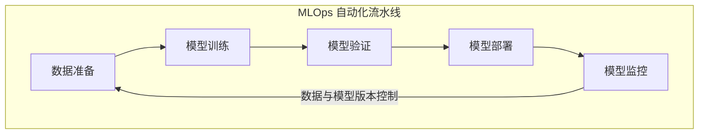

| 阶段 | 核心能力 | 支撑场景 |
|------|---------|---------|
| 数据准备 | 特征提取、数据版本管理 | 所有AI场景 |
| 模型训练 | 分布式训练、超参优化 | 风险模型、推荐模型 |
| 模型验证 | 准确性测试、公平性检测 | 高风险模型上线前验证 |
| 模型部署 | 灰度发布、A/B测试 | 模型迭代更新 |
| 模型监控 | 漂移检测、性能告警 | 持续学习触发 |

### 5.5 数据层技术方案

数据层为智能体提供实时与历史数据支撑，计划使用总行数据湖。

### 5.6 基础设施层技术方案

基础设施层为智能体系统提供算力、存储、网络支撑。

#### 5.6.1 算力资源双轨架构

**算力资源约束：**

我行在算力资源方面面临以下约束：
- **监管约束**：无法使用公有云，数据必须留在本地
- **总行资源约束**：总行未规划固定资源给境外机构使用
- **接口约束**：总行不支持分行通过OpenAI兼容接口直接对接大模型

基于以上约束，智能体开发框架需要独立的本地算力支撑，而智能体编排平台可使用总行私有云。因此形成"总行私有云 + 本地算力卡"的双轨架构：

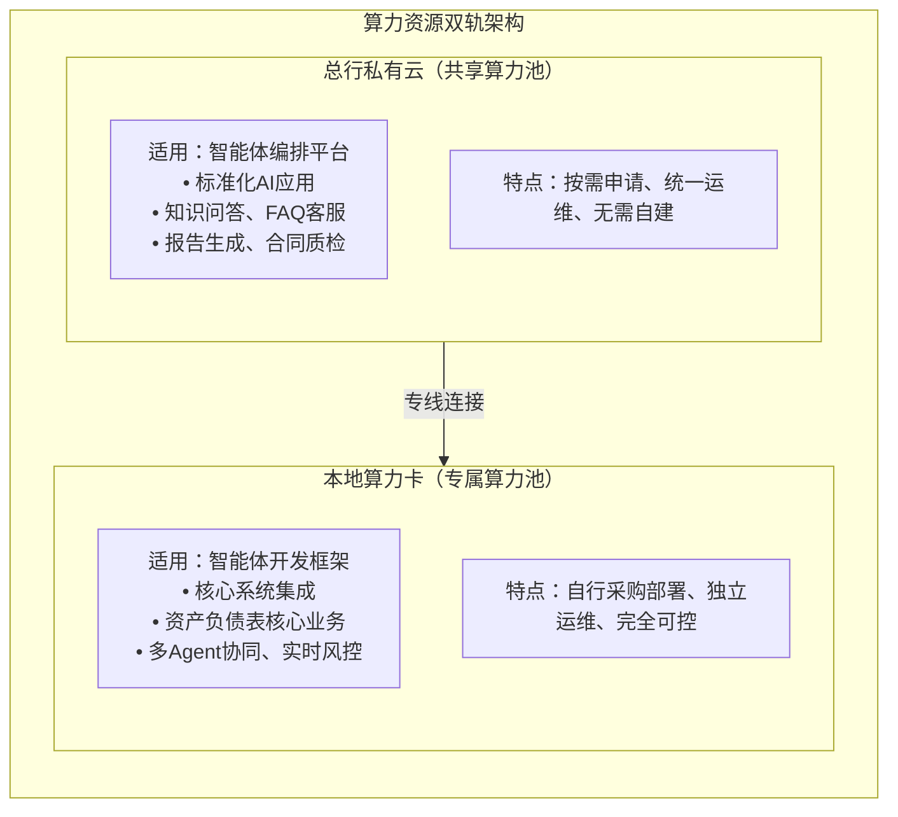

**算力资源对比：**

| 维度 | 总行私有云 | 本地算力卡 |
|------|-----------|-----------|
| **适用构建方式** | 智能体编排平台 | 智能体开发框架 |
| **申请方式** | 按需申请、审批后使用 | 自行采购、自主部署 |
| **运维责任** | 总行统一运维 | 本地团队运维 |
| **资源独占性** | 共享资源池 | 专属资源池 |
| **响应延迟** | 依赖专线带宽 | 本地网络、延迟最低 |
| **数据位置** | 总行数据中心 | 本地机房 |
| **适用场景** | 标准化AI应用 | 核心业务系统集成 |

#### 5.6.2 总行私有云资源

总行私有云为智能体编排平台提供算力支撑，适合标准化AI应用。

| 资源类型 | 说明 | 使用方式 |
|---------|------|---------|
| GPU推理资源 | LLM推理、向量化计算 | 按需申请 |
| 存储资源 | 模型文件、知识库 | 按容量申请 |

**接入方式：**
- 通过专线连接总行私有云
- 编排平台配置总行API端点
- 无需自建算力基础设施

#### 5.6.3 本地算力卡资源

本地算力卡为智能体开发框架提供专属算力支撑，适合核心业务系统集成。

| 资源类型 | 说明 | 技术方案 |
|---------|------|---------|
| GPU集群 | LLM推理、模型训练 | 如NVIDIA H200/H20 + Docker |
| 本地存储 | 模型文件、向量数据库 | 如MinIO + Milvus |

#### 5.6.4 存储资源

| 存储类型 | 用途 | 部署位置 | 特点 |
|---------|------|---------|------|
| 对象存储 | 模型文件、文档、日志 | 如MinIO | 低成本、高可靠 |
| 向量数据库 | 语义检索、RAG | 如Milvus | 高性能向量检索 |
| 图数据库 | 关系分析、知识图谱 | 如Neo4j | 图遍历、路径查询 |
| 关系数据库 | 业务数据、配置信息 | 如PostgreSQL | ACID事务 |

### 5.7 关键技术决策

#### 5.7.1 大模型选型

由于监管要求，我行无法使用公有云模型服务，必须采用本地部署方案。

| 选型维度 | 本地部署要求 | 推荐方案 |
|---------|-------------|---------|
| **数据安全** | 数据不出域，满足金融合规 | 本地机房部署 |
| **响应延迟** | 内网推理，延迟可控 | 本地算力卡 |
| **成本模式** | 前期投入大，长期成本可控 | 按场景规划算力规模 |
| **模型能力** | 开源模型，能力持续提升 | DeepSeek等国产模型 |

**推荐方案：国产大模型本地部署**
- **推荐模型**：DeepSeek系列（开源免费、性能顶尖、金融行业案例丰富）
- **备选模型**：Qwen系列（尺寸齐全、中文能力强）

#### 5.7.2 智能体开发框架选型

| 构建方式 | 核心优势 | 适用场景 | 算力资源 |
|---------|---------|---------|---------|
| **智能体编排平台** | 低代码、RAG成熟、API开放、可视化编排 | 标准化场景、快速交付 | 总行私有云 |
| **智能体开发框架** | 企业级、技能驱动、Java支持、深度集成 | 复杂业务逻辑、核心系统集成 | 本地算力卡 |

**双轨构建策略：**

| 构建轨道 | 适用场景 | 算力资源 | 技术门槛 |
|---------|---------|---------|---------|
| **低代码编排** | 标准化知识问答、快速原型验证、业务人员自主构建 | 总行私有云 | 低 |
| **代码开发** | 复杂业务逻辑、深度系统集成、多智能体协同 | 本地算力卡 | 中高 |

### 5.8 落地挑战与应对策略

以下是银行AI落地过程中可能遇到的实际挑战与应对策略。

#### 5.8.1 本地算力采购与运维成本

**挑战：**

智能体开发框架需依托本地算力卡部署GPU集群（如NVIDIA H200/H20），而境外机构没有总行固定资源规划，需自行采购运维。

**应对策略：**

| 阶段 | 策略 | 说明 |
|------|------|------|
| **试点期（1-6个月）** | 小规模验证 | 采购少量高性价比算力卡（如H200/H20节点），优先验证DeepSeek等国产模型在量化后的推理性能 |
| **扩展期（6-12个月）** | ROI驱动扩容 | 基于试点场景的ROI数据，向管理层申请追加预算；优先追加已验证价值的场景所需算力 |
| **稳定期（12个月后）** | 成本优化 | 探索模型蒸馏、动态批处理、推理加速等技术，提升算力利用率 |

**成本控制要点：**
- 优先选用对算力优化友好的国产模型（如DeepSeek），降低硬件门槛
- 建立算力使用监控机制，避免资源闲置
- 考虑分时调度策略，提升GPU利用率

#### 5.8.2 确定性流程与智能编排的边界

**挑战：**

银行本质上是排斥非确定性的。如果Supervisor Agent在动态分解任务时发生微小偏差，可能导致交易或审批链路走错，造成合规风险。

**应对策略：**

| 阶段 | 编排策略 | 大模型角色 |
|------|---------|-----------|
| **第一阶段（1-2年）** | 严格确定性流程编排 | 大模型仅作为"节点内的文本处理工具"或"初审意见生成器"，不参与流程路由决策 |
| **第二阶段（2年后）** | 逐步引入智能决策点 | 在已充分验证的场景中，允许大模型参与特定决策点，但需人工确认 |

**边界划分原则：**
- 流程路由：由Spring Cloud硬编码调用链控制，确保可审计、可追溯
- 节点处理：大模型可参与文本理解、信息提取、意见生成等非决策性任务
- 关键决策：必须由规则引擎或人工审批，大模型仅提供参考意见

---

## 六、治理架构层：确保AI安全可靠

治理架构层建立覆盖战略、执行、运营三个层次的治理体系。

### 6.1 三层治理体系

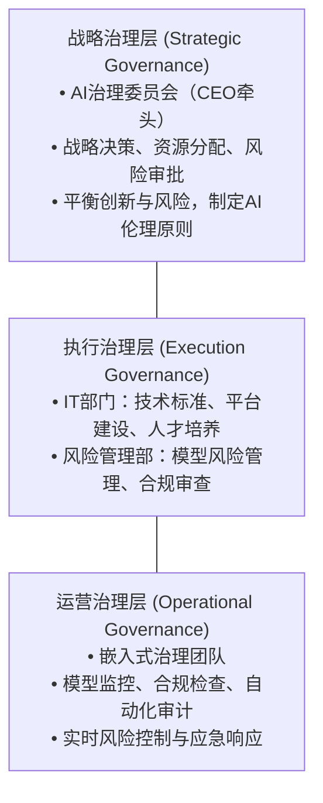

#### 6.1.1 战略治理层

战略治理层由AI治理委员会主导，CEO担任主席，负责顶层设计与重大决策。

**核心职责：**
- 审批AI战略规划与年度计划
- 批准高风险AI应用的上线决策
- 制定AI伦理原则与风险偏好
- 协调跨部门资源与利益冲突

#### 6.1.2 执行治理层

执行治理层由IT部门与风险管理部协同承担，分工明确、各司其职。

**IT部门职责：**
- 制定AI开发、测试、部署技术标准
- 建设与维护AI基础设施与工具链
- 培养AI技术人才

**风险管理部职责：**
- 实施模型风险管理（MRM）框架
- 评审高风险模型的上线申请
- 制定AI合规政策与伦理准则

#### 6.1.3 运营治理层

运营治理层由嵌入式治理团队执行，负责日常监控、合规检查与应急响应。

**核心职责：**
- 持续监控模型性能与风险指标
- 执行合规检查与自动化审计
- 处理AI系统异常与应急响应
- 收集反馈并推动持续改进

### 6.2 模型风险管理框架

依据香港金融管理局(HKMA)《生成式人工智能客户保障指引》及监管政策手册，建立覆盖模型全生命周期的风险管理框架。

#### 6.2.1 模型生命周期管理

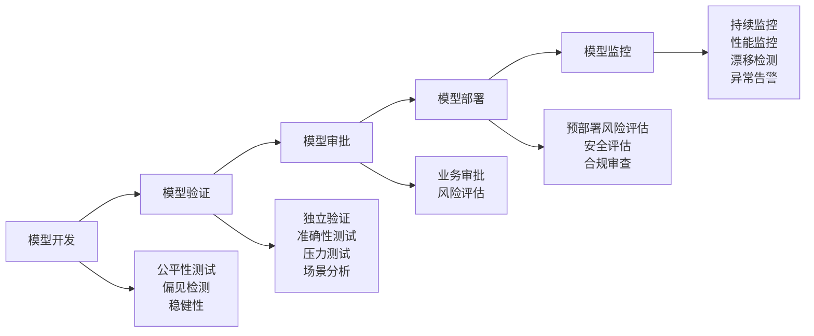

#### 6.2.2 HKMA监管核心要求

| 监管要求 | 具体内容 | 实施要点 |
|---------|---------|---------|
| **董事会问责** | AI治理框架需董事会审批 | 定期向董事会汇报AI风险状况 |
| **预部署风险评估** | 评估幻觉、数据投毒、提示注入等风险 | 建立风险评估清单与测试流程 |
| **人工监督机制** | 客户面向应用需人工覆核 | 设立人机协同决策流程 |
| **模型透明度** | 关键决策需可解释 | 采用可解释AI技术 |
| **数据治理** | 数据质量、隐私保护 | 建立数据血缘与访问控制 |

### 6.3 合规与伦理框架

合规与伦理框架确保AI系统符合监管要求与伦理原则，建立公平、透明、负责任的AI应用。

#### 6.3.1 合规原则

| 原则 | 含义 | 实践要求 |
|------|------|---------|
| **公平性(Fairness)** | 避免歧视与偏见 | 定期审计模型决策，确保不构成不当歧视 |
| **问责制(Accountability)** | 明确的责任归属 | 董事会承担最终责任，建立责任追溯机制 |
| **透明度(Transparency)** | 决策过程可解释 | 向客户和监管机构解释AI决策依据 |
| **稳健性(Robustness)** | 系统稳定可靠 | 压力测试、安全测试、持续监控 |
| **隐私保护(Privacy)** | 数据安全与隐私 | 遵守PDPO，建立数据治理框架 |

#### 6.3.2 伦理审查机制

| 审查环节 | 审查内容 | 审查主体 |
|---------|---------|---------|
| **用例准入审查** | 业务合理性、社会影响、伦理风险 | AI治理委员会 |
| **模型开发审查** | 数据来源、偏见检测、公平性测试 | IT部门 |
| **上线前审查** | 风险评估、人工监督机制、应急预案 | 风险管理部门 |
| **持续监控审查** | 性能漂移、公平性监测、用户反馈 | 运营治理团队 |

---

## 七、组织与人才架构

组织与人才架构明确AI转型所需的组织模式、角色配置与文化变革。

### 7.1 关键成功因素

AI转型需要组织、价值、治理、人才四个维度的保障：

| 成功因素 | 核心要求 | 具体实践 |
|---------|---------|---------|
| **CEO亲自驱动** | 高层承诺，消除跨部门壁垒 | 成立AI治理委员会，CEO担任主席；建立跨部门协作机制；统一资源调配权 |
| **价值导向** | 每个用例有明确的P&L目标 | 用例优先级以ROI衡量；建立价值追踪仪表盘；定期评估投入产出 |
| **治理先行** | 从Day 1设计风险控制 | 安全网关同步建设；合规审查嵌入流程；建立熔断与回滚机制 |
| **复合型人才培养** | 业务人员深度参与 | 业务+技术融合团队；业务人员参与模型训练；建立AI大使网络（各部门AI推广者） |

### 7.2 目标组织模式

AI转型推动组织从传统IT部门模式向AI赋能组织模式演进，形成"业务部门+IT部门"协同的两层结构。

```mermaid
flowchart TB
    subgraph OLD["传统模式"]
        direction TB
        O1["业务部门<br/>• 产品经理<br/>• 业务分析"] --> O2["IT部门<br/>• 开发团队<br/>• 运维团队"]
    end
    subgraph NEW["目标模式"]
        direction TB
        N1["业务部门<br/>• AI产品负责人<br/>• 领域专家<br/>• 嵌入式AI团队"] --> N2["IT部门<br/>• AI平台工程<br/>• 数据科学<br/>• MLOps专家"]
    end
```

#### 7.2.1 业务部门

业务部门是AI价值的最终实现者，需要配置AI产品负责人、领域专家与嵌入式AI团队，主导AI用例的需求定义、价值验证与场景落地。

**关键能力要求：**
- AI产品负责人：理解AI能力边界，能够定义可落地的用例需求
- 领域专家：深度业务知识，能够验证AI输出的业务合理性
- 嵌入式AI团队：将通用模型适配到具体业务场景，设计端到端解决方案

**嵌入式AI团队的矩阵式管理建议：**

嵌入式AI团队在传统银行组织中易遭遇"业务部门觉得太技术、IT部门觉得不规范"的边缘化困境。建议采用矩阵式管理明确权责：

- **IT部门（纵向）**：主导AI基础设施、MLOps安全网关、技术标准制定，考核权重50%
- **业务部门（横向）**：主导用例需求、业务场景适配、P&L目标达成，考核权重50%

通过"业务P&L挂钩考核"驱动技术真正服务于业务价值，避免嵌入式团队边缘化。

#### 7.2.2 IT部门

IT部门是AI能力的技术底座，负责平台建设、标准制定、技术支持与运维保障。

**关键能力要求：**
- 平台工程：构建与维护AI基础设施与工具链
- 数据科学：模型研发、特征工程、算法优化
- MLOps专家：模型部署、监控、运维自动化

### 7.3 关键角色与能力

#### 7.3.1 核心角色配置

| 角色类型 | 占比 | 核心职责 | 关键能力 |
|---------|------|---------|---------|
| **AI产品负责人** | 40-50% | 定义用例需求、验证业务价值、推动落地 | 业务理解、AI认知、项目管理 |
| **数据科学家/ML工程师** | 30-40% | 模型开发、特征工程、性能优化 | 机器学习、编程能力、数据处理 |
| **AI治理与合规专家** | 10-15% | 风险评估、合规审查、伦理监督 | 监管知识、风险管理、审计能力 |
| **平台工程与运维** | 10-15% | 基础设施、模型部署、系统运维 | 云原生、容器化、自动化运维 |

#### 7.3.2 能力发展路径

```mermaid
flowchart LR
    A["全员AI素养"] --> B["专业AI技能"] --> C["领导AI转型"]
    A --> A1["基础培训<br/>意识提升<br/>风险认知"]
    B --> B1["角色定制<br/>技能认证<br/>实践项目"]
    C --> C1["战略规划<br/>变革领导<br/>生态构建"]
```

**各阶段培养重点：**

| 阶段 | 目标人群 | 培养内容 |
|------|---------|---------|
| **全员AI素养** | 全体员工 | AI基础知识、风险意识、工具使用 |
| **专业AI技能** | 技术团队 | 模型开发、特征工程、MLOps实践 |
| **领导AI转型** | 管理层 | 战略规划、变革管理、生态构建 |

### 7.4 文化变革

AI转型不仅是技术变革，也是组织文化的转型。需要从"恐惧与忽视"走向"创新与责任"。

#### 7.4.1 文化变革方向

| 传统文化 | 目标文化 | 变革措施 |
|---------|---------|---------|
| **恐惧AI** | **拥抱AI** | 开展AI知识普及，消除对AI的误解与恐惧 |
| **技术炫技** | **价值导向** | 建立价值追踪机制，聚焦业务成果 |
| **部门墙** | **跨职能协作** | 组建融合团队，打破部门边界 |
| **规避风险** | **创新与责任并重** | 建立容错机制，鼓励有边界创新 |

#### 7.4.2 文化变革关键要素

| 要素 | 具体措施 | 预期效果 |
|------|---------|---------|
| **心理安全** | 鼓励实验，容忍失败，不追责试错 | 员工敢于尝试新想法 |
| **持续学习** | 建立AI学习型组织，提供培训资源 | 员工能力持续提升 |
| **跨职能协作** | 组建业务+技术融合团队 | 打破部门墙，加速交付 |
| **价值导向** | 用例优先级以ROI衡量 | 聚焦高价值场景，避免技术炫技 |

---

AI是银行深化客户服务、优化风险管理、提升经营韧性的竞争力来源。银行若能抓住这一机遇，将在数字化浪潮中打造更具竞争力的金融服务新模式。

---

## 附录：术语解释

### 业务与财务术语

| 术语 | 英文全称 | 含义 |
|------|---------|------|
| **AUM** | Assets Under Management | 资产管理规模，指银行或金融机构管理的客户资产总额，是衡量财富管理业务规模的核心指标 |
| **NPS** | Net Promoter Score | 净推荐值，衡量客户忠诚度的指标，通过"您有多大可能向他人推荐本产品/服务"问卷计算得出 |
| **ROI** | Return on Investment | 投资回报率，衡量投资效益的指标，计算公式为（收益-成本）/成本×100% |
| **P&L** | Profit and Loss | 损益，指收入与支出的差额，常用于衡量业务单元或项目的盈利状况 |

### 技术与架构术语

| 术语 | 英文全称 | 含义 |
|------|---------|------|
| **LLM** | Large Language Model | 大语言模型，基于海量文本数据训练的深度学习模型，具备理解和生成自然语言的能力，如GPT、DeepSeek |
| **DeepSeek** | - | 国产开源大语言模型，性能优异、对算力优化友好，适合金融行业本地化部署 |
| **RAG** | Retrieval-Augmented Generation | 检索增强生成，结合知识库检索与语言模型生成的技术，使模型能够基于特定领域知识回答问题 |
| **MCP** | Model Context Protocol | 模型上下文协议，标准化智能体与外部工具/系统的交互接口，支持跨平台工具调用 |
| **ReAct** | Reasoning + Acting | 推理与行动循环，智能体核心执行模式：思考→行动→观察→调整的迭代过程 |
| **Supervisor-Worker** | - | 多智能体协同模式，Supervisor负责任务分解与调度，Worker负责具体执行 |
| **Copilot** | - | 副驾驶/智能助手，AI辅助人类完成任务的交互模式，人类主导、AI提供建议与执行支持 |
| **MLOps** | Machine Learning Operations | 机器学习运维，将DevOps理念应用于机器学习系统，实现模型的自动化训练、部署、监控与迭代 |
| **NLP** | Natural Language Processing | 自然语言处理，使计算机能够理解、解释和生成人类语言的人工智能分支 |
| **OCR** | Optical Character Recognition | 光学字符识别，将图像中的文字转换为可编辑文本的技术 |
| **RPA** | Robotic Process Automation | 机器人流程自动化，通过软件机器人模拟人类操作，自动执行规则化的业务流程 |
| **API** | Application Programming Interface | 应用程序接口，定义软件组件之间交互规范的接口，使不同系统能够互相调用功能 |
| **SDK** | Software Development Kit | 软件开发工具包，为开发者提供构建应用程序所需的工具、库、文档和示例代码 |
| **Spring Cloud** | - | Java微服务框架，提供服务发现、配置管理、负载均衡等企业级能力，用于构建智能体编排基础设施 |
| **GPU** | Graphics Processing Unit | 图形处理器，因其并行计算能力，成为训练和运行AI模型的核心硬件 |
| **CI/CD** | Continuous Integration / Continuous Deployment | 持续集成与持续部署，自动化软件交付流程，实现代码提交后自动测试、构建、部署 |
| **Embedding** | Word Embedding | 词嵌入/向量嵌入，将文本转换为数值向量的技术，使计算机能够理解语义相似性 |
| **ASR** | Automatic Speech Recognition | 自动语音识别，将人类语音转换为文本的技术，是语音交互系统的基础 |
| **AIOps** | Artificial Intelligence for IT Operations | 智能运维，利用AI技术实现IT系统的自动化监控、故障检测、根因分析和自我修复 |
| **ETL** | Extract, Transform, Load | 数据抽取、转换、加载，将数据从源系统提取、转换为统一格式、加载到目标系统的过程 |
| **RBAC** | Role-Based Access Control | 基于角色的访问控制，根据用户角色分配权限，简化权限管理的企业级安全模型 |

### 数据与存储术语

| 术语 | 英文全称 | 含义 |
|------|---------|------|
| **PII** | Personally Identifiable Information | 个人身份信息，可用于识别特定个人身份的数据，如姓名、身份证号、地址等 |
| **CDC** | Change Data Capture | 变更数据捕获，实时捕获数据库变更并同步到下游系统的技术，支持实时数据处理 |
| **MinIO** | - | 开源对象存储系统，高性能、低成本，适合存储模型文件、文档、日志等非结构化数据 |
| **Milvus** | - | 开源向量数据库，专为AI应用设计，支持高性能向量检索，是RAG系统的核心组件 |
| **Neo4j** | - | 图数据库，支持图遍历与路径查询，用于构建知识图谱、分析交易关联网络 |

### 数据与安全术语

| 术语 | 英文全称 | 含义 |
|------|---------|------|
| **OAuth** | Open Authorization | 开放授权协议，允许第三方应用在用户授权下访问其资源，而无需暴露用户密码 |

### 组织与治理术语

| 术语 | 英文全称 | 含义 |
|------|---------|------|
| **MRM** | Model Risk Management | 模型风险管理，识别、评估、监控和缓解模型相关风险的系统性框架 |

### 监管与合规术语

| 术语 | 英文全称 | 含义 |
|------|---------|------|
| **HKMA** | Hong Kong Monetary Authority | 香港金融管理局，香港银行业的监管机构，负责维护银行体系稳定 |
| **PDPO** | Personal Data (Privacy) Ordinance | 《个人资料（私隐）条例》，香港保护个人数据隐私的核心法规 |

---
