# 银行AI平台技术架构规划文档（科技部专属版）

> **文档定位**：银行科技部AI平台建设的核心技术规划文档
> **目标读者**：科技部架构师、技术团队负责人、项目经理
> **实施范围**：全行级AI平台建设
> **团队阶段**：AI探索阶段（已有一些AI应用，需要系统化整合和规模化）
> **核心依据**：基于《银行AI发展整体架构框架.md》提取并深化技术架构内容
>
> **监管适用**：香港持牌银行 | **监管机构**：香港金融管理局(HKMA) | **数据隐私**：《个人资料（私隐）条例》(PDPO)

---

## 文档导航

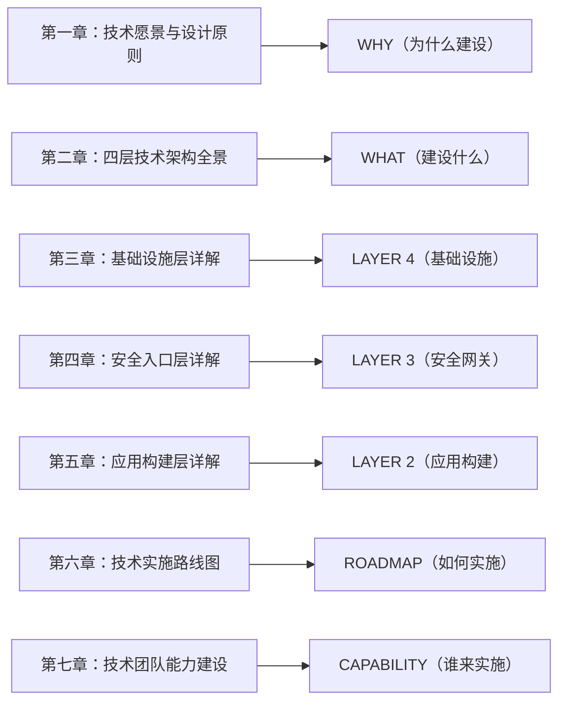

---

# 第一章：技术愿景与设计原则

## 1.1 AI平台建设目标

建设全行统一的AI能力平台，实现AI应用的集约化建设与规模化应用。

| 目标维度 | 具体目标 | 衡量指标 |
|---------|---------|---------|
| **能力集约** | 统一AI能力入口，避免烟囱式建设 | AI应用复用率>70% |
| **安全可控** | 技术护栏代偿组织治理缺失 | 安全事件0发生 |
| **快速交付** | 业务部门快速构建AI应用 | 应用上线周期<2周 |
| **平滑演进** | 支持从L1到L5的渐进式成熟 | 每年提升1-2个成熟度等级 |

### 业务价值目标

| 时间维度 | 目标 | 关键成果 |
|---------|------|---------|
| **短期（1年）** | L1-L2阶段 | 完成2-3个试点应用，建立基础平台能力 |
| **中期（3年）** | L3阶段 | 实现10+应用规模化，运营效率提升20-30% |
| **长期（5年）** | L4-L5阶段 | AI成为核心竞争力，成为行业标准制定者 |

## 1.2 成熟度模型（L1-L5）

### 五级成熟度定义

```
L1（试点期）→ L2（应用期）→ L3（流程重构期）→ L4（规模期）→ L5（创新期）
```

| 级别 | 阶段名称 | 技术特征 | 团队能力 | 业务价值 |
|------|---------|---------|---------|---------|
| **L1** | 试点期 | 单点技术应用，独立部署 | 2-3人技术小组 | 1-2个试点应用验证 |
| **L2** | 应用期 | 平台化建设，标准化组件 | 5-8人技术团队 | 3-5个应用规模化 |
| **L3** | 流程重构期 | 深度集成业务系统 | 10-15人专业团队 | 业务流程智能化改造 |
| **L4** | 规模期 | 企业级平台，多部门复用 | 20+人AI团队 | 跨部门AI能力输出 |
| **L5** | 创新期 | AI驱动创新，生态构建 | AI卓越中心 | 成为行业标准制定者 |

### 当前阶段定位

我行处于L1-L2过渡阶段：
- ✅ 已有一些AI应用（制度问答、研发助手等）
- ✅ 团队有基础的AI技术能力
- ⚠️ 缺乏统一的AI平台
- ⚠️ 应用之间烟囱式建设，难以复用
- ⚠️ 缺乏标准化的安全机制

目标：在12-18个月内完成L2阶段建设，建立全行统一的AI平台能力。

## 1.3 四层技术架构概览

### 架构分层设计

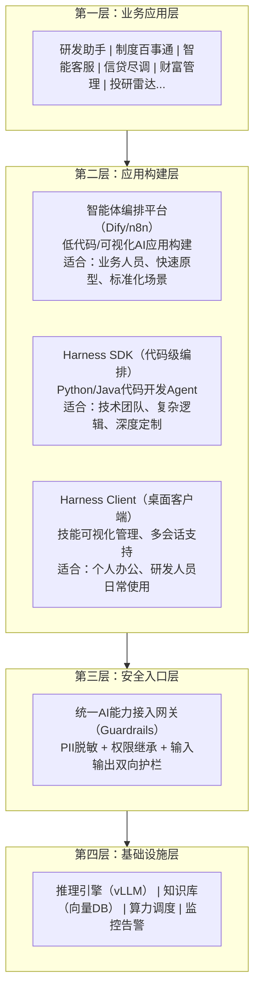

### 各层职责

| 层级 | 核心职责 | 关键组件 | 技术团队 |
|------|---------|---------|---------|
| **业务应用层** | 满足业务需求，创造业务价值 | 具体业务应用 | 业务+技术联合团队 |
| **应用构建层** | 提供AI应用构建能力 | 编排平台、SDK、客户端 | 平台开发团队 |
| **安全入口层** | 统一安全管控，防护风险 | Guardrails网关 | 安全+平台团队 |
| **基础设施层** | 提供算力、存储、调度能力 | GPU集群、向量DB、推理引擎 | 基础设施团队 |

## 1.4 关键设计原则

### 四大设计原则

#### 原则一：底层集约建设

打造全行统一的AI能力入口，拒绝"烟囱式"开发。

技术实现：
- 统一AI能力接入网关（Guardrails）
- 集中式PII检测、权限管理、安全护栏
- 避免各应用重复建设安全模块

收益：
- 成本节约：避免重复投资，算力集约利用
- 安全可控：统一安全标准，降低风险
- 效率提升：业务部门专注业务逻辑

#### 原则二：上层乐高组装

业务部门像"搭积木"一样快速组装AI应用。

技术实现：
- 智能体编排平台（Dify）提供低代码构建能力
- Harness SDK提供代码级深度定制能力
- 预置工作流模板、技能库、工具库

收益：
- 快速交付：应用上线周期从月缩短到周
- 降低门槛：业务人员也能构建简单应用
- 标准化：复用标准化组件，保证质量

#### 原则三：技术硬核控险

用技术护栏代偿行政管理组织缺失。

技术实现：
- 三大硬核控险机制（PII脱敏、权限继承、双向过滤）
- Two-Layer Guardrail Architecture
- 实时监控、熔断降级、审计追溯

收益：
- 合规保障：从源头免疫隐私泄露
- 风险防控：提供刚性的安全承诺
- 灵活治理：在无AI治理委员会过渡期安全落地

#### 原则四：业务三步演进

Run → Protect → Grow 渐进式落地。

实施路径：
- **第一步（Run）**：办公提效、研发助手、知识问答
- **第二步（Protect）**：风险控制、合规审查、反欺诈
- **第三步（Grow）**：客户服务、精准营销、财富管理

收益：
- 风险可控：先低风险场景，后高风险场景
- 价值可见：每个阶段都有可衡量的业务价值
- 能力积累：逐步提升团队AI能力

---

# 第二章：四层技术架构全景

## 2.1 技术架构全景图

### 详细架构设计

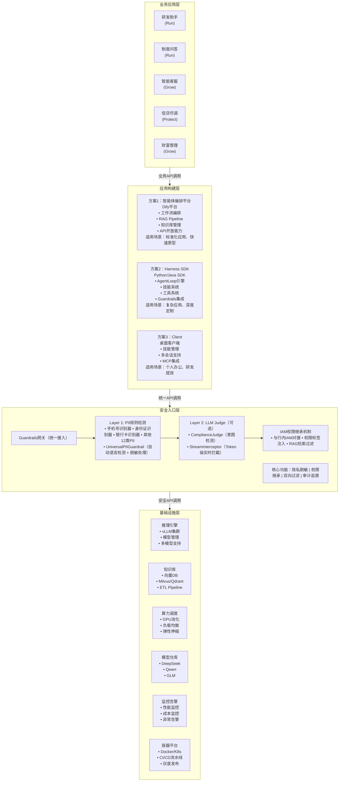

## 2.2 各层职责与边界

### 层级职责矩阵

| 层级 | 核心职责 | 输入 | 输出 | 关键技术 |
|------|---------|------|------|---------|
| **业务应用层** | 满足业务需求 | 业务需求 | 业务价值 | 业务逻辑、用户体验 |
| **应用构建层** | 构建AI应用 | 业务需求+AI能力 | AI应用 | 工作流编排、SDK开发 |
| **安全入口层** | 安全管控 | API请求 | 安全响应 | PII检测、权限管理、过滤拦截 |
| **基础设施层** | 提供基础能力 | 硬件资源 | 算力、存储、网络 | GPU调度、向量检索、模型推理 |

### 层间交互设计

#### 请求流程（从上到下）

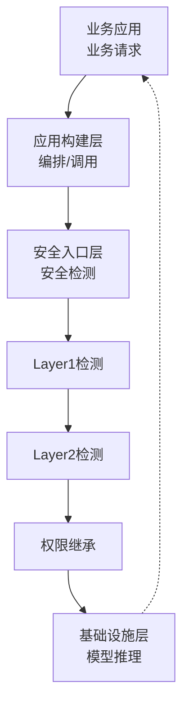

#### 数据流向（从下到上）

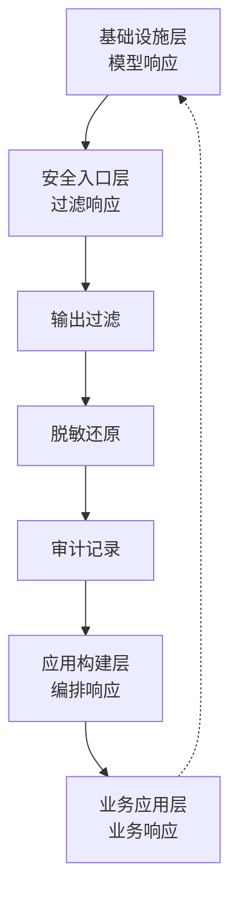

## 2.3 技术栈选型决策

### 核心技术栈选型矩阵

| 技术领域 | 首选方案 | 备选方案 | 选型理由 | 适用阶段 | 成熟度 |
|---------|---------|---------|---------|---------|--------|
| **推理引擎** | TensorRT-LLM (Blackwell) / vLLM (其他) | SGLang | TensorRT-LLM在B200/B300上成本最优；vLLM通用性好 | L1-L5 | 高 |
| **向量数据库** | Qdrant | Milvus/pgvector | 部署简单，性能优异，过滤能力强 | L1-L5 | 高 |
| **智能体框架** | Harness SDK | LangChain/CrewAI | 企业级、技能驱动、支持Java、可扩展 | L1-L5 | 中 |
| **编排平台** | Dify v1.13+ | n8n/LangFlow | RAG成熟、API开放、易用、私有化部署、10万+GitHub stars | L1-L3 | 高 |
| **GPU类型** | B200/B300 | H200/昇腾910B | Blackwell架构已成主流，B300专为推理优化 | L1-L3 | 高 |
| **PII检测** | Microsoft Presidio | 自研规则引擎 | 金融行业标准、可扩展、准确率高 | L1-L5 | 高 |
| **容器平台** | Docker | Kubernetes | 部署简单、资源隔离、适合中小规模 | L1-L3 | 高 |
| **监控告警** | Prometheus+Grafana | Datadog/云监控 | 开源、功能强大、社区活跃 | L2-L5 | 高 |

### 模型选型对比

| 模型 | 版本 | 参数量 | 上下文 | 推理成本 | 适用场景 | 推荐指数 |
|------|------|--------|--------|---------|---------|---------|
| **DeepSeek-V4-Pro** | 2026.04 | 1.6T/49B活跃 | 1M tokens | $0.09/1M输入 | 复杂推理、Agent、长上下文 | ⭐⭐⭐⭐⭐ |
| **DeepSeek-V4-Flash** | 2026.04 | 284B/13B活跃 | 1M tokens | $0.09/1M输入 | 通用场景、成本敏感 | ⭐⭐⭐⭐⭐ |
| **Qwen3-Max** | 2025.09 | ~1T | 256K | API定价 | 编程、多语言、企业应用 | ⭐⭐⭐⭐⭐ |
| **Qwen3-235B** | 2025.07 | 235B/22B活跃 | 128K | 开源免费 | 本地部署、中等规模 | ⭐⭐⭐⭐ |
| **GLM-4-Plus** | 2025 | 未知 | 128K | API定价 | 国产化、中文优化 | ⭐⭐⭐⭐ |

选型建议：
- **主力模型（云API）**：DeepSeek-V4-Flash（性价比最高，1M上下文，Agent能力强）
- **复杂推理**：DeepSeek-V4-Pro（最强推理能力，支持Thinking模式）
- **本地部署**：Qwen3-235B-A22B（开源，支持本地化）
- **编程场景**：Qwen3-Coder（专门优化编程任务）
- **国产化要求**：GLM-4-Plus 或 昇腾+Qwen3组合

注：DeepSeek V4于2026年4月发布，支持1M token上下文，成本比GPT-5.5低34倍。Qwen3支持92种语言的翻译。

## 2.4 与现有系统集成策略

### 现有系统对接方案

#### 对接模式一：API网关模式（推荐）

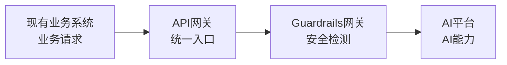

**优势**：
- 松耦合，对现有系统改造小
- 统一安全管控
- 易于监控和审计

#### 对接模式二：SDK嵌入模式

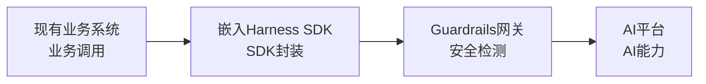

**优势**：
- 性能更好，减少网络跳转
- 更灵活的定制能力
- 适合深度集成场景

#### 对接模式三：消息队列模式

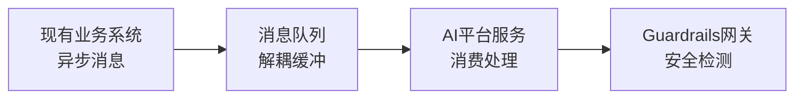

**优势**：
- 异步处理，削峰填谷
- 高可用，故障隔离
- 适合批量处理场景

### 集成优先级

| 系统类型 | 集成优先级 | 集成方式 | 预估工时 |
|---------|-----------|---------|---------|
| **OA系统** | 高 | API网关模式 | 2周 |
| **知识管理系统** | 高 | SDK嵌入模式 | 3周 |
| **信贷系统** | 中 | API网关模式 | 4周 |
| **CRM系统** | 中 | API网关模式 | 3周 |
| **核心银行系统** | 低 | 消息队列模式 | 6周 |

# 第三章：基础设施层详解

## 3.1 算力基础设施规划

### GPU选型对比

| GPU型号 | 显存 | 算力(FP4) | 价格(云租赁) | 生态成熟度 | 推荐指数 |
|---------|------|----------|-------------|-----------|---------|
| **B200** | 192GB HBM3e | 9,000 TFLOPS | $2.68-7.41/hr | 高 | ⭐⭐⭐⭐⭐ |
| **B300** | 288GB HBM3e | 15,000 TFLOPS | $3.29-9.16/hr | 高 | ⭐⭐⭐⭐⭐ |
| **H200** | 141GB HBM3 | 3,958 TFLOPS | $1.00-3.00/hr | 高 | ⭐⭐⭐⭐ |
| **昇腾910B** | 64GB | 256 TFLOPS | ¥8-12万(采购) | 中 | ⭐⭐⭐⭐ |
| **昇腾950** | 预计2026H2 | - | 待定 | 中 | ⭐⭐⭐ |

选型建议：
- **推荐方案（推理）**：B200（192GB显存，性价比最优，适合70B模型）
- **高端场景（大规模推理）**：B300（288GB显存，支持DeepSeek-R1等大模型高效推理）
- **国产化要求**：昇腾910B（当前成熟）/ 昇腾950（2026年下半年量产）
- **存量方案**：H200（当前供应充足，成本较低）

注：B200/B300为NVIDIA Blackwell架构，2026年已成为主流选择。B300专为推理优化，成本每token比B200低约26%。

### 算力需求估算

#### L1阶段（试点期，Month 1-3）

| 资源项 | 配置 | 数量 | 用途 | 预算 |
|-------|------|------|------|------|
| GPU服务器 | A800*8 | 1台 | 模型推理 | ¥120-160万 |
| CPU服务器 | 32核/128G | 2台 | 应用服务 | ¥10万 |
| 存储服务器 | 10TB SSD | 1台 | 数据存储 | ¥5万 |
| 网络设备 | 万兆交换机 | 2台 | 网络连接 | ¥3万 |
| **合计** | - | - | - | **¥138-178万** |

#### L2阶段（应用期，Month 4-8）

| 资源项 | 配置 | 数量 | 用途 | 预算 |
|-------|------|------|------|------|
| GPU服务器 | A800*8 | 2台 | 模型推理（扩容） | ¥240-320万 |
| CPU服务器 | 32核/128G | 3台 | 应用服务（扩容） | ¥15万 |
| 负载均衡 | F5/A10 | 2台 | 流量调度 | ¥20万 |
| **合计** | - | - | - | **¥275-355万** |

### 推理引擎选型

#### vLLM vs TensorRT-LLM对比

| 维度 | vLLM | TensorRT-LLM | 对比结果 |
|------|------|-------------|---------|
| **性能** | 吞吐高，延迟低 | 延迟极低，吞吐中等 | vLLM吞吐优 |
| **易用性** | 部署简单，API友好 | 配置复杂，需要优化 | vLLM易用性优 |
| **兼容性** | 支持多模型，生态活跃 | NVIDIA生态，模型支持有限 | vLLM兼容性优 |
| **Blackwell支持** | 2026年已支持 | 原生优化，性能最优 | TensorRT-LLM在B200/B300上优 |
| **成本** | 开源免费 | 需要NVIDIA授权 | vLLM成本优 |
| **社区** | 活跃，迭代快 | 官方维护，更新慢 | vLLM社区优 |

推荐方案：
- **Blackwell GPU（B200/B300）**：TensorRT-LLM（NVIDIA官方优化，成本每token最低可达$0.02/百万token）
- **其他GPU**：vLLM（综合优势明显）
- **混合方案**：生产环境用TensorRT-LLM，开发测试用vLLM

### 部署架构设计

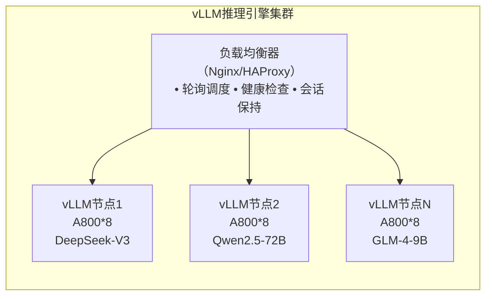

## 3.2 网络与安全架构

### 内网部署拓扑

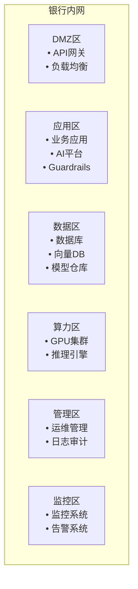

### 网络隔离策略

| 区域 | 访问策略 | 安全级别 | 说明 |
|------|---------|---------|------|
| **DMZ区** | 可接受外网请求 | 中 | API网关、负载均衡 |
| **应用区** | 仅允许DMZ区访问 | 高 | 业务应用、AI平台 |
| **数据区** | 仅允许应用区访问 | 极高 | 数据库、向量DB |
| **算力区** | 仅允许应用区访问 | 极高 | GPU集群、推理引擎 |
| **管理区** | 仅运维人员访问 | 极高 | 运维管理、日志审计 |
| **监控区** | 可访问所有区域 | 高 | 监控系统、告警系统 |

### 防火墙规则配置

#### 入站规则

| 源地址 | 目标地址 | 端口 | 协议 | 用途 |
|-------|---------|------|------|------|
| 业务网段 | DMZ区 | 443 | HTTPS | API访问 |
| DMZ区 | 应用区 | 8080 | HTTP | 应用调用 |
| 应用区 | 数据区 | 5432/19530 | PostgreSQL/Milvus | 数据访问 |
| 应用区 | 算力区 | 8000 | HTTP | 推理请求 |
| 管理网段 | 所有区域 | 22 | SSH | 运维管理 |

#### 出站规则

| 源地址 | 目标地址 | 端口 | 协议 | 用途 |
|-------|---------|------|------|------|
| 应用区 | 外网模型API | 443 | HTTPS | 外部模型调用 |
| 监控区 | 所有区域 | 各服务端口 | 各协议 | 监控采集 |
| 管理区 | 所有区域 | 各服务端口 | 各协议 | 运维管理 |

## 3.3 存储与数据架构

### 向量数据库选型

#### Milvus vs Qdrant对比（2026年最新）

| 维度 | Milvus | Qdrant | 选型建议 |
|------|--------|--------|---------|
| **性能** | 高（分布式） | 极高（单节点Rust实现，p99~12ms） | Qdrant速度优 |
| **过滤查询** | 中等 | 优秀（高选择性过滤快2-4倍） | Qdrant过滤优 |
| **扩展性** | 支持分布式，适合10亿+向量 | 单节点优化，支持分布式 | Milvus大规模优 |
| **索引构建** | 快（并行C++构建） | 中等 | Milvus构建快 |
| **易用性** | 中等（部署复杂） | 高（部署简单，REST/gRPC API） | Qdrant易用性优 |
| **混合检索** | 支持 | 支持且生产成熟 | 相当 |
| **社区** | 44,000+ GitHub stars | 活跃增长中 | Milvus社区大 |

选型建议：
- **L1-L2阶段（<1000万向量）**：Qdrant（部署简单，性能优异，过滤能力强）
- **L3+阶段（>1亿向量）**：Milvus（分布式架构，大规模数据管理）
- **已有PostgreSQL**：pgvector（<1000万向量时可复用现有数据库）

### 数据存储架构

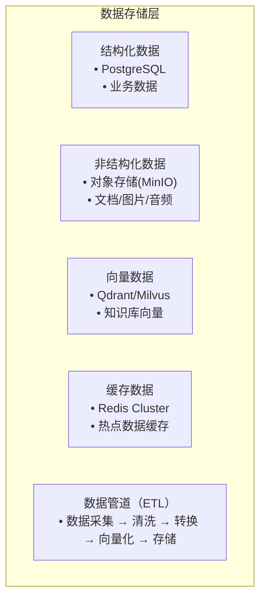

### 知识库ETL管道

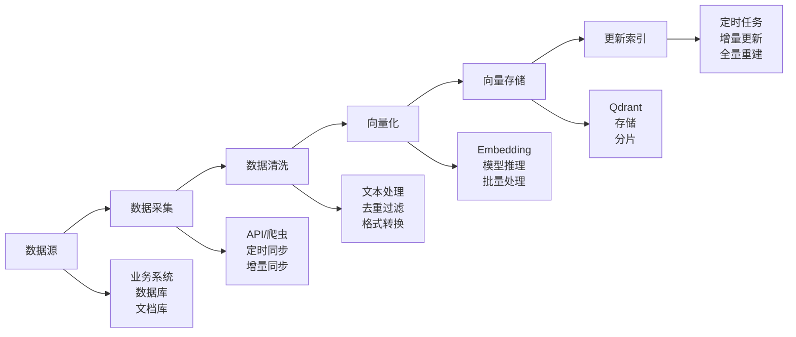

## 3.4 容器化部署策略

### Docker vs Kubernetes选型

| 维度 | Docker | Kubernetes | 选型建议 |
|------|--------|-----------|---------|
| **部署复杂度** | 低 | 高 | L1-L2用Docker |
| **运维成本** | 低 | 高 | L1-L2用Docker |
| **扩展能力** | 手动扩展 | 自动扩展 | L3+用K8s |
| **高可用** | 需额外配置 | 原生支持 | L3+用K8s |
| **适用规模** | 中小规模 | 大规模 | 看阶段选择 |

推荐方案：
- **L1-L2阶段**：Docker（部署简单，成本可控）
- **L3+阶段**：Kubernetes（自动扩展，高可用）

### 解耦式部署架构

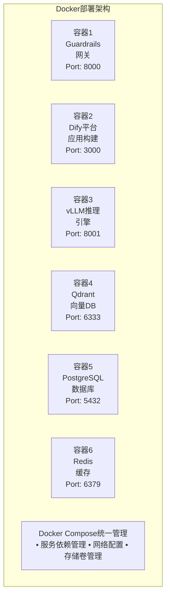

### CI/CD流水线设计

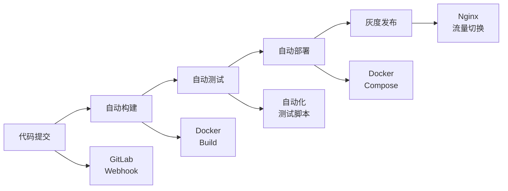

**灰度发布流程**：
1. 新版本部署到灰度环境
2. 10%流量切换到新版本
3. 监控指标（错误率、性能）
4. 逐步扩大到50%、100%
5. 如有问题，快速回滚

---

*（文档继续第四章至第七章...由于篇幅限制，完整文档将在后续部分继续创建）*
# 第四章：安全入口层详解

## 4.1 统一AI能力接入网关

### 网关架构设计

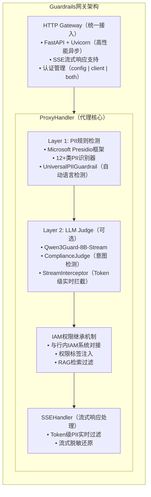

### 技术选型

| 技术组件 | 选型方案 | 选型理由 |
|---------|---------|---------|
| **HTTP框架** | FastAPI + Uvicorn | 高性能异步，原生支持SSE流式响应 |
| **PII检测框架** | Microsoft Presidio | 金融行业标准，支持自定义识别器扩展 |
| **NLP引擎** | spaCy (en_core_web_sm) | 轻量级，内网离线部署友好 |
| **HTTP客户端** | httpx | 异步支持，HTTP2提升连接效率 |
| **Layer 2 Judge** | Qwen3Guard-8B-Stream | 中文语义理解能力强，支持快速检测模式 |

## 4.2 三大硬核控险机制

### 机制一：隐私数据动态脱敏

#### PII识别器配置

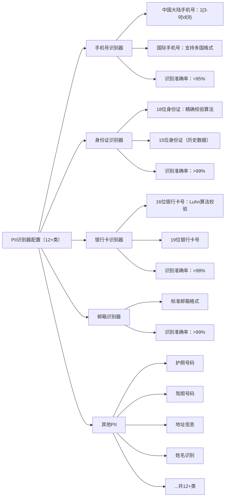

#### 脱敏策略

| PII类型 | 脱敏方式 | 示例 |
|---------|---------|------|
| 手机号 | 中间4位遮掩 | 138****5678 |
| 身份证 | 中间10位遮掩 | 310***********1234 |
| 银行卡 | 中间12位遮掩 | 6222************1234 |
| 邮箱 | 用户名部分遮掩 | t***@example.com |
| 姓名 | 部分遮掩 | 张** |

#### 性能优化

- **批量处理**：支持批量PII检测，提升吞吐量
- **缓存机制**：相同文本缓存检测结果
- **并行处理**：多线程并行识别

**性能基准**：
- 单次检测延迟：<50ms
- 并发处理能力：>1000 QPS
- 识别准确率：>95%

### 机制二：IAM权限强制继承

#### 权限继承流程

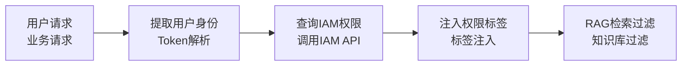

#### 技术实现

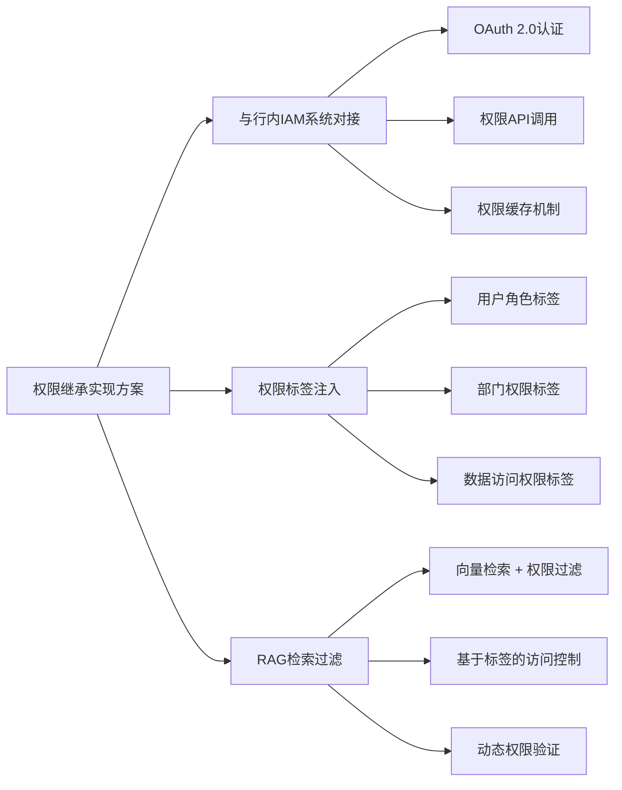

#### 权限标签设计

| 标签类型 | 标签名称 | 说明 |
|---------|---------|------|
| **角色标签** | role:admin, role:user, role:guest | 用户角色 |
| **部门标签** | dept:risk, dept:credit, dept:wealth | 部门权限 |
| **数据标签** | data:public, data:internal, data:confidential | 数据级别 |
| **功能标签** | func:read, func:write, func:delete | 功能权限 |

### 机制三：输入输出双向过滤

#### Layer 1规则检测

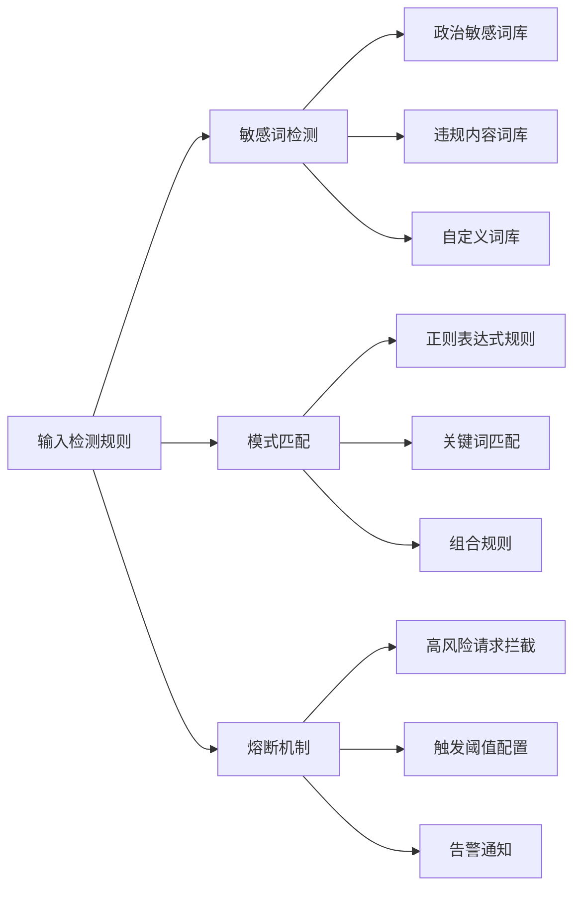

#### Layer 2 LLM Judge

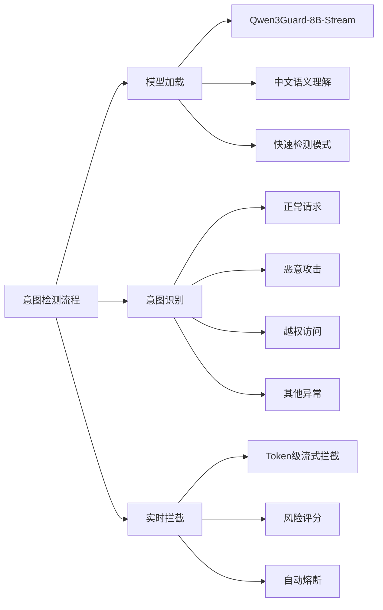

#### 输出过滤

```mermaid
flowchart LR
    ROOT["输出检测机制"]
    ROOT --> A["幻觉检测"]
    A --> A1["事实一致性验证"]
    A --> A2["置信度评分"]
    A --> A3["不确定表述标记"]
    ROOT --> B["敏感信息过滤"]
    B --> B1["PII二次检测"]
    B --> B2["敏感业务信息"]
    B --> B3["合规审查"]
    ROOT --> C["格式标准化"]
    C --> C1["输出格式规范"]
    C --> C2["语言风格统一"]
    C --> C3["长度控制"]
```

## 4.3 PII检测与脱敏实现

### Presidio框架集成

#### 核心组件

```mermaid
flowchart LR
    ROOT["Presidio核心组件"]
    ROOT --> A["AnalyzerEngine（分析引擎）"]
    A --> A1["预置识别器（15+种）"]
    A --> A2["自定义识别器"]
    A --> A3["多语言支持"]
    ROOT --> B["AnonymizerEngine（脱敏引擎）"]
    B --> B1["替换策略"]
    B --> B2["遮掩策略"]
    B --> B3["哈希策略"]
    ROOT --> C["RecognizerRegistry（识别器注册）"]
    C --> C1["识别器管理"]
    C --> C2["优先级配置"]
    C --> C3["动态加载"]
```

#### 自定义识别器开发

```python
# 银行卡识别器示例
class BankCardRecognizer:
    def __init__(self):
        self.patterns = [
            # 16位银行卡号
            Pattern(name="bank_card_16", regex=r"\d{16}", score=0.8),
            # 19位银行卡号
            Pattern(name="bank_card_19", regex=r"\d{19}", score=0.8)
        ]
    
    def validate(self, card_number):
        # Luhn算法校验
        return luhn_check(card_number)
```

### 性能基准测试

#### 测试环境
- CPU：Intel Xeon 32核
- 内存：128GB
- 并发：100线程

#### 测试结果

| 测试场景 | 平均延迟 | P95延迟 | 吞吐量 | 准确率 |
|---------|---------|---------|--------|--------|
| 短文本（<100字） | 15ms | 25ms | 1500 QPS | 96% |
| 中等文本（100-500字） | 35ms | 55ms | 800 QPS | 95% |
| 长文本（>500字） | 85ms | 120ms | 350 QPS | 94% |

## 4.4 IAM权限继承设计

### 与行内IAM对接方案

#### 对接架构

```mermaid
flowchart LR
    subgraph IAM["IAM权限继承架构"]
        direction LR
        A["业务应用<br/>用户请求<br/>+ Token"] -->|"权限查询"| B["Guardrails 网关<br/>权限查询<br/>权限注入"]
        B -->|"权限注入"| C["IAM系统<br/>权限数据<br/>角色信息"]
        CACHE["权限缓存（Redis）<br/>• TTL: 5分钟<br/>• 缓存命中率: >90%"]
    end
```

#### 权限API设计

```python
# 权限查询API
GET /api/iam/permissions
Headers: 
  Authorization: Bearer {token}
  
Response:
{
  "user_id": "user123",
  "roles": ["admin", "risk_manager"],
  "permissions": [
    "data:credit:view",
    "data:risk:edit",
    "func:report:generate"
  ],
  "departments": ["risk", "credit"]
}
```

### RAG检索过滤实现

#### 向量检索 + 权限过滤

```python
def search_with_permission(query, user_permissions):
    # 向量检索
    results = vector_db.search(query, top_k=100)
    
    # 权限过滤
    filtered_results = []
    for result in results:
        if has_permission(result, user_permissions):
            filtered_results.append(result)
    
    return filtered_results[:top_k]
```

#### 权限标签设计

```mermaid
flowchart LR
    ROOT["知识库文档标签"]
    ROOT --> A["部门标签"]
    A --> A1["dept:credit（信贷部可见）"]
    A --> A2["dept:risk（风控部可见）"]
    A --> A3["dept:wealth（财富管理部可见）"]
    ROOT --> B["数据级别标签"]
    B --> B1["data:public（全员可见）"]
    B --> B2["data:internal（内部可见）"]
    B --> B3["data:confidential（机密）"]
    ROOT --> C["功能标签"]
    C --> C1["func:read（可读）"]
    C --> C2["func:edit（可编辑）"]
    C --> C3["func:delete（可删除）"]
```

## 4.5 性能与高可用设计

### 高可用架构

```mermaid
flowchart TB
    subgraph HA["高可用部署架构"]
        direction TB
        LB["负载均衡（Nginx/HAProxy）<br/>• 轮询调度 • 健康检查 • 会话保持"]
        N1["Guardrails<br/>节点1<br/>(Active)"]
        N2["Guardrails<br/>节点2<br/>(Active)"]
        N3["Guardrails<br/>节点3<br/>(Standby)"]
        MON["监控告警系统<br/>• Prometheus + Grafana<br/>• 自动故障切换"]
        LB --> N1
        LB --> N2
        LB --> N3
    end
```

### 性能优化策略

#### 缓存策略

| 缓存层 | 缓存内容 | TTL | 命中率目标 |
|-------|---------|-----|-----------|
| **内存缓存** | PII检测结果 | 5分钟 | >70% |
| **Redis缓存** | 权限数据 | 5分钟 | >90% |
| **CDN缓存** | 静态资源 | 1小时 | >95% |

#### 并发优化

- **异步处理**：FastAPI异步框架
- **连接池**：数据库连接池优化
- **批量处理**：PII检测批量接口

### 监控指标

#### 关键监控指标

| 指标类型 | 指标名称 | 阈值 | 告警级别 |
|---------|---------|------|---------|
| **性能指标** | P95延迟 | <100ms | Warning |
|  | P99延迟 | <200ms | Critical |
|  | 吞吐量 | >500 QPS | Warning |
| **可用性指标** | 服务可用率 | >99.9% | Critical |
|  | 错误率 | <1% | Warning |
| **业务指标** | PII识别准确率 | >95% | Warning |
|  | 权限验证成功率 | >99% | Critical |

---

# 第五章：应用构建层详解

## 5.1 三种构建方式选型

### 构建方式对比矩阵

| 维度 | 智能体编排平台 | Harness SDK | Harness Client |
|-----|--------------|-------------|----------------|
| **用户角色** | 业务人员、IT通才 | 技术团队（开发人员） | 个人用户（研发人员） |
| **开发方式** | 可视化拖拽、低代码 | Python/Java代码 | 配置式、技能文件 |
| **学习曲线** | 低（1-2天） | 高（1-2周） | 中（2-3天） |
| **定制能力** | 中等（受平台约束） | 高（完全可控） | 中等 |
| **部署方式** | 服务端部署、API开放 | 嵌入业务代码 | 桌面客户端（EXE） |
| **适用场景** | 标准化场景、快速交付 | 复杂逻辑、深度集成 | 个人办公、研发提效 |
| **知识库支持** | 内置RAG Pipeline | 需自行集成 | 通过MCP连接Context7 |
| **多智能体** | 支持（工作流编排） | 原生支持 | 单Agent |
| **成熟度阶段** | L1-L3 | L2-L5 | L1-L2 |

### 选型决策树

```mermaid
flowchart LR
    ROOT["应用构建需求"]
    ROOT --> Q1{"需要快速交付、标准化场景？"}
    Q1 -->|"是"| A1["智能体编排平台（Dify）"]
    ROOT --> Q2{"需要深度定制、复杂逻辑？"}
    Q2 -->|"是"| A2["Harness SDK"]
    ROOT --> Q3{"个人办公、研发提效？"}
    Q3 -->|"是"| A3["Harness Client"]
```

## 5.2 智能体编排平台（Dify）

### Dify平台架构

```mermaid
flowchart TB
    subgraph DIFY["Dify平台架构"]
        A["工作流编排引擎<br/>• 可视化拖拽设计<br/>• 节点：LLM、条件、工具、知识库<br/>• 变量传递、上下文管理"]
        B["RAG Pipeline<br/>• 文档上传 → 切片 → 向量化 → 存储<br/>• 检索：语义搜索、关键词搜索、混合检索<br/>• 重排序：提升检索精度"]
        C["API开放能力<br/>• REST API<br/>• SSE流式响应<br/>• 与Guardrails网关集成"]
    end
```

### 与Guardrails网关集成

#### 集成配置

```python
# Dify模型配置
model_providers:
  - provider: "custom"
    name: "Guardrails Gateway"
    base_url: "http://guardrails:8000/v1"
    api_key: "${GUARDRAILS_API_KEY}"
    models:
      - name: "deepseek-v3"
        context_length: 128000
      - name: "qwen2.5-72b"
        context_length: 128000
```

### 工作流模板库

#### 预置模板

| 模板名称 | 用途 | 节点数 | 复杂度 |
|---------|------|--------|--------|
| **制度问答** | 企业制度知识库问答 | 5 | 低 |
| **文档摘要** | 长文档智能摘要 | 3 | 低 |
| **智能客服** | 多轮对话客服机器人 | 8 | 中 |
| **信贷尽调** | 信贷材料智能分析 | 12 | 高 |
| **风险预警** | 风险信号识别预警 | 10 | 高 |

## 5.3 Harness SDK框架

### SDK架构设计

```mermaid
flowchart TB
    subgraph SDK["Harness SDK架构"]
        A["AgentLoop引擎<br/>• 感知 → 思考 → 行动 → 观察 循环<br/>• 状态机管理<br/>• 异常处理与重试"]
        B["技能系统<br/>• 技能定义（YAML/JSON）<br/>• 技能注册与管理<br/>• 技能编排与组合"]
        C["工具系统<br/>• 内置工具（搜索、计算、数据库）<br/>• 自定义工具开发<br/>• MCP工具集成"]
        D["Guardrails集成<br/>• PII检测与脱敏<br/>• 权限继承<br/>• 输入输出过滤"]
    end
```

### 多智能体协同架构

#### Spring Cloud集成

```java
// 多智能体协同示例
@Service
public class MultiAgentOrchestrator {
    
    @Autowired
    private LoanAnalysisAgent loanAgent;
    
    @Autowired
    private RiskAssessmentAgent riskAgent;
    
    @Autowired
    private ComplianceAgent complianceAgent;
    
    public LoanDecision processLoan(LoanRequest request) {
        // 1. 贷款分析智能体
        LoanAnalysis analysis = loanAgent.analyze(request);
        
        // 2. 风险评估智能体
        RiskAssessment risk = riskAgent.assess(analysis);
        
        // 3. 合规审查智能体
        ComplianceResult compliance = complianceAgent.check(request, risk);
        
        // 4. 综合决策
        return new LoanDecision(analysis, risk, compliance);
    }
}
```

## 5.4 Harness Client桌面客户端

### 客户端架构

```mermaid
flowchart TB
    subgraph CLIENT["Harness Client架构"]
        A["桌面客户端（EXE）<br/>• 跨平台支持（Windows/Mac/Linux）<br/>• 技能可视化管理<br/>• 多会话并发支持"]
        B["MCP集成<br/>• Context7知识库连接<br/>• 工具扩展能力<br/>• 自定义MCP服务器"]
        C["本地推理引擎<br/>• 支持本地模型部署<br/>• 离线使用能力<br/>• 隐私保护"]
    end
```

## 5.5 多智能体协同架构

### 协同模式设计

#### 编排模式

```mermaid
flowchart TB
    subgraph MULTI["多智能体协同模式"]
        direction TB
        CO["协调智能体（Coordinator）<br/>• 任务分解<br/>• 智能体调度<br/>• 结果聚合"]
        CO --> A["分析智能体<br/>• 数据分析<br/>• 特征提取"]
        CO --> B["决策智能体<br/>• 风险决策<br/>• 合规审查"]
        CO --> C["执行智能体<br/>• 流程执行<br/>• 结果反馈"]
    end
```

---

*（文档继续第六章至第七章...）*

# 第六章：技术实施路线图

## 6.1 L1-L5分阶段实施计划

### L1阶段：试点期（Month 1-3）

#### 实施目标
- 完成基础设施搭建
- 部署安全网关（Guardrails）
- 上线1-2个试点应用验证平台能力

#### 详细实施计划

| 周次 | 任务 | 负责人 | 交付物 | 验收标准 |
|------|------|--------|--------|---------|
| W1-2 | GPU服务器采购与到货 | 基础设施组 | 采购合同、服务器到位 | 合同签订、设备到货 |
| W3-4 | 基础环境部署 | 平台组 | 部署文档、环境验证 | 服务启动成功 |
| W5-6 | vLLM推理引擎部署 | 平台组 | 推理服务、API文档 | 模型推理正常 |
| W7-8 | Guardrails网关部署 | 安全组 | 网关服务、测试报告 | PII检测通过率>95% |
| W9-10 | Dify平台部署 | 应用组 | 平台服务、用户手册 | 平台可访问 |
| W11-12 | 试点应用开发（制度问答） | 应用组 | 应用Demo、测试报告 | 用户验收通过 |

#### 资源配置

| 资源项 | 配置 | 数量 | 预算 |
|-------|------|------|------|
| GPU服务器 | A800*8 | 1台 | ¥120-160万 |
| CPU服务器 | 32核/128G | 2台 | ¥10万 |
| 存储服务器 | 10TB SSD | 1台 | ¥5万 |
| 人员投入 | 架构师+工程师 | 5人 | - |
| **合计** | - | - | **¥135-175万** |

#### 关键里程碑

| 里程碑 | 时间 | 验收标准 |
|-------|------|---------|
| M1：基础设施就绪 | W4 | 服务器部署完成，网络连通 |
| M2：AI平台可用 | W8 | 推理引擎、网关正常运行 |
| M3：试点应用上线 | W12 | 制度问答应用验收通过 |

### L2阶段：应用期（Month 4-8）

#### 实施目标
- 扩展基础设施容量
- 上线3-5个业务应用
- 建立完整的运维体系

#### 详细实施计划

| 阶段 | 任务 | 负责人 | 交付物 | 验收标准 |
|------|------|--------|--------|---------|
| Month 4 | 算力扩容 | 基础设施组 | 新增GPU服务器 | 吞吐量翻倍 |
| Month 4-5 | 应用开发（研发助手） | 应用组 | 研发助手应用 | 用户验收通过 |
| Month 5-6 | 应用开发（智能客服） | 应用组 | 智能客服应用 | 转人工率<30% |
| Month 6-7 | 应用开发（文档摘要） | 应用组 | 文档摘要应用 | 准确率>85% |
| Month 7-8 | 运维体系建设 | 平台组 | 监控告警、运维手册 | 7x24监控覆盖 |

#### 资源配置

| 资源项 | 配置 | 数量 | 预算 |
|-------|------|------|------|
| GPU服务器（扩容） | A800*8 | 1台 | ¥120-160万 |
| 负载均衡设备 | F5/A10 | 2台 | ¥20万 |
| 监控系统 | Prometheus+Grafana | 1套 | 开源免费 |
| 人员投入 | 扩充至8人 | 8人 | - |
| **合计** | - | - | **¥140-180万** |

#### 关键里程碑

| 里程碑 | 时间 | 验收标准 |
|-------|------|---------|
| M4：基础设施扩容 | Month 4 | 新增GPU服务器上线 |
| M5：3个应用上线 | Month 6 | 研发助手、智能客服、文档摘要验收 |
| M6：运维体系建立 | Month 8 | 监控告警覆盖所有服务 |

### L3阶段：流程重构期（Month 9-18）

#### 实施目标
- 深度集成业务系统
- 实现业务流程智能化改造
- 团队扩充至10-15人

#### 详细实施计划

| 阶段 | 任务 | 负责人 | 交付物 | 验收标准 |
|------|------|--------|--------|---------|
| Month 9-12 | 业务系统集成 | 应用组 | 集成方案、接口文档 | 系统对接完成 |
| Month 10-14 | 高价值应用开发 | 应用组 | 信贷尽调、风险预警应用 | 业务验收通过 |
| Month 12-16 | 数据中台对接 | 数据组 | 数据管道、ETL流程 | 数据同步正常 |
| Month 15-18 | 规模化推广 | 运营组 | 推广计划、培训材料 | 覆盖率>50% |

## 6.2 现有AI应用迁移策略

### 迁移评估模板

| 应用名称 | 制度百事通 |
|---------|-----------|
| **业务价值评级** | 高 |
| **当前技术栈** | LangChain + OpenAI API |
| **数据依赖** | 制度文档库（10万+文档） |
| **用户规模** | 500+ 日活用户 |
| **迁移难度** | 中 |
| **迁移优先级** | 高 |
| **预估迁移工时** | 3周 |

### 平滑过渡策略

#### 阶段一：影子运行期（Month 1-2）

```mermaid
flowchart LR
    A["现有应用"] ==> Z["现有业务持续运行"]
    A --> B["新平台（影子模式）<br/>• 流量镜像测试<br/>• 性能对比验证<br/>• 不影响现有业务"]
```

**执行步骤**：
1. 新平台并行部署
2. 复制流量到新平台
3. 对比新旧平台响应结果
4. 记录性能差异

#### 阶段二：灰度切换期（Month 3-4）

```mermaid
flowchart LR
    A["现有应用"] --> P90["90%流量"]
    A --> B["新平台<br/>• A/B测试验证<br/>• 用户反馈收集<br/>• 问题修复优化"]
    B --> P10["10%流量"]
```

**执行步骤**：
1. 选择低风险应用迁移
2. 10%流量切换到新平台
3. 监控关键指标（响应时间、准确率）
4. 收集用户反馈
5. 逐步扩大流量比例

#### 阶段三：全面迁移期（Month 5-6）

```mermaid
flowchart LR
    A["现有应用"] --> OFF["下线"]
    A --> B["新平台<br/>• 全面切换<br/>• 旧系统下线<br/>• 知识转移培训"]
    B --> P100["100%流量"]
```

**执行步骤**：
1. 逐步迁移高优先级应用
2. 旧系统下线计划
3. 知识转移培训
4. 运维体系建立

### 应用迁移清单

| 应用名称 | 业务价值 | 迁移难度 | 优先级 | 预估工时 |
|---------|---------|---------|--------|---------|
| 制度百事通 | 高 | 中 | P1 | 3周 |
| 研发助手 | 高 | 低 | P1 | 2周 |
| 智能客服（试点） | 中 | 高 | P2 | 4周 |
| 文档摘要工具 | 中 | 低 | P2 | 2周 |
| 知识库问答 | 低 | 低 | P3 | 1周 |

## 6.3 资源配置与成本估算

### L1-L3阶段成本估算

| 阶段 | 时间 | 硬件成本 | 软件成本 | 人力成本 | 合计 |
|------|------|---------|---------|---------|------|
| **L1** | Month 1-3 | ¥138-178万 | ¥10万 | ¥50万 | **¥198-238万** |
| **L2** | Month 4-8 | ¥140-180万 | ¥15万 | ¥100万 | **¥255-295万** |
| **L3** | Month 9-18 | ¥200万 | ¥30万 | ¥200万 | **¥430万** |
| **总计** | 18个月 | ¥478-558万 | ¥55万 | ¥350万 | **¥883-963万** |

### 成本构成分析

```mermaid
flowchart LR
    ROOT["总成本结构"]
    ROOT --> A["硬件成本（53%）"]
    A --> A1["GPU服务器：¥360-480万"]
    A --> A2["CPU服务器：¥40万"]
    A --> A3["存储设备：¥30万"]
    A --> A4["网络设备：¥48万"]
    ROOT --> B["软件成本（6%）"]
    B --> B1["系统软件：¥20万"]
    B --> B2["安全软件：¥15万"]
    B --> B3["工具软件：¥20万"]
    ROOT --> C["人力成本（41%）"]
    C --> C1["开发团队：¥200万"]
    C --> C2["运维团队：¥100万"]
    C --> C3["外部咨询：¥50万"]
```

## 6.4 风险评估与应对

### 关键风险识别

| 风险类别 | 风险描述 | 影响程度 | 发生概率 | 应对策略 |
|---------|---------|---------|---------|---------|
| **技术风险** | 模型推理性能不达标 | 高 | 中 | 提前POC测试，备选方案 |
| **技术风险** | PII检测准确率不足 | 高 | 低 | 持续优化规则，增加测试覆盖 |
| **安全风险** | 数据泄露 | 极高 | 低 | 多层安全防护，审计追溯 |
| **安全风险** | 恶意攻击 | 高 | 中 | WAF防护，实时监控 |
| **业务风险** | 用户接受度低 | 中 | 中 | 充分培训，灰度发布 |
| **业务风险** | 业务部门配合度不足 | 中 | 中 | 高层支持，价值展示 |
| **合规风险** | 监管政策变化 | 中 | 中 | 持续关注政策，合规预留 |

### 风险应对预案

#### 技术风险应对

```mermaid
flowchart LR
    ROOT["技术风险应对流程"]
    ROOT --> A["预防阶段"]
    A --> A1["技术选型POC验证"]
    A --> A2["压力测试"]
    A --> A3["安全审计"]
    ROOT --> B["监控阶段"]
    B --> B1["实时性能监控"]
    B --> B2["异常告警"]
    B --> B3["日志分析"]
    ROOT --> C["应急阶段"]
    C --> C1["故障定位"]
    C --> C2["快速回滚"]
    C --> C3["问题修复"]
```

#### 安全风险应对

```mermaid
flowchart LR
    ROOT["安全风险应对流程"]
    ROOT --> A["预防阶段"]
    A --> A1["安全培训"]
    A --> A2["权限最小化"]
    A --> A3["数据脱敏"]
    ROOT --> B["监控阶段"]
    B --> B1["实时安全监控"]
    B --> B2["入侵检测"]
    B --> B3["审计日志"]
    ROOT --> C["应急阶段"]
    C --> C1["安全事件响应"]
    C --> C2["影响评估"]
    C --> C3["加固整改"]
```

## 6.5 关键里程碑与验收

### 里程碑验收标准

#### L1阶段验收

| 验收项 | 验收标准 | 验收方式 |
|-------|---------|---------|
| 基础设施 | GPU服务器部署完成，网络连通 | 系统巡检 |
| 推理引擎 | vLLM推理延迟<500ms（P95） | 性能测试 |
| 安全网关 | PII检测准确率>95% | 功能测试 |
| 试点应用 | 用户满意度>80% | 用户调查 |

#### L2阶段验收

| 验收项 | 验收标准 | 验收方式 |
|-------|---------|---------|
| 应用数量 | 3-5个应用上线 | 功能验收 |
| 用户规模 | 日活用户>1000 | 数据统计 |
| 系统稳定性 | 服务可用率>99.5% | 监控数据 |
| 运维体系 | 7x24监控覆盖 | 运维检查 |

#### L3阶段验收

| 验收项 | 验收标准 | 验收方式 |
|-------|---------|---------|
| 业务集成 | 核心业务系统集成完成 | 集成测试 |
| 用户覆盖 | 覆盖50%以上部门 | 使用统计 |
| 业务价值 | 运营效率提升>15% | 业务评估 |
| 团队能力 | 团队扩充至10-15人 | 人员盘点 |

---

# 第七章：技术团队能力建设

## 7.1 技术角色与技能矩阵

### 核心角色配置

| 角色 | 人数 | 核心职责 | 关键技能 | 招聘难度 |
|------|------|---------|---------|---------|
| **平台架构师** | 1-2人 | 整体架构设计、技术选型 | 系统架构、AI技术、金融业务 | 高 |
| **AI工程师** | 3-5人 | 模型调优、应用开发 | Python、LLM、RAG | 中 |
| **MLOps工程师** | 1-2人 | 平台运维、模型部署 | 容器化、CI/CD、监控 | 中 |
| **安全工程师** | 1-2人 | 安全网关、合规审查 | 网络安全、数据安全 | 中 |
| **数据工程师** | 1-2人 | 数据管道、知识库建设 | ETL、向量数据库 | 低 |

### 技能等级定义

| 等级 | 名称 | 定义 | 典型表现 |
|------|------|------|---------|
| **L1** | 入门 | 了解基础概念 | 能在指导下完成简单任务 |
| **L2** | 初级 | 掌握基本技能 | 能独立完成标准任务 |
| **L3** | 中级 | 熟练应用技能 | 能解决复杂问题，指导他人 |
| **L4** | 高级 | 深度掌握技能 | 能优化改进，引领技术方向 |
| **L5** | 专家 | 行业顶尖水平 | 能创新突破，制定标准 |

### 技能矩阵

| 角色 | Python | Java | LLM/Agent | MLOps | 容器化 | 安全 | 业务理解 |
|------|--------|------|-----------|-------|--------|------|----------|
| **平台架构师** | L4 | L4 | L4 | L4 | L5 | L4 | L3 |
| **AI工程师** | L5 | L3 | L5 | L4 | L4 | L3 | L2 |
| **MLOps工程师** | L4 | L3 | L3 | L5 | L5 | L3 | L2 |
| **安全工程师** | L3 | L3 | L3 | L3 | L4 | L5 | L3 |
| **数据工程师** | L4 | L2 | L3 | L4 | L3 | L2 | L2 |

## 7.2 培训计划与认证体系

### 培训体系设计

#### 基础课程（全员必修，20学时）

| 课程模块 | 学时 | 内容 | 目标 |
|---------|------|------|------|
| AI基础认知 | 4学时 | AI概念、发展历程、应用场景 | 建立AI基本认知 |
| 大模型原理 | 4学时 | Transformer架构、训练推理原理 | 理解LLM工作机制 |
| 安全合规 | 4学时 | 数据安全、隐私保护、监管要求 | 建立安全意识 |
| 平台使用 | 4学时 | 平台功能、操作指南、最佳实践 | 能使用平台构建应用 |
| 案例分析 | 4学时 | 行业案例、成功经验、失败教训 | 借鉴实践经验 |

#### 专业课程（技术人员必修，60学时）

| 课程模块 | 学时 | 内容 | 目标 |
|---------|------|------|------|
| Prompt Engineering | 8学时 | 提示词设计、优化技巧 | 掌握提示词工程 |
| RAG架构设计 | 12学时 | 检索增强生成、向量数据库 | 能设计RAG系统 |
| Agent开发 | 12学时 | 智能体框架、工具调用、编排 | 能开发智能体应用 |
| Guardrails安全 | 8学时 | PII检测、权限管理、过滤拦截 | 能配置安全护栏 |
| MLOps实践 | 12学时 | 模型部署、监控、运维 | 能运维AI系统 |
| 项目实战 | 8学时 | 完整项目实践 | 综合能力提升 |

#### 高级课程（核心骨干选修，40学时）

| 课程模块 | 学时 | 内容 | 目标 |
|---------|------|------|------|
| 模型微调 | 8学时 | 微调方法、数据准备、评估 | 能进行模型微调 |
| 多智能体协同 | 8学时 | 协同架构、任务分解、结果聚合 | 能设计多智能体系统 |
| 性能优化 | 8学时 | 推理优化、资源调度、成本控制 | 能优化系统性能 |
| 架构设计 | 8学时 | 系统架构、技术选型、演进规划 | 能设计系统架构 |
| 技术前瞻 | 8学时 | 行业趋势、新技术研究 | 保持技术前瞻性 |

### 认证体系

#### 认证等级

| 等级 | 名称 | 要求 | 认证方式 |
|------|------|------|---------|
| **L1** | AI应用开发者 | 完成基础课程 | 在线考试 |
| **L2** | AI工程师 | 完成专业课程+1个项目 | 考试+项目答辩 |
| **L3** | AI高级工程师 | 完成高级课程+3个项目 | 项目答辩+同行评审 |
| **L4** | AI架构师 | 主导2个大型项目 | 项目评审+面试 |
| **L5** | AI专家 | 行业影响力+创新成果 | 成果评审+答辩 |

## 7.3 外部资源与合作

### 合作伙伴选择

| 合作类型 | 合作方 | 合作内容 | 价值 |
|---------|-------|---------|------|
| **技术支持** | 模型厂商 | 模型优化、技术支持 | 快速解决技术问题 |
| **培训服务** | 培训机构 | 定制化培训 | 提升团队能力 |
| **咨询服务** | 咨询公司 | 战略规划、架构设计 | 借鉴行业经验 |
| **生态合作** | 开源社区 | 技术交流、贡献代码 | 保持技术前沿 |

### 外部资源利用

#### 技术社区

- **GitHub开源项目**：参考优秀开源项目，避免重复造轮子
- **技术博客**：学习行业最佳实践
- **技术会议**：了解前沿技术趋势

#### 培训资源

| 资源类型 | 来源 | 内容 | 适用对象 |
|---------|------|------|---------|
| **在线课程** | Coursera、Udacity | AI基础、机器学习 | 全员 |
| **技术文档** | 官方文档、技术博客 | 技术细节、最佳实践 | 技术人员 |
| **认证培训** | 厂商认证 | 产品使用、技术认证 | 核心骨干 |

## 7.4 组织演进路径

### 组织发展阶段

```mermaid
flowchart LR
    A["L1阶段（试点期）<br/>技术小组<br/>2-3人<br/>• 架构师1人<br/>• 工程师2人"] --> B["L2阶段（应用期）<br/>技术团队<br/>5-8人<br/>• 架构师2人<br/>• 工程师4人<br/>• 运维2人"] --> C["L3阶段（流程重构期）<br/>AI中心<br/>10-15人<br/>• 架构师2人<br/>• 工程师6人<br/>• 运维3人<br/>• 安全2人<br/>• 数据2人"]
```

### 组织定位演进

| 阶段 | 组织定位 | 核心任务 | 考核指标 |
|------|---------|---------|---------|
| **L1** | 技术支持 | 平台搭建、试点应用 | 平台可用性、应用验收 |
| **L2** | 能力提供者 | 应用开发、运维保障 | 应用数量、用户满意度 |
| **L3** | 业务赋能者 | 业务集成、流程优化 | 业务价值、效率提升 |
| **L4** | 价值创造者 | 创新探索、生态构建 | 创新成果、行业影响力 |
| **L5** | 行业引领者 | 标准制定、技术输出 | 行业标准、专利论文 |

### 协作机制设计

#### 跨部门协作

```mermaid
flowchart LR
    subgraph COLLAB["AI平台协作机制"]
        direction TB
        B1["业务部门：需求提出"] --> A1["AI团队：需求评估"] --> S1["安全合规：安全评审"]
        S2["安全合规：合规审批"] --> A2["AI团队：应用交付"] --> B2["业务部门：应用使用"]
        B3["业务部门：效果反馈"] --> A3["AI团队：持续优化"] --> S3["安全合规：风险监控"]
        P["协作流程<br/>1. 需求提交 → 2. 需求评审 → 3. 安全评审 → 4. 开发实施<br/>→ 5. 测试验收 → 6. 上线发布 → 7. 运维保障"]
    end
```

---

## 附录：技术选型参考文档

### 一、核心技术文档

| 技术领域 | 文档名称 | 路径 |
|---------|---------|------|
| 技术架构总览 | 银行大模型技术架构总览 | `/data/splan/2. 银行大模型技术架构总览.md` |
| 安全入口层 | 银行大模型接入网关技术说明书 | `/data/splan/3. 银行大模型接入网关技术说明书.md` |
| 编排平台 | 银行智能体编排平台技术说明书 | `/data/splan/4. 银行智能体编排平台技术说明书.md` |
| 开发框架 | 银行智能体开发框架技术说明书 | `/data/splan/5. 银行智能体开发框架技术说明书.md` |
| 研发助手 | 银行研发智能助手技术说明书 | `/data/splan/6. 银行研发智能助手技术说明书.md` |

### 二、行业参考报告

| 报告名称 | 来源 | 参考价值 |
|---------|------|---------|
| 区域型银行如何实现AI战略突围？ | 麦肯锡 | 战略规划、实施路径 |
| 中国AI Agent行业研究报告 | 甲子光年 | 市场趋势、技术选型 |
| 金融业大模型应用报告 | IDC | 应用场景、案例分析 |

---

文档创建时间：2026年7月9日
文档更新时间：2026年7月13日
文档版本：v1.1
更新内容：更新GPU选型（B200/B300 Blackwell架构）、模型选型（DeepSeek-V4/Qwen3）、向量数据库对比（Qdrant优势）、推理引擎选型（TensorRT-LLM for Blackwell）
文档负责人：银行科技部架构组
核心依据：银行AI发展整体架构框架_v2.md

---

**文档结束**
