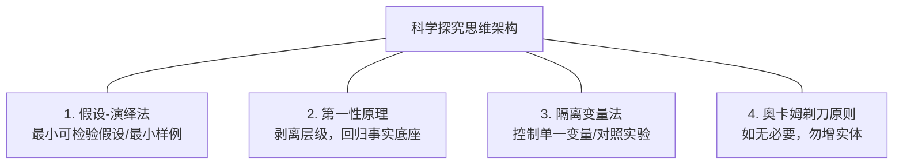
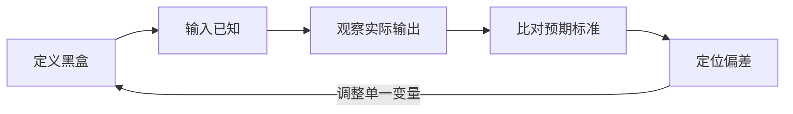

# Vibe Coding 与 AI 时代的提问哲学及科学纠偏指南

## 目录

1. [范式转变：从 Vibe Coding 到“定义目标与上下文”](#1-范式转变从-vibe-coding-到定义目标与上下文)

2. [核心技能：为什么“会问问题”是 AI 时代最关键的壁垒之一](#2-核心技能为什么会问问题是-ai-时代最关键的壁垒之一)

3. [非专家视角：不懂领域知识时如何提出好问题](#3-非专家视角不懂领域知识时如何提出好问题)

4. [验证答案与适用边界：会问，也要会证、会拒](#4-验证答案与适用边界会问也要会证会拒)

5. [科学纠偏：缺乏直觉时，如何运用科学思维逼近真相](#5-科学纠偏缺乏直觉时如何运用科学思维逼近真相)

6. [总结：从“直觉驱动”到“机制驱动”](#6-总结从直觉驱动到机制驱动)

## 1. 范式转变：从 Vibe Coding 到“定义目标与上下文”

在 AI 辅助编程（Vibe Coding）模式下，开发者的角色发生了根本性转变：**从“手写代码的程序员”演变为“定义目标与上下文的架构师”**。

传统开发与 Vibe Coding 的重心对比：

* **传统开发**：精力消耗在语法细节、API 记忆、手工调用与排错调试上。

* **Vibe Coding**：效率取决于以下两大核心要素：

  1. **清晰的目标定义（Goal Clarification）**：准确表达期望的功能、输入输出结构及边界限制。

  2. **高质量的上下文注入（Context Engineering）**：提供现有的代码库规范、相关架构文档、依赖包说明及示范样例（Few-shot examples）。

## 2. 核心技能：为什么“会问问题”是 AI 时代最关键的壁垒之一

“会问问题”本质上是**精准定义问题、提供高质上下文与系统化拆解的综合能力**。执行层的边际成本被极大地拉低后，主导权转移到了规范与定义（Specification）。需要强调的是，提问能力只是“最关键的壁垒之一”——可归因性（能否判断错误来自哪里）、验证能力（能否确认结果正确）与领域判断（能否识别风险与取舍）同样不可或缺，且往往更难被 AI 替代。

### 提问者的三层境界

| 层次 | 提问特征 | 典型结果 | 
| ----- | ----- | ----- | 
| **初级：盲盒式提问** | “帮我写一个接口。” | 生成一段能跑但缺少异常处理、安全校验和架构设计的基础代码。 | 
| **中级：结构化提问** | “基于 X 框架，设计一个支持 Y 功能的 API，包含错误捕获，输入格式参照以下 JSON...” | 生成符合规范、拿来即用的高质量模块。 | 
| **高级：系统化决策** | “我们要重构模块 A，上下文材料如下... 评估方案1与方案2的利弊，并先写出核心抽象接口。” | AI 成为专家顾问与架构助手，协助进行系统性技术决策。 | 

### 高效提问的三大原则

* **明确约束条件**：告诉 AI“不能做什么”（如：不可修改现有数据库 Schema、必须遵守特定编码规范）能有效缩小方案空间、降低不确定性。注意：这是**限制解空间**，而非消除事实性幻觉；幻觉属于事实性错误，需依靠检索增强（Grounding）、结果验证等手段抑制，不能指望加约束解决。

* **先确认理解，再开始输出**：复杂任务中加入：“在编写代码前，先总结你对需求的理解和拟采用的方案。”

* **将优质提问沉淀为 SOP/Skill**：将验证有效的 Prompt 结构标准化为 Custom Skill、System Prompt 或 Project Instructions。

## 3. 非专家视角：不懂领域知识时如何提出好问题

当面对未知或不熟悉的领域时，提问策略应从“直接索要答案”转变为“反向提取”与“角色对调”。

> **与第 2 节的关系**：角色对调、探针提问主要面向“低掌握度”场景（此时你甚至不知道该问什么）。一旦掌握度提升、问题结构变得清晰，就应回到第 2 节的“结构化提问 + SOP 沉淀”，两者是同一能力在不同成熟度阶段的表现，并非互斥。

### 四个突破口

#### 1. 角色对调法（“你来问我”）

把提问的主动权交给 AI，让 AI 扮演专家来问出技术细节。

> **提示词范例：**
> “我想做一个 \[具体目标\]。但我不是这个领域的专家，不知道需要考虑哪些技术细节。**请你作为高级技术专家，向我提出 5 个最关键的引导性问题**，帮助我厘清边界和需求。在我回答后，我们再开始编写代码。”

#### 2. 探针提问法（由宏观到微观）

* **第一步（建概念）**：“在 \[场景\] 实现 \[功能\]，行业内的通用架构或标准流程是什么？有哪些核心概念需要了解？”

* **第二步（找方案）**：“针对该场景，主流开源工具或方案有哪几种？各自优缺点和适用场景是什么？”

* **第三步（做实现）**：“基于方案 A，请拆解实现步骤，并先写出第一步的代码。”

#### 3. 场景与约束描述法（讲事实，不讲名词）

* **输入**：“手头有 100 张格式不一的 Word/PDF 报表。”

* **输出**：“自动生成一个 Excel 表格，将关键数据进行比对。”

* **限制**：“只有一台普通配置笔记本，敏感数据不可上传至公有云 API。”

#### 4. 渐进式纠偏（Iterative Refining）

1. 先让 AI 输出最简原型（MVP）。

2. 实际运行代码或校验方案。

3. 根据报错信息或不符合预期之处进行定向反馈。

## 4. 验证答案与适用边界：会问，也要会证、会拒

“会问问题”只解决一半问题——另一半是**判断 AI 给出的答案是否正确**。提问能力再强，若不会验证，等于把方向盘交给了幻觉率未知的黑盒。以下三种验证手段按可信度从高到低排列。

#### 1. 可执行验证（最强）：跑起来，用事实说话

* 代码类：本地运行 + 单测，用“黄金数据”比对输出。AI 生成“能跑”的代码不等于“正确”的代码，必须校验边界条件、异常路径与性能。

* 数据类：对 AI 生成的结果做抽检（Sampling），人工核对至少一个子集，而非只依赖 AI 的“自查报告”。

#### 2. 多源交叉验证（中等）：用第二来源互证

* 让 AI 给出答案时标注来源与推导依据，再独立检索权威文档（官方 API 文档、白皮书、行业标准）进行核对，而非让 AI 给自己“背书”。

* 同一问题用不同模型或不同表述复问，观察结论是否收敛；若分歧明显，说明问题本身定义不清晰或属于高不确定性场景。

#### 3. 反向质询（最弱，但成本最低）：逼 AI 自我证伪

* “请指出你上述回答中最可能出错的三处，并说明理由。”——用于快速排查，但不能作为唯一依据，因为 AI 无法可靠识别自己的错误。

### 不适用场景：何时不该依赖 Vibe Coding / AI

提问与验证做得再好，以下场景仍应保持警惕，AI 只可辅助、不可决策：

* **高合规与强一致场景**：金融交易、监管报送、资金清算等，错误的边际成本极高，需四眼原则、审计双签与人工复核兜底。

* **安全与隐私敏感**：代码含密钥、敏感数据，或依赖链未经审计（依赖投毒、供应链攻击风险），AI 生成的代码必须经过安全评审。

* **不可验证的输出**：当结果无法运行、无法对照、无法抽检时（如纯文本承诺、一次性推断），应默认按“不可信”处理。

* **强实时、高并发**：AI 生成代码的性能与稳定性未经压测，直接上生产存在容量风险。

## 5. 科学纠偏：缺乏直觉时，如何运用科学思维逼近真相

当缺乏行业经验与直觉时，盲目凭感觉调整容易陷入“碰运气”陷阱。科学家探索未知世界依赖的是一套严密的**思维架构**与**基于机制的反馈闭环**。

### 四大科学思维架构

1. **假设-演绎法（Hypothetico-Deductive Method）**

   * **原理**：提出极小、可被证伪的假设并设计测试。

   * **AI 实践**：不一次性修改全局代码。要求 AI 编写独立最小测试代码（Minimal Reproducible Example），单独验证某一个子模块的输入输出。

2. **第一性原理（First Principles Thinking）**

   * **原理**：剥离复杂表象，回归最基础的数据事实。

   * **AI 实践**：要求 AI 降维解释：“抛开复杂框架，这个任务最底层的**数据流**是怎样的？输入经过哪几步转换后得到输出？”

3. **隔离变量与对照实验（Control Variables）**

   * **原理**：保持其他条件不变，只改变单一变量以确定因果关联。

   * **AI 实践**：严禁同时修改 Prompt、上下文和代码结构。保持其他环境不变，每次只改动一个特定参数。

   * **前提与局限**：控制变量是**可重复观测系统**上才能成立的实验方法，而 LLM 是随机系统——同样输入、不同温度或采样噪声会得到不同输出。因此“只改一个参数”≠“对照实验”：应在固定随机种子（temperature=0 等）的前提下进行，对不确定的改动需多次重复、取稳定趋势后再下结论。

4. **奥卡姆剃刀原则（Occam's Razor）**

   * **原理**：若有多种解释或方案，优先选择假设最少、最简洁的一个。

   * **AI 实践**：防止 AI 过度设计（Over-engineering）。提问：“如果不引入任何额外依赖或复杂架构，实现核心目标的最少代码量是多少？”

### “无直觉纠偏”标准化流程

当缺乏直觉时，严格按照以下闭环进行操作：

#### Step 1: 建立客观参照物（Ground Truth）

* **报错日志（Error Log）**：直接复制完整日志，作为客观事实。

* **黄金数据集（Golden Dataset）**：一小份完全人工校验无误的输入与预期输出样例。

* **官方规范（Spec）**：官方 API 文档或权威标准示例。

#### Step 2: 使用“诊断型 Prompt”代替“猜测型 Prompt”

不要凭感觉问“是不是这里错了”，而是让 AI 增加日志以呈现运行状态。

> **与奥卡姆剃刀的关系**：加日志看似“增实体”，但它是诊断期的临时探针，定位完成后即应移除——保持最终交付物精简，而非拒绝临时诊断手段。

> **诊断型 Prompt 模板：**
> “请在关键节点加入日志打印（Print/Log），输出中间过程的数据形态。运行后我会把日志发给你，请根据日志分析哪一步的数据转换与预想不符。”

#### Step 3: 引入“交叉验证”与对抗诊断

* **角色对抗法（Red Teaming）**：“请你扮演一位极其严苛的系统架构师/安全审计员，找出这个方案中的 3 个潜在隐患或边界漏洞。”

* **多视角比对（Multi-Perspective）**：“除了方案 A，行业内还有没有完全不同的方案 B 或 C？请从复杂度、维护成本和性能三个维度进行对比。”

## 6. 总结：从“直觉驱动”到“机制驱动”

| 维度 | 依赖直觉的纠偏（易受阻） | 依赖科学机制的纠偏（可复现） | 
| ----- | ----- | ----- | 
| **判断依据** | “感觉这里不太对劲” | “第 3 行打印的变量类型与 API 规范不符” | 
| **调整方式** | 大面积随机修改 Prompt 或代码 | 隔离变量，每次只调整一个参数 | 
| **沟通方式** | 让 AI “再试一次” | 让 AI “增加日志，解释这一步的推导逻辑” | 
| **最终效果** | 运气好能跑通，但未知原因 | 建立清晰因果链条，获得**可复现的过程**（LLM 输出本身仍具随机性，确定性指过程与结论的可复现，而非每次输出逐字相同） | 

这套“提问 → 验证 → 纠偏”的完整闭环，配合第 4 节对适用边界的把握，即使在一个完全陌生的领域，也能引导 AI 一步步剥开迷雾，获得可验证、可复现的高品质交付成果。