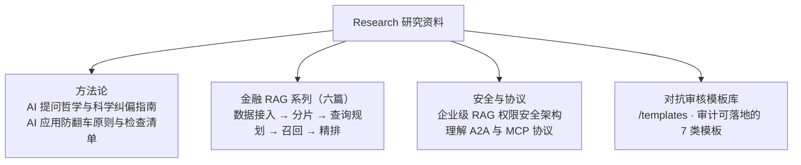

# Research：银行 AI 落地前瞻性研究资料

本目录承载《银行大模型本地化落地与AI转型全景规划书》的前瞻性研究与实战方法论资料，聚焦**AI 工程化落地中"最容易翻车"的环节**——不是模型能力，而是工程纪律、合规边界与治理机制。

## 资料全景图

## 文档清单

| 文档 | 定位 | 核心内容 |
|------|------|---------|
| [AI 时代的提问哲学及科学纠偏指南.md](AI%20时代的提问哲学及科学纠偏指南.md) | AI 协作方法论 | 双环结构：内环（提问→验证→纠偏的个人闭环）+ 外环（组织对抗审核），含附录 A-L 与审计模板 |
| [AI应用开发通用防翻车原则与检查清单.md](AI应用开发通用防翻车原则与检查清单.md) | 通用工程原则 | 核心共识：**LLM 输出不可信，关键决策必须由确定性代码把关**（SSOT、零信任边界、对账、熔断、可观测） |
| [企业级RAG知识库权限安全架构.md](企业级RAG知识库权限安全架构.md) | RAG 安全架构 | 前置过滤 + 后置校验、权限向量、防诱导推理、动态权限与降级策略 |
| [理解 A2A 與 MCP 協議.pdf](理解%20A2A%20與%20MCP%20協議.pdf) | 协议研究 | Agent-to-Agent（A2A）与模型上下文协议（MCP）原理理解 |

### 金融 RAG 系列（六篇）

| # | 文档 | 主题 |
|---|------|------|
| 1 | [金融行业为什么需要金融级 RAG](金融%20RAG%20系列1%20金融行业为什么需要金融级%20RAG，而不是一个普通%20AI%20知识库.md) | 金融 RAG 的本质：可追溯、可审计、可复核的知识工作系统 |
| 2 | [数据接入层](金融%20RAG%20系列2%20数据接入层.md) | 数据血缘、数字与单位对应、表头页码对齐 |
| 3 | [文档分片](金融%20RAG%20系列3%20最容易翻车的地方：不是模型，而是文档分片做错了.md) | 自包含语义注入，分片质量决定系统可靠性 |
| 4 | [查询规划](金融%20RAG%20系列4%20硬核拆解查询规划，干掉合规灾难与数据穿越.md) | 保护问题变异层，杜绝合规灾难与数据穿越 |
| 5 | [数据召回层](金融%20RAG%20系列5%20拆解金融级RAG数据召回层，别让智能变成合规风险.md) | 金融 RAG 召回的是**候选证据链**而非相似文本 |
| 6 | [数据精排（证据风控）](金融%20RAG%20系列6%20金融RAG最容易翻车的一层：数据精排不是Rerank，而是证据风控.md) | 精排不是 Rerank，而是证据风控 |

> 六篇 RAG 系列构成完整链路：**接入层 → 分片层 → 查询规划层 → 召回层 → 精排层（证据风控）**，逐层拆解金融 RAG 的工程雷区。

## 对抗审核模板库（templates）

适配《AI 时代的提问哲学及科学纠偏指南》附录 A-L 的可落地模板，直接拷贝使用：

| 模板 | 用途 |
|------|------|
| [prompt-review.md](templates/prompt-review.md) | Prompt 审核表 |
| [redteam.md](templates/redteam.md) | 红队用例模板（含 [redteam-corpus](templates/redteam-corpus/README.md) 语料库） |
| [compliance-checklist.md](templates/compliance-checklist.md) | 合规审查清单 |
| [ci-test.yml](templates/ci-test.yml) | CI 测试模板（黄金回归 + 红队 + 依赖扫描） |
| [audit-log.schema.json](templates/audit-log.schema.json) | 审计日志字段 JSON Schema |
| [experiment.md](templates/experiment.md) | 实验设计模板（AB/灰度/统计显著） |
| [postmortem.md](templates/postmortem.md) | 事后分析记录模板 |

## 阅读路径建议

* **研发人员**：先读《AI 时代的提问哲学及科学纠偏指南》第一编（内环方法论），再读防翻车清单。
* **架构/安全**：金融 RAG 六篇 + 权限安全架构，配合指南第二编（对抗审核）落地。
* **审计/合规**：直接使用 templates 下的审核表、红队用例、合规清单与审计日志 Schema。

---
*维护：OpenCode · 银行 AI 落地前瞻性研究项目*